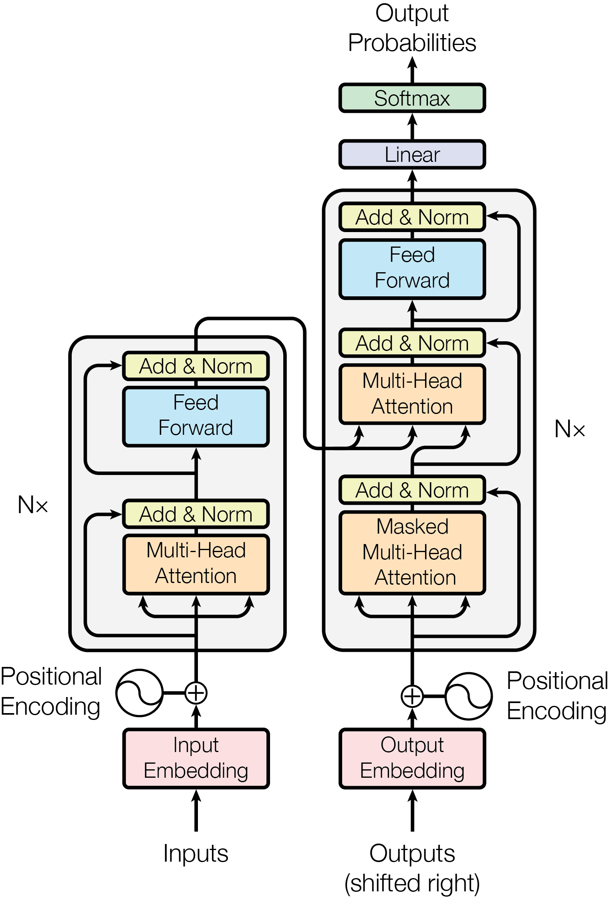

# Study

- https://www.youtube.com/playlist?list=PLtBw6njQRU-rwp5__7C0oIVt26ZgjG9NI

- GPT-OSS-20B
  - embedding 2880 dim
  - RoPE

| abbr. | stand for                   | meaning        |
| ----- | --------------------------- | -------------- |
| GQA   | Grouped Query Attention     | 分组查询注意力 |
| MHA   | Multi-Head Attention        | 多头注意力     |
| MLA   | Multi-Head Latent Attention | 多头潜在注意力 |
| MoE   | Mixture of Experts          | 专家混合       |

- https://magazine.sebastianraschka.com/p/the-big-llm-architecture-comparison
- https://magazine.sebastianraschka.com/p/from-gpt-2-to-gpt-oss-analyzing-the

# Transformer

- Tokenization - Embedding - Positional encoding - Transformer block - Attention
- Context QKV
  - Attention Pattern
- Self Attention
- Cross Attention
  - KV 不同 dataset
- Multi-head Attention
- Single Head Attention
- Sparse Attention Mechanism
- Blockwise Attention
- Linformer
- Reformer
- Ring Attention
- GQA - Grouped Query Attention
- SwiGUL
- 参考
  - [What Are Transformer Models and How Do They Work?](https://cohere.com/blog/what-are-transformer-models)
  - [Attention Is All You Need](https://arxiv.org/abs/1706.03762)
  - [The Illustrated Transformer](https://jalammar.github.io/illustrated-transformer/)
  - [The Transformer Family](https://lilianweng.github.io/posts/2020-04-07-the-transformer-family/)
    - 2020
  - https://www.zhihu.com/question/445556653/answer/3254012065

- GPT3
  - Q 12,288x128
  - K 12,288x128
  - 96 heads
  - 12 layers
  - 175B params
- Attention in transformers, step-by-step | Deep Learning Chapter 6 https://www.youtube.com/watch?v=eMlx5fFNoYc

## Attention Is All You Need

- 2017-06, by Ashish Vaswani et al.
- 引入 Transformer 模型架构，改变了自然语言处理领域
- 打破了顺序处理的枷锁，实现了大规模并行计算。
- 极大地提升了模型捕捉“长距离依赖”的能力。
- RNN/LSTM 的时代与困境
  - 计算效率低下 (无法并行) - 海量训练数据不现实
  - 长距离依赖问题 (信息丢失)
- 用自注意力机制 (Self-Attention) 实现并行计算
- 用自注意力机制解决长距离依赖
- 深远实际意义
  - 奠定了现代大语言模型 (LLM) 的基础
  - 开启了“预训练+微调”的新范式
  - 推动了模型规模的“军备竞赛”
  - 跨领域的范式转移
- [Attention Is All You Need](https://arxiv.org/abs/1706.03762)

---

1. 生成 Q, K, V

- 对于输入序列中的每一个词嵌入向量，都通过乘以 $W_Q$, $W_K$, $W_V$ 矩阵生成对应的 Q, K, V 向量。

2. 计算注意力分数 (Score)

- 当前处理的词的 Q 向量与所有词的 K 向量进行点积，得到注意力分数。

$$
Score(Q, K) = Q \cdot K^T
$$

3. 归一化 (Normalization)

- 将分数转换成一个总和为 1 的概率分布
- 得到 注意力权重

$$
Attention(Q, K, V) = softmax(QK^T / sqrt(d_k))V
$$

4. 加权求和 (Weighted Sum)

$$
Context Vector = Attention Weights \cdot V
$$
