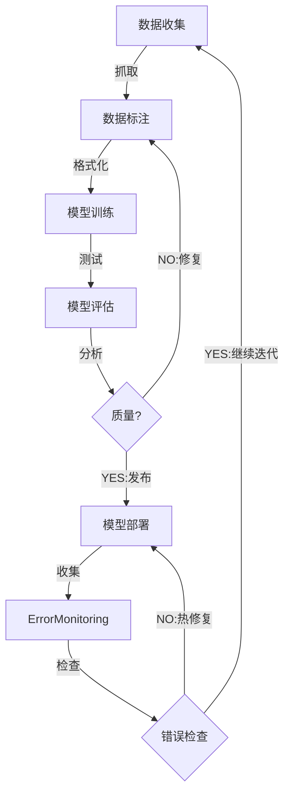

# Traning

```mermaid
graph TD
  DataCollection["数据收集"]
  DataLabeling["数据标注"]
  ModelTraining["模型训练"]
  ModelEvaluation["模型评估"]
  ModelDeploy["模型部署"]

  DataCollection -- 抓取 --> DataLabeling
  DataLabeling -- 格式化 --> ModelTraining
  ModelTraining -- 测试 --> ModelEvaluation
  ModelEvaluation -- 分析 --> Quality{"质量?"}
  Quality -- YES:发布 --> ModelDeploy
  Quality -- NO:修复 --> DataLabeling
  ModelDeploy -- 收集 --> ErrorMonitoring
  ErrorMonitoring -- 检查 --> ErrorCheck{"错误检查"}
  ErrorCheck -- YES:继续迭代 --> DataCollection
  ErrorCheck -- NO:热修复 --> ModelDeploy
```

- label-studio 数据标注工具
- transformers - 模型训练套件
- TextBrewer - 模型蒸馏工具
