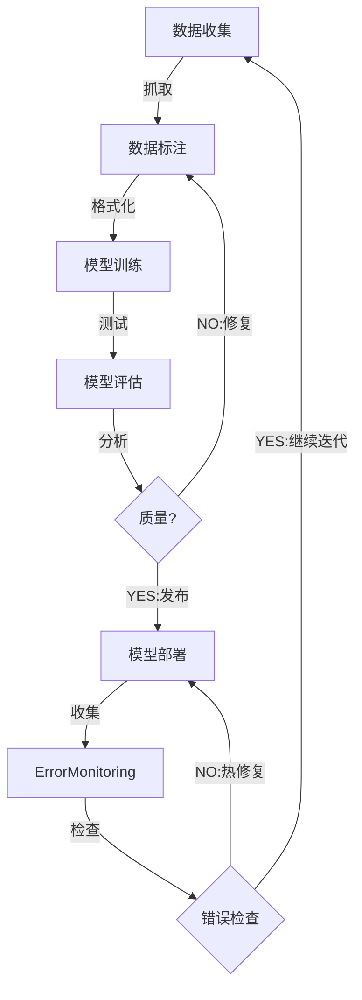

# Traning

- Pre-Training - 预训练
  - 产出 基础模型、从 0 到 1、成本高昂
- Post-Training
  - Instruction Fine-Tuning - 指令微调
  - Alignement Fine-Tuning - 对齐微调
  - Task-Specific Fine-Tuning - 任务特定微调
- Fine-Tuning
  - 对已有模型进行微调、领域适应微调、低成本满足特定需求



- label-studio 数据标注工具
- transformers - 模型训练套件
- TextBrewer - 模型蒸馏工具

---

---

- toolkit
  - [InternLM/xtuner](https://github.com/InternLM/xtuner)
    - Apache-2.0, Python
  - [hiyouga/LLaMA-Factory](https://github.com/hiyouga/LLaMA-Factory)
    - Apache-2.0, Python
    - Unified Efficient Fine-Tuning of 100+ LLMs & VLMs
  - [modelscope/ms-swift](https://github.com/modelscope/ms-swift)
    - Apache-2.0, Python
    - by 阿里巴巴, 阿里达摩院
    - SWIFT - Scalable lightWeight Infrastructure for Fine-Tuning
  - [volcengine/verl](https://github.com/volcengine/verl)
    - Apache-2.0, Python
    - Volcano Engine Reinforcement Learning for LLMs
    - by 火山引擎
  - [2U1/Qwen2-VL-Finetune](https://github.com/2U1/Qwen2-VL-Finetune)
    - Apache-2.0, Python
    - Liger-Kernel
  - [axolotl-ai-cloud/axolotl](https://github.com/axolotl-ai-cloud/axolotl)
    - Apache-2.0, Python
  - [unslothai/unsloth](https://github.com/unslothai/unsloth)
    - Apache-2.0, Python
  - [pytorch/torchtune](https://github.com/pytorch/torchtune)
    - Apache-2.0, Python
  - [kiln-ai/kiln](https://github.com/kiln-ai/kiln)
    - Rapid AI Prototyping and Dataset Collaboration Tool
- Eval
  - [open-compass/VLMEvalKit](https://github.com/open-compass/VLMEvalKit)
    - Apache-2.0, Python
    - evaluation toolkit of large multi-modality models (LMMs), support 220+ LMMs, 80+ benchmarks
- Example/LoRA
  - [daniel3303/StoryReasoning](https://github.com/daniel3303/StoryReasoning)
    - 多image，连续故事推理，人物识别
    - 数据集 [daniel3303/StoryReasoning](https://huggingface.co/datasets/daniel3303/StoryReasoning)
- Article/文章/参考/阅读/Reading/Reference
  - [Training a WAN or HunYuan LoRA the right way.](https://civitai.com/articles/11942)
  - [Train Your Own O1 Preview Model Within $450](https://news.ycombinator.com/item?id=43125430)

## 微调 {#fine-tuning}

- 为什么要微调大语言模型 (LLM)？
  - 解决特定问题：针对具体、可衡量的问题优化模型表现。
  - 提升任务质量：提高模型在特定任务上的准确性和效果。
  - 降低成本与提升速度：使用微调后的小模型可能比通用大模型更经济、更快速。
  - 优化工具调用能力：增强模型理解和执行特定工具或 API 调用的能力。
  - 增强逻辑与规则遵循：使模型更好地理解和遵循复杂的指令、逻辑和特定规则。
  - 模型蒸馏：将大型、复杂模型的知识和能力迁移到更小、更高效的模型中。
  - 改进思考与推理链：提升模型进行复杂思考、推理和形成连贯思维链条的能力。
  - 对齐人类价值观与安全要求：使模型的输出更符合人类的价值观、道德标准和安全规范。
- 如何开始微调 LLM？
  - 明确目标 (Pick a goal)：清晰定义你希望通过微调解决的具体问题或达成的性能指标。
  - 准备训练数据 (Generate training data)：收集或生成高质量的训练数据。文章提到，合成数据（Synthetic data）在微调中效果良好。
  - 训练候选模型 (Train a few candidates)：选择合适的基模型，并尝试训练几个不同的微调版本。
  - 评估关键指标 (Measure what matters)：根据你设定的目标，对微调后的模型进行严格的评估，衡量其在关键指标上的表现。

# 2U1/Qwen2-VL-Finetune

- [2U1/Qwen2-VL-Finetune](https://github.com/2U1/Qwen2-VL-Finetune)
  - Apache-2.0, Python, Liger-Kernel, DeepSpeed
  - ⚠️ Liger-kernel 不支持 QLoRA
- dataset
  - --data_path data.json
  - --image_folder

```json
[
  {
    "id": "000000033471",
    "image": ["000000033471.jpg", "000000033472.jpg"],
    "conversations": [
      {
        "from": "human",
        "value": "<image>\n<image>\nIs the perspective of the camera differnt?"
      },
      {
        "from": "gpt",
        "value": "Yes, It the perspective of the camera is different."
      }
    ]
  }
]
```

```bash
git clone https://github.com/2U1/Qwen2-VL-Finetune
cd Qwen2-VL-Finetune
uv venv --python 3.11
uv pip install -r requirements.txt -f https://download.pytorch.org/whl/cu124
uv pip install qwen-vl-utils
uv pip install flash-attn --no-build-isolation

# 复制脚本 自行修改后使用
# 修改 data-path, image-folder, MODEL_NAME
cp scripts/finetune.sh ft.sh

# 参考脚本
# Full Finetuning
bash scripts/finetune.sh
# LoRA Finetuning
bash scripts/finetune_lora.sh
# LoRA Finetuning language model & vision model
bash scripts/finetune_lora_vision.sh

# for Video
bash scripts/finetune_video.sh

bash scripts/merge_lora.sh
```

- https://github.com/2U1/Qwen2-VL-Finetune
