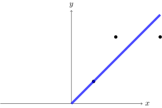
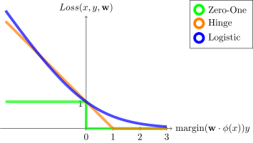
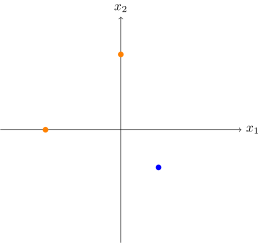

# CS221 AI: Principles and Techniques

- 基于刺激的模型 - [Reflex-based models](./cs221-reflex.md)
- 基于状态的模型 - [States-based models](./cs221-state.md)
- 基于变量的模型 - variable
- 基于逻辑的模型 - logic

---

- https://www.youtube.com/watch?v=J8Eh7RqggsU&list=PLoROMvodv4rO1NB9TD4iUZ3qghGEGtqNX
- https://www.youtube.com/watch?v=ZiwogMtbjr4&list=PLoROMvodv4rOca_Ovz1DvdtWuz8BfSWL2
- shervine [cs-221](https://stanford.edu/~shervine/teaching/cs-221/)

# Stanford CS221: Artificial Intelligence: Principles and Techniques | Autumn 2021

- https://stanford-cs221.github.io/autumn2021/
- [Youtube 播放列表](https://www.youtube.com/playlist?list=PLoROMvodv4rOca_Ovz1DvdtWuz8BfSWL2)

## Lession 1: Overview

Reflex-based models
: 基于 反射/刺激 的模型
: $
\text{\color{orange}input } x
->
\stackrel{\color{orange}\text{predicator}}{\boxed{f(x)} }
->
y \text{\color{orange} output}
$
: 最简单的模型，不考虑历史，只考虑当前情况

Binary Classification
: 二元分类
: $
x ->
\stackrel{\color{orange}\text{classifier}}{\boxed{f(x)} }
-> y \in \color{orange} \{+1,-1\} \text{ \color{red}label}
$
: 输出二元结果 - true/false, yes/no, positive/negative, 1/-1, 1/0

Regression
: 回归
: $
x -> \boxed{f(x)} -> y \in \color{orange} \mathbb{R} \text{ \color{red}response}
$
: 输出实数结果

Structured prediction
: 结构化预测
: $
x -> \boxed{f(x)} -> y \text{ is a } \text{\color{orange}complex object}
$
: 输出复杂对象

## Lession 2: Linear Regression

Linear regression framework
: 线性回归框架
: Decision boundary - 一条线
: Hypothesis class - 假设类 - 哪些预测是可能的
: Loss function - 损失函数 - 如何衡量预测的好坏
: Optimization algorithm - 优化算法 - 如何找到最好的预测

Hypothesis class
: 假设类
: 哪些预测是可能的

$$
\begin{alignat*}{2}
\mathcal{F}
&=\{ f_\mathbf{w} : \mathbf{w} \in \mathbb R ^d \} \\
&=\{ f_\mathbf{w} = \mathbf{w} \cdot \phi(x) : \mathbf w \in \mathbb R ^d \}
\end{alignat*}
$$

**符号说明**

| name              | notation                      | 含义       |
| ----------------- | ----------------------------- | ---------- |
| weight vector     | $\mathbf w = [ w_1, w_2 ]$    | 权重向量   |
| feature extractor | $\phi(x)$                     | 特征提取器 |
| feature vector    | $\phi(x)=\color{red}[1,x]$    | 特征向量   |
| train set         | $\mathcal D _ \textrm{train}$ | 训练集     |
| test set          | $\mathcal D _ \textrm{test}$  | 测试集     |

Feature vector
: 特征向量
: 特征工程 - feature-engineering
: 将原始数据抽象为特征向量

$$
\phi(x)=
  \begin{bmatrix}
    \phi_1(x)\\
    \vdots\\
    \phi_d(x)
  \end{bmatrix}
  \in
  \reals^d
$$


Score
: 分数
: 如果是最终结果，则代针对某个结论的肯定程度
: $
s(x,\mathbf w) = \mathbf w \cdot \phi(x) = \sum _{i=1}^d \mathbf w_i \phi_i(x)
$

- w - weight - 权重
  - 对于一个输出，不同的特征对输出的影响不同
  - 例如: 一个人的身高，体重，年龄，性别，对于 性别和年龄 的影响不同
- s - score - 分数
  - 特征\*权重
  - 例如: 0.78 是 男性


Loss function
: 损失函数
: 评价模型的**预测值**和**真实值**不一样的程度
: 分为 **经验风险损失函数** 和 **结构风险损失函数**

$$
\text{Loss}(x,y,\mathbf w) = 1[f_\mathbf w (x) \ne y] \text{\color{orange} zero-one loss}
$$

$$
\text{Loss}(x,y,\mathbf w) = (f_\mathbf w(x) - y)^2 \text{\color{orange} squared loss}
$$

TrainLoss
: 训练损失
: 在训练中希望**减小**的值
: value of the objective function that you are minimizing

$$
\textrm{TrainLoss}(\mathbf w)=
\frac{1}{|\mathcal{D}_{\textrm{train}}|}\sum_{(x,y)\in\mathcal{D}_{\textrm{train}}}\textrm{Loss}(x,y,\mathbf w)
$$

:::tip 机器学习目标

**最小化 TrainLoss/训练损失**

$$
\text{min}_\mathbf w \textrm{TrainLoss}(\mathbf w)
$$

:::

gradient
: the gradient $\nabla_\mathbf w\textrm{TrainLoss}(\mathbf w)$ is the direction that increases the training loss the most
: 梯度 是让训练损失最大化的方向
: $\nabla_\mathbf w \textrm{Loss}(x,y,\mathbf w)$
: $\nabla_\mathbf w\textrm{TrainLoss}(\mathbf w)$

:::tip gradient descent - 梯度下降算法

- 初始化 $\mathbf w = [0,...,0]$
- for $t = 1,..., T \text{ \tiny\color{orange}周期/epoch}$
  - $
\mathbf w \longleftarrow
\mathbf w -
  \underbrace{ \color{red} \eta  }_{\text{step size}}
  \underbrace{ \color{purple} \nabla_\mathbf w\textrm{TrainLoss}(\mathbf w) }_{\text{gradient}}
$

> - $\eta \in \mathbb R$
>   - learning rate - step size
>   - 学习速率 - 每次更新多少
> - 权重 $\mathbf w$ 在每个周期被更新 - **Machine 学习的内容**


:::

Objective function
: 目标函数
: 统称
: loss function **is a part of** a cost function **which is a type of** an objective function.
: Objective function 一般指需要 **优化** 的函数
: Loss/Cost function 一般指需要 **最小化** 的函数

$$
\begin{alignat*}{2}
\textrm{TrainLoss}(\mathbf w)
&=\frac{1}{|\mathcal{D}_{\textrm{train}}|}
  \sum_{(x,y)\in\mathcal{D}_{\textrm{train}}}
  \textrm{Loss}(x,y,\mathbf w) \\
&=\frac{1}{|\mathcal{D}_{\textrm{train}}|}
  \sum_{(x,y)\in\mathcal{D}_{\textrm{train}}}
  (\mathbf w \cdot \phi(x) - y)^2 \text{ \tiny\color{orange}squared loss}
\end{alignat*}
$$

> **Note** 使用每个 loss 的平均作为初始 TrainLoss

$$
\nabla_\mathbf w\textrm{TrainLoss}(\mathbf w)=
  \frac 1 {|\mathcal{D}_{\textrm{train}}|}
  \sum_{(x,y)\in\mathcal{D}_{\textrm{train}}}
  2(
    \underbrace{
    {\color{red} \mathbf w \cdot \phi(x)} - {\color{green}y}
    }_{\text{{\color{red}predication} - \color{green}target}}
  ) \phi(x)
$$

> **Note**
>
> - $()^2 \longrightarrow 2()$ 的 gradient/$\nabla$ 的转换逻辑后面会讲到
> - 使用 squared loss 的 gradient

import Admonition from '@theme/Admonition';
import Tabs from '@theme/Tabs';
import TabItem from '@theme/TabItem';
import {Lession2Demo} from '@theme/CS221';

<Admonition type="note" icon="💡" title="Demo">

<details>

<summary>代码:</summary>

<Tabs>
  <TabItem value="javascript" label="JavaScript" default>

```js
function train({ iterations = 200, learningRate = 0.1, log = console.log.bind(console) } = {}) {
  // 训练集
  const trainSet = [
    [1, 1],
    [2, 3],
    [4, 3],
  ];
  log(`train epochs:${iterations} eta:${learningRate}`);
  // Optimization problem
  // 1/3 * sum((w*phi(x) - y) ^ 2)
  const trainLoss = (w) => {
    let sum = 0;
    for (const [x, y] of trainSet) {
      sum += (w[0] * 1 + w[1] * x - y) ** 2;
    }
    return sum * (1 / trainSet.length);
  };
  // 1/3 * sum(2(w*phi(x) - y)phi(x))
  const gradientTrainLoss = (w) => {
    let sum = [0, 0];
    for (const [x, y] of trainSet) {
      let d = 2 * (w[0] * 1 + w[1] * x - y);
      let z = [d * 1, d * x];
      sum = [sum[0] + z[0], sum[1] + z[1]];
    }
    const loss = [sum[0] * (1.0 / trainSet.length), sum[1] * (1.0 / trainSet.length)];
    return loss;
  };
  // Optimization algorithm
  const gradientDescent = (F, gradientF, initialWeightVector) => {
    let w = initialWeightVector;
    let eta = learningRate;
    for (let i = 0; i < iterations; i++) {
      let value = F(w);
      let gradient = gradientF(w);
      w = [w[0] - eta * gradient[0], w[1] - eta * gradient[1]];
      //
      log(`epoch ${i + 1}:`, `w: ${w}, F(w)=${value}, gradient: ${gradient}`);
    }
    return w;
  };
  const w = gradientDescent(trainLoss, gradientTrainLoss, [0, 0]);
  log(`w: ${w}`);
  return { w };
}
```

  </TabItem>
</Tabs>

</details>

<Lession2Demo/>



</Admonition>

:::tip 向量计算

$$
\begin{pmatrix}
  a_1&a_2
\end{pmatrix}
\cdot
\begin{pmatrix}
  b_1&b_2
\end{pmatrix} = a_1b_1+a_2b_2
$$

:::

## Lession 3: Linear Classification

- which classfiers are possible - 有哪些可能分类器 - 假设类 - hypothesis class
- how good is a classifier - 评价标准 - 损失函数 - loss function
- how to compute the best classifier - 如何计算 - 优化算法 - optimization algorithm

Decision boundary
: 决策边界
: $x$ for $\mathbf w \cdot \phi(x) = 0$

Binary classfier
: 二分类器
: $f_\mathbf w(x) = \text{sign}(\mathbf w \cdot \phi(x))$
  - 输出 label
: $\mathbf w \cdot \phi(x) \geq 0 \longrightarrow y = +1$


Hypothesis class
: 假设类
: $\mathcal{F}=\{ f_\mathbf{w} : \mathbf{w} \in \mathbb R ^2 \}$

score
: 分数
: $\mathbf w \cdot \phi(x)$
: 可信度 - how **confident** the classifier is

margin
: 边距
: $(\mathbf w \cdot \phi(x))y$
: 正确度 - how **correct** the classifier is

Loss function
: 损失函数

$$
\begin{alignat*}{2}
\text{Loss}_{0-1}(x,y,\mathbf w)
  &= 1[f_\mathbf w (x) \ne y] \\
  &= 1[
    \underbrace{(\mathbf w \cdot \phi(x))y}_\text{margin}
     \le 0] \\
\end{alignat*}
$$


**训练目标**
$$\text{min}_\mathbf w \text{TrainLoss}(\mathbf w)$$
**梯度下降**
$$
\nabla_\mathbf w\text{TrainLoss}(\mathbf w)=\sum_{(x,y)\in \mathcal D _ \textrm{train}} \nabla\text{Loos}_{0-1}(x,y,\mathbf w)
$$

$$
\nabla\text{Loos}_{0-1}(x,y,\mathbf w)
=\nabla 1[(\mathbf w \cdot \phi(x))y \le 0]
$$

- 由于使用了 zero-one loss，此时梯度大多数都是为 0
- 因此无法正常下降，需要使用其他损失函数

Hinge loss
: 避免 zero-one loss &le; 0 时大多为 0 的问题

$$
\text{Loos}_\text{hinge}(x,y,\mathbf w)
= \mathrm{max}\{{\color{orange}1 - (\mathbf w\cdot \phi(x))y}, 0\}
$$

$$
\nabla\text{Loos}_\text{hinge}(x,y,\mathbf w)=
\begin{cases}
  -\phi(x) y & \text{if} \space {\color{orange}1- (\mathbf w \cdot \phi(x))y} > 0 \\
  0 & \text{otherwise}
\end{cases}
$$

Logistic loss
: 在超过 1 后还在尝试增加 margin

$$
\text{Loos}_\text{logistic}(x,y,\mathbf w)
= \text{log}(1+e^{−(\mathbf w \cdot \phi(x))y})
$$



<!-- TODO DEMO -->

<Admonition type="note" icon="💡" title="Demo">

<details>

<summary>代码:</summary>
TODO
</details>

TODO



</Admonition>

## Lession 4: SGD

## Lession 5: Group DRO

## Lession 6: Non-Linear Features

## Lession 7: Feature Template

## Lession 8: Neural Networks

## Lession 9: Backpropagation

## Lession 10: Differentiable Programming

## Lession 11: Generalization

## Lession 12: Best Practices

## Lession 13: K-means

# Misc

Cost function
: sum of loss &times; weight
: Mean Squared Error
