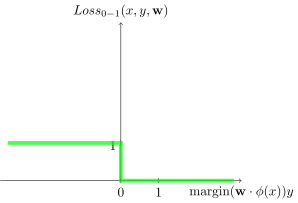
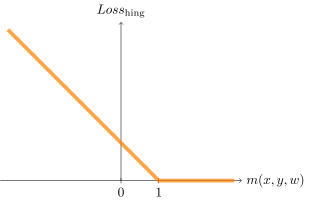
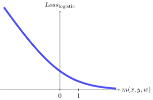
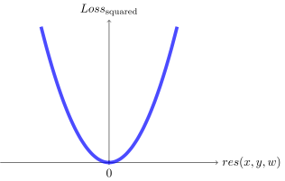
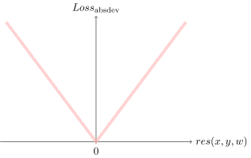

# Reflex Based Models

Reflex agent
: 1. 从环境中获取输入
: 2. 通过预测器，预测输出
: 3. 输出结果

<!-- x -> \boxed{f(x)} -> y \in \color{orange} \mathcal{Y} \text{ \color{red}label}
-->

**非线性**

Quadratic predictors
: 二次预测器

Quadratic clasifiers
: 二次分类器
: Decision boundary - 一个圆

Piecewise constant predictors
: 分段常数预测器

Predictors with periodicity structure
: 周期性结构预测器

### Linear predictors

feature template
: 特征模板
: group of features all computed in a similar way
: e.g. 字符串 以 .com,.cn 结尾

- dense feature
- sparse feature
  - 大量 0

**Linear classifier**

$$
\
f_w(x)=
sign(s(x,w)) =
\begin{cases}
+1 & \text{if} \space w \cdot \phi(x) > 0 \\
-1 & \text{if} \space w \cdot \phi(x) < 0 \\
? & \text{if} \space w \cdot \phi(x) = 0
\end{cases}
$$

**Margin**

- larger values are better

$$
m(x,y,w) = s(x,w) \times y
$$

**Linear regression**

$$
f_w(x) = s(x,w) = w \cdot \phi(x)
$$

**Residual**

amount by which the prediction $f_w(x)$ overshoots the target $y$

$$
r(x,y,w) = f_w(x) - y = s(x,w) - y
$$

### Loss minimization

Loss function
: 损失函数
: $Loss(x,y,w)$
: weights $w$, output $y$, input $x$.

Classification case
: 分类问题

| Name         | Zero-one loss                   | Hinge loss                   | Logistic loss                   |
| ------------ | ------------------------------- | ---------------------------- | ------------------------------- |
| Loss         | $1_{m(x,y,w) <= 0}$             | $\text{max}(1−m(x,y,w),0)$   | $\text{log}(1+e^{−m(x,y,w)})$   |
| Illustration |  |  |  |

**Regression case**

| Name                   | Squared loss                   | Absolute deviation loss        |
| ---------------------- | ------------------------------ | ------------------------------ |
| $\textrm{Loss}(x,y,w)$ | $(\textrm{res}(x,y,w))^2$      | $\|\textrm{res}(x,y,w)\|$      |
| Illustration           |  |  |

**Zero-one loss**

$$
\begin{alignat*}{2}
\text{Loss}_{0-1}(x,y,\text{w}) &= 1[f_\text{w}(x) \ne y] \\
&= 1[
\underbrace{ (\text{w} \cdot \phi(x)) y }_{\text{margin}}
\le 0
]
\end{alignat*}
$$

**Hinge loss**

$$
\begin{alignat*}{2}
\textrm{Loos}_\text{hinge}(x,y,w)
&= \text{max}\{1− (w \cdot \phi(x))y ,0\} \\
&= \begin{cases}
    -\phi(x) y & \text{if} \space 1- (w \cdot \phi(x))y > 0 \\
    0 & \text{otherwise}
  \end{cases}
\end{alignat*}
$$

**Logistic regression**

$$
\textrm{Loos}_\text{logistic}(x,y,w) =
\text{log}(1+e^{−m(x,y,w)})
$$

**Loss minimization framework**

$$
\textrm{TrainLoss}(w)=\frac{1}{|\mathcal{D}_{\textrm{train}}|}\sum_{(x,y)\in\mathcal{D}_{\textrm{train}}}\textrm{Loss}(x,y,w)
$$

group DRO
: Group distributionally robust optimization

$$
\textrm{TrainLoos}_\text{max}(w) =
\underset{g}{\text{max}}
\textrm{TrainLoos}_g(w)
$$

$$
\nabla\textrm{TrainLoos}_\text{max}(\mathbf{w})
= \nabla \textrm{TrainLoos}_{\text{g}^\text{*}} (\mathbf{w}) \\
\text{where } g^\text{*}=\underset{g}{\text{argmax}} \text{TrainLoss}_g(\mathbf{w})
$$

## Non-linear predictors

$k$-nearest neighbors
: KNN
: $k$相邻
: 用于分类、回归

- $k$
  - 与 bias 成正比
  - 与 variance 成反比

Neural networks
: 神经网络

$$
z_j^{[i]}={w_j^{[i]}}^Tx+b_j^{[i]}
$$

- w - weight
- b - bias
- x - input
- z - non-activated output

### Stochastic gradient descent

Gradient descent
: 梯度下降

$$
w\longleftarrow w-\eta\nabla_w \textrm{Loss}(x,y,w)
$$

- $\eta \in \mathbb R$
  - learning rate - step size
  - 学习速率 - 每次更新多少

Stochastic gradient descent - SGD
: 随机梯度下降
: Stochastic updates - 每次训练更新

Batch gradient descent - BGD
: 批量梯度下降
: Batch updates - 一次训练集更新一次

## Fine-tuning models

Hypothesis class
: 假设类
: $
\mathcal{F}=\left\{f_w:w\in\mathbb{R}^d\right\}
$

Logistic function
: 逻辑函数
: $\sigma$ - sigmoid function

$$
\boxed{\forall z\in]-\infty,+\infty[,\quad\sigma(z)=\frac{1}{1+e^{-z}}}
$$

$$
\sigma'(z)=\sigma(z)(1-\sigma(z))
$$

Backpropagation
: 后向传播
: $g_i=\frac{\partial\textrm{out}}{\partial f_i}$

Approximation error
: hypothesis <-> predictor
: $\epsilon_\text{approx}$

Estimation error
: predictor <-> best predictor
: $\epsilon_\text{est}$

- Regularization
  - keep the model from overfitting
  - LASSO
    - Shrinks coefficients to 0
    - Good for variable selection
  - Ridge
    - Makes coefficients smaller
  - Elastic Net
    - Tradeoff between variable selection and small coefficients
- Hyperparameters
- Sets vocabulary

| Training set                   | Validation set                          | Testing set                   |
| ------------------------------ | --------------------------------------- | ----------------------------- |
| 训练集                         | 验证集 hold-out development set | 测试集                        |
| $\mathcal{D}_{\textrm{train}}$ |                                         | $\mathcal{D}_{\textrm{test}}$ |
| 80%                            | 20%                                     |
| 用于训练模型                   | 用于估算模型                            | 模型未见过的数据              |

## Unsupervised Learning

### k-means

Clustering
: $n \in \mathcal D _ \textrm{train}$, clustering 将点 $\phi(x_i)$ 划分为 $k$ 类 $z_i \in \{1,...,k\}$

Objective function
: 初始化 clustering 的函数
: 选取 $k$ 个点作为初始的 $k$ 个 cluster 的中心点
: $
\textrm{Loss}_{\textrm{k-means}}(x,\mu)=\sum_{i=1}^n||\phi(x*i)-\mu*{z_i}||^2
$

k-means
: 1. 随机选取 $k$ 个点作为初始的 $k$ 个 cluster 的中心点 - **Objective function**
  2. 计算每个点到 $k$ 个 cluster 的中心点的距离 - **Algorithm**
  3. 将每个点划分到距离最近的 cluster
  4. 重新计算每个 cluster 的中心点
  5. 重复 2-4 直到收敛

Algorithm

$$
\boxed{z*i=\underset{j}{\textrm{arg min}}||\phi(x_i)-\mu_j||^2}\quad\textrm{and}\quad\boxed{\mu_j=\frac{\displaystyle\sum*{i=1}^n1*{\{z_i=j\}}\phi(x_i)}{\displaystyle\sum*{i=1}^n1\_{\{z_i=j\}}}}
$$

**Principal Component Analysis**

- Eigenvalue, eigenvector

$$
\boxed{Az=\lambda z}
$$

Spectral theorem

$$
\exists\Lambda\textrm{ diagonal},\quad A=U\Lambda U^T
$$

$$
\boxed{\phi*j(x_i)\leftarrow\frac{\phi_j(x_i)-\mu_j}{\sigma_j}}\quad\textrm{where}\quad\boxed{\mu_j = \frac{1}{n}\sum*{i=1}^n\phi*j(x_i)}\quad\textrm{and}\quad\boxed{\sigma_j^2=\frac{1}{n}\sum*{i=1}^n(\phi_j(x_i)-\mu_j)^2}
$$

## Misc

- $y = w_1x_1 + w_2x_2 + ... + w_nx_n + b$
  - $y$ is the output
  - $x_i$ is the input
  - $w_i$ is the weight
  - $b$ is the bias
- 有监督学习
  - 有输入和输出
  - 输入是特征
  - 输出是标签
  - 通过学习输入和输出的关系, 从而预测未知的输出
