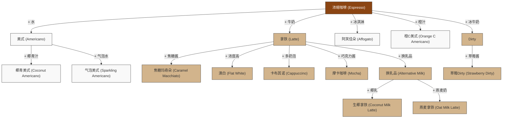

# 咖啡

咖啡因可阻断腺苷的 A1和 A2A受体，有效地阻止了腺苷受体部位的腺苷。这推迟了睡意，并释放出多巴胺。

腺苷是细胞活动的副产品，腺苷受体与腺苷结合则会产生疲倦感和睡意。

- 耐受 - 7 天服用 400 毫克咖啡因，每天 3 次。
- 完全耐受 - 连续 18 天食用 300 毫克，每天 3 次。

## 咖啡因依赖

咖啡因戒断症

- 戒断症状
  - 包括头痛、肌肉疼痛和僵硬、乏力嗜眠、恶心、呕吐、情绪低落和明显的易怒。
- 影响时间
  - 停止咖啡因摄入后的 12-24 小时内开始，20-48 小时达到高峰，持续时间长达 9 天。
