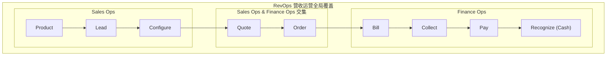

# Billing

- Billing - 计费 / 出账
- [Glossary](./billing-glossary.md)
  - 计费、产品、价格和营收指标术语
- [FAQ](./billing-faq.md)
  - Pricing / Rating、结算流程、SKU、Price 和 Rollup 设计

## 计费流程

- 流程
  - Product / SKU -> Price -> Usage -> Metering -> Cost -> Billing -> Invoicing -> Payment
- RevOps
  - Revenue Operations
  - 从产品使用转化为财务收入
- M2C
  - 先使用、后计量、再结账
- O2C
  - 客户买一个东西 -> 发货 -> 收钱。

```text
Usage
= What happened?

Metering
= How much counts?

Pricing
= What are the commercial rules?

Rating
= How much is it worth?

Billing
= What should be settled this period?

Invoice
= What do I formally ask you to pay?

Payment
= Did money actually arrive?
```

## RevOps

- RevOps - Revenue Operations - 营收运营
- 一种将营销 (Marketing)、销售 (Sales)、客户成功 (Customer Success) 和财务 (Finance) 部门整合在一起的战略框架。
- 打破部门间的“孤岛效应”，让所有产生收入的团队在流程、数据和技术上保持一致。
- vs Sales Ops / 销售运营
  - Sales Ops - 销售运营
    - 范围较窄，主要关注如何让销售团队更高效（例如简化销售流程、分析销售数据）。它通常只出现在收入周期的中期。
  - RevOps - 营收运营
    - 覆盖整个收入旅程。从产品开发、市场营销、销售成交，一直到后续的客户续费和现金回收。它确保了从潜在客户接触到最终收款的端到端一致性。

---

- 整合数据： 将分散在各处的产品、账户、报价和发票数据集中管理。
- 集成系统： 将 CRM（客户关系管理）、ERP（企业资源计划）等工具打通。
- 自动化： 简化高频次的重复操作。
- 数据驱动决策： 利用分析结果发现新的增长点或效率瓶颈。

---



- https://www.salesforce.com/ap/sales/revenue-lifecycle-management/what-is-revenue-operations/

## 定价模型

- 固定费率 (Flat-rate)
- 阶梯定价 (Tiered)
- 按量计费 (Usage-based)
- 订阅制 (Subscription)
- 免费增值 (Freemium)
- Token 计费 (Pay-as-you-go / Token-based Billing)
- https://stripe.com/en-hk/resources/more/pricing-models-explained-types-of-pricing-models-and-when-to-use-them

## 参考

- https://stripe.com/en-hk/resources/more/meter-to-cash-germany
- https://stripe.com/en-hk/resources/more
- https://www.m3ter.com/blog/usage-based-billing-integration
