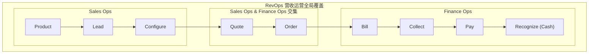

---
tags:
  - FAQ
---

# Billing FAQ

- Billing - 计费

| abbr.  | stand for                   | means              | desc                                                                         |
| ------ | --------------------------- | ------------------ | ---------------------------------------------------------------------------- |
| M2C    | Meter-to-Cash               | 从计量到现金       | 指从收集资源使用量到最终生成账单并完成收款的完整闭环流程                     |
| O2C    | Order-to-Cash               | 从订单到现金       | 指从接收客户订单到最终完成收款和财务记账的端到端流程                         |
| RevOps | Revenue Operations          | 营收运营           | 打破销售、市场和客户成功等部门壁垒，通过流程和数据优化实现收入增长最大化     |
| MRR    | Monthly Recurring Revenue   | 月度经常性收入     | 在订阅制 SaaS 模式下，每个月稳定且可预期的持续性收入指标                     |
| NRR    | Net Retention Rate          | 净收入留存率       | 衡量现有客户群体在特定周期内产生的经常性收入留存情况，包括续约、增购和流失   |
| ARR    | Annual Recurring Revenue    | 年度经常性收入     | 在订阅制 SaaS 模式下，每个公司一年内稳定且可预期的持续性收入指标             |
| CAC    | Customer Acquisition Cost   | 客户获取成本       | 获取一个新客户所需的总成本（市场营销费用 + 销售费用）                        |
| LTV    | Lifetime Value              | 客户生命周期总价值 | 一个客户在整个生命周期内为企业带来的总收入或利润                             |
| DSO    | Days Sales Outstanding      | 应收账款天数       | 企业从确认销售收入到最终收到现金的平均时间                                   |
| CRO    | Chief Revenue Officer       | 首席营收官         | 负责公司整体营收增长的高管                                                   |
| ARPU   | Average Revenue Per User    | 平均每用户收入     | 在特定周期内，平均每个用户或客户为企业贡献的收入金额（通常用于衡量用户价值） |
| ARPA   | Average Revenue Per Account | 平均每客户收入     | 在特定周期内，平均每个客户为企业贡献的收入金额（通常用于衡量客户价值）       |
| CUR    | Cost and Usage Report       | 成本和用量报告     | 企业对成本和用量进行详细分析的报告，用于监控和优化资源使用效率               |

| en                     | cn            | desc                                                          |
| ---------------------- | ------------- | ------------------------------------------------------------- |
| Usage                  | 用量 / 使用量 | 客户实际使用服务或资源的数量指标记录                          |
| Metering               | 计量          | 收集、验证、聚合 Usage 数据的过程                             |
| Price                  | 价格 / 定价   | 为特定服务或产品设定的单价及计价规则                          |
| Rate                   | 费率          | 按单位资源、时间、请求、Token 等维度收取的价格                 |
| Unit Price             | 单价          | 某个计费单位对应的价格，例如每 GB、每分钟、每 1K Token         |
| List Price             | 目录价 / 标价 | 公开价目表或产品目录中的标准价格，通常是折扣前的基准价格      |
| Catalog Price          | 目录价        | Catalog / Price Book 中维护的标准价格，可作为报价和折扣基准   |
| Standard Price         | 标准价        | 默认定价策略下的标准价格，通常不含客户级折扣                  |
| Original Price         | 原价          | 折扣、促销、优惠前展示或计算用的基准价格                      |
| Base Price             | 基础价 / 基准价 | 复杂定价中作为起点的价格，可叠加阶梯、用量、区域、套餐等规则 |
| MSRP                   | 建议零售价    | Manufacturer's Suggested Retail Price，厂商建议零售价格       |
| Retail Price           | 零售价        | 面向最终用户的销售价格，可能不同于目录价或合同价              |
| Sale Price             | 促销价 / 售价 | 当前对客户展示或销售的价格，可能已经包含促销折扣              |
| Discounted Price       | 折扣价        | 按折扣规则从目录价、原价或合同价扣减后的价格                  |
| Contract Price         | 合同价 / 协议价 | 合同、框架协议或客户等级约定的价格，优先级通常高于目录价     |
| Negotiated Price       | 议定价 / 谈判价 | 销售与客户谈判后确定的价格，常落入 quote / contract         |
| Net Price              | 净价          | 扣除折扣、优惠、返利、抵扣后的实际计费价格                    |
| Gross Price            | 毛价 / 含税前总价 | 折扣或税费处理前的价格口径，需结合上下文确认是否含税        |
| Effective Price        | 有效价 / 实际单价 | 把折扣、返利、赠送额度、阶梯价摊销后得到的真实单价          |
| Billing Price          | 计费价        | 计费引擎最终用于生成 charge / invoice line 的价格             |
| Charge Amount          | 计费金额      | 单条计费项按用量和价格计算出的金额                            |
| Invoice Amount         | 发票金额      | 进入账单或发票的金额，通常包含多个 charge 并可能含税费        |
| Payable Amount         | 应付金额      | 客户最终需要支付的金额，通常等于发票金额扣除抵扣和已付款      |
| Cost                   | 成本 / 费用   | 基于 Usage 和 Price 计算得出的金额                            |
| Billing                | 计费 / 出账   | 根据计算的费用周期性生成账单（Invoice）并向客户收取款项的过程 |
| Revenue Infrastructure | 营收基础设施  | 支撑 revenue lifecycle 的技术、数据、流程和团队等基础架构     |
| Churn Rate             | 流失率        | 在特定时期内，流失的客户占总客户数的比例                      |

- 流程
  - Usage -> Metering -> Price -> Cost -> Billing -> Invoicing -> Payment
- RevOps
  - Revenue Operations
  - 从产品使用转化为财务收入
- M2C
  - 先使用、后计量、再结账
- O2C
  - 客户买一个东西 -> 发货 -> 收钱。

## 价格名词关系

- 目录价 / 标价 / 标准价通常是 price book 或 catalog 里的公开基准价。
- 原价通常用于展示“优惠前价格”，不一定等于目录价；促销场景里可能只是对比口径。
- 合同价 / 协议价 / 议定价是客户级覆盖价，通常优先级高于目录价。
- 折扣价是应用折扣后的价格；净价是扣除折扣、优惠、返利、抵扣后的实际计费口径。
- 有效价适合分析真实成交单价，常用于把阶梯价、赠送额度、返利摊回每个单位。
- 计费价是 billing engine 最终落到 charge / invoice line 的价格，应明确是否含税、是否已折扣、币种和精度。

---

**参考**

- https://stripe.com/en-hk/resources/more/meter-to-cash-germany
- https://stripe.com/en-hk/resources/more
- [What are AWS Cost and Usage Reports?](https://docs.aws.amazon.com/cur/latest/userguide/what-is-cur.html)

## RevOps

- RevOps - Revenue Operations - 营收运营
- 一种将营销 (Marketing)、销售 (Sales)、客户成功 (Customer Success) 和财务 (Finance) 部门整合在一起的战略框架。
- 打破部门间的“孤岛效应”，让所有产生收入的团队在流程、数据和技术上保持一致。
- vs Sales Ops / 销售运营
  - Sales Ops - 销售运营
    - 范围较窄，主要关注如何让销售团队更高效（例如简化销售流程、分析销售数据）。它通常只出现在收入周期的中期。
  - RevOps - 营收运营
    - 覆盖整个收入旅程。从产品开发、市场营销、销售成交，一直到后续的客户续费和现金回收。它确保了从潜在客户接触到最终收款的端到端一致性。

---

- 整合数据： 将分散在各处的产品、账户、报价和发票数据集中管理。
- 集成系统： 将 CRM（客户关系管理）、ERP（企业资源计划）等工具打通。
- 自动化： 简化高频次的重复操作。
- 数据驱动决策： 利用分析结果发现新的增长点或效率瓶颈。

---

---

- https://www.salesforce.com/ap/sales/revenue-lifecycle-management/what-is-revenue-operations/

## 定价模型

- 固定费率 (Flat-rate)
- 阶梯定价 (Tiered)
- 按量计费 (Usage-based)
- 订阅制 (Subscription)
- 免费增值 (Freemium)
- Token 计费 (Pay-as-you-go / Token-based Billing)
- https://stripe.com/en-hk/resources/more/pricing-models-explained-types-of-pricing-models-and-when-to-use-them
