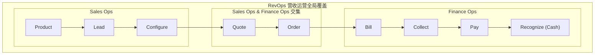

---
tags:
  - FAQ
---

# Billing FAQ

- Billing - 计费

| abbr.  | stand for                   | means              | desc                                                                         |
| ------ | --------------------------- | ------------------ | ---------------------------------------------------------------------------- |
| M2C    | Meter-to-Cash               | 从计量到现金       | 指从收集资源使用量到最终生成账单并完成收款的完整闭环流程                     |
| O2C    | Order-to-Cash               | 从订单到现金       | 指从接收客户订单到最终完成收款和财务记账的端到端流程                         |
| RevOps | Revenue Operations          | 营收运营           | 打破销售、市场和客户成功等部门壁垒，通过流程和数据优化实现收入增长最大化     |
| MRR    | Monthly Recurring Revenue   | 月度经常性收入     | 在订阅制 SaaS 模式下，每个月稳定且可预期的持续性收入指标                     |
| NRR    | Net Retention Rate          | 净收入留存率       | 衡量现有客户群体在特定周期内产生的经常性收入留存情况，包括续约、增购和流失   |
| ARR    | Annual Recurring Revenue    | 年度经常性收入     | 在订阅制 SaaS 模式下，每个公司一年内稳定且可预期的持续性收入指标             |
| CAC    | Customer Acquisition Cost   | 客户获取成本       | 获取一个新客户所需的总成本（市场营销费用 + 销售费用）                        |
| LTV    | Lifetime Value              | 客户生命周期总价值 | 一个客户在整个生命周期内为企业带来的总收入或利润                             |
| DSO    | Days Sales Outstanding      | 应收账款天数       | 企业从确认销售收入到最终收到现金的平均时间                                   |
| CRO    | Chief Revenue Officer       | 首席营收官         | 负责公司整体营收增长的高管                                                   |
| ARPU   | Average Revenue Per User    | 平均每用户收入     | 在特定周期内，平均每个用户或客户为企业贡献的收入金额（通常用于衡量用户价值） |
| ARPA   | Average Revenue Per Account | 平均每客户收入     | 在特定周期内，平均每个客户为企业贡献的收入金额（通常用于衡量客户价值）       |

| en                     | cn            | desc                                                          |
| ---------------------- | ------------- | ------------------------------------------------------------- |
| Usage                  | 用量 / 使用量 | 客户实际使用服务或资源的数量指标记录                          |
| Metering               | 计量          | 收集、验证、聚合 Usage 数据的过程                             |
| Price                  | 价格 / 定价   | 为特定服务或产品设定的单价及计价规则                          |
| Cost                   | 成本 / 费用   | 基于 Usage 和 Price 计算得出的金额                            |
| Billing                | 计费 / 出账   | 根据计算的费用周期性生成账单（Invoice）并向客户收取款项的过程 |
| Revenue Infrastructure | 营收基础设施  | 支撑 revenue lifecycle 的技术、数据、流程和团队等基础架构     |
| Churn Rate             | 流失率        | 在特定时期内，流失的客户占总客户数的比例                      |

- 流程
  - Usage -> Metering -> Price -> Cost -> Billing -> Invoicing -> Payment
- RevOps
  - Revenue Operations
  - 从产品使用转化为财务收入
- M2C
  - 先使用、后计量、再结账
- O2C
  - 客户买一个东西 -> 发货 -> 收钱。

---

**参考**

- https://stripe.com/en-hk/resources/more/meter-to-cash-germany
- https://stripe.com/en-hk/resources/more

## RevOps

- RevOps - Revenue Operations - 营收运营
- 一种将营销 (Marketing)、销售 (Sales)、客户成功 (Customer Success) 和财务 (Finance) 部门整合在一起的战略框架。
- 打破部门间的“孤岛效应”，让所有产生收入的团队在流程、数据和技术上保持一致。
- vs Sales Ops / 销售运营
  - Sales Ops - 销售运营
    - 范围较窄，主要关注如何让销售团队更高效（例如简化销售流程、分析销售数据）。它通常只出现在收入周期的中期。
  - RevOps - 营收运营
    - 覆盖整个收入旅程。从产品开发、市场营销、销售成交，一直到后续的客户续费和现金回收。它确保了从潜在客户接触到最终收款的端到端一致性。

---

- 整合数据： 将分散在各处的产品、账户、报价和发票数据集中管理。
- 集成系统： 将 CRM（客户关系管理）、ERP（企业资源计划）等工具打通。
- 自动化： 简化高频次的重复操作。
- 数据驱动决策： 利用分析结果发现新的增长点或效率瓶颈。

---

---

- https://www.salesforce.com/ap/sales/revenue-lifecycle-management/what-is-revenue-operations/

## 定价模型

- 固定费率 (Flat-rate)
- 阶梯定价 (Tiered)
- 按量计费 (Usage-based)
- 订阅制 (Subscription)
- 免费增值 (Freemium)
- Token 计费 (Pay-as-you-go / Token-based Billing)
- https://stripe.com/en-hk/resources/more/pricing-models-explained-types-of-pricing-models-and-when-to-use-them
