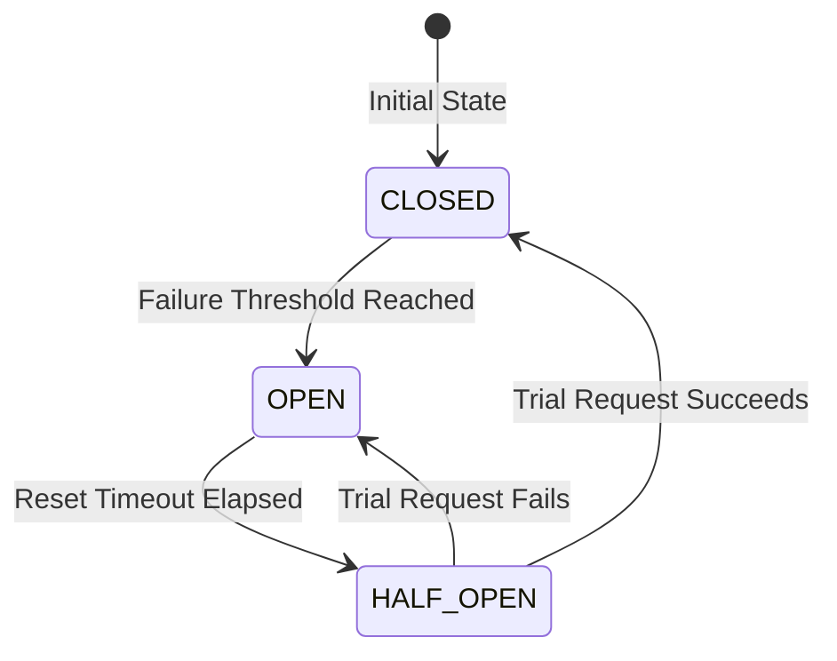

## 熔断

- Circuit breaker
- 保护调用方
- 应对故障的被动反应机制。
- 避免 级联故障（Cascading Failures）
- Closed -> Open -> Half-Open -> Closed
  - Open/打开 - 阻断请求
- HTTP 5XX
- ACA - Automated Canary Analysis
- Java: Resilience4j, Netflix Hystrix (目前已进入维护状态)
- .NET: Polly
- Golang
  - [failsafe-go/failsafe-go](https://github.com/failsafe-go/failsafe-go)
  - [sony/gobreaker](https://github.com/sony/gobreaker)
    - Apache-2.0, Go
    - 🌟 简单好理解，推荐阅读
    - age bucket 的 index
    - start - 当前窗口起始时间
    - generation - 跟踪 bucket 的切换, 避免旧请求写入新桶, 避免时间窗口过大导致统计数据污染
    - expiry 控制 Open -> Half-Open
    - requests <= maxRequests - HalfOpen - 可能出现 TooManyRequests
- NodeJS/JS
  - [nodeshift/opossum](https://github.com/nodeshift/opossum)
    - Apache-2.0, JS
- https://github.com/netflix/hystrix/wiki/how-it-works
- https://learn.microsoft.com/en-us/azure/architecture/patterns/bulkhead
- https://github.com/spinnaker/kayenta
  - Deployment, Measurement, Judging, Scoring & Decision
  - Mann-Whitney U test
- https://github.com/argoproj/argo-rollouts

| conf              | for          | mean                                                                                                           |
| ----------------- | ------------ | -------------------------------------------------------------------------------------------------------------- |
| failureThreshold  | 失败阈值     | 触发熔断的条件。通常以百分比表示（例如，失败率超过 50%）。                                                     |
| slidingWindowSize | 滑动窗口大小 | 用于计算失败率的样本数量。例如，窗口大小为 100，意味着熔断器会基于最近的 100 次请求来计算失败率。              |
| minimumRequests   | 最小请求数   | 在滑动窗口内，必须达到这个请求数，才会开始计算失败率。这可以防止在流量很低时，因为一两次偶然的失败就触发熔断。 |
| resetTimeout      | 重置超时时间 | 在 OPEN 状态下停留的时间（毫秒），之后会切换到 HALF-OPEN。                                                     |
| fallback          | 降级函数     | 当请求被熔断时执行的函数。可以返回一个缓存的、默认的或者简化的结果。                                           |
| halfOpenTimeout   | 半开请求超时 | 在 HALF-OPEN 状态下，试探请求的超时时间。如果试探请求本身卡住了，也应算作失败。                                |

- slide bucket
  - 滑动窗口
  - 每个窗口独立统计
