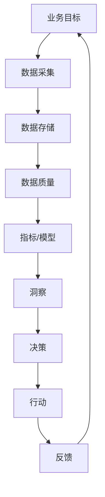
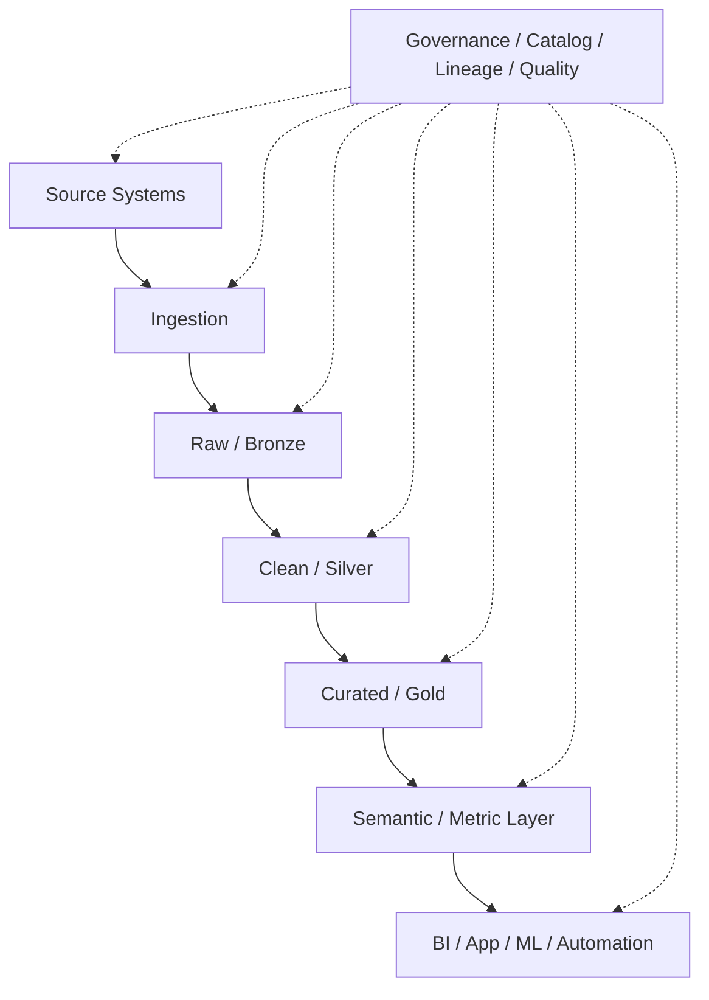

# 数据驱动

- Data-driven - 数据驱动。
- 目标：让产品、运营、研发、风控、财务等决策基于可验证的数据，而不是只依赖经验、直觉或层级意见。
- 数据驱动不是“有很多报表”，而是形成从数据采集、治理、分析、实验、决策到行动反馈的闭环。
- 关键问题：数据是否可信、是否能被找到、是否能被理解、是否能推动行动、是否能被持续改进。



## 核心含义

| 层次 | 说明 | 例子 |
| --- | --- | --- |
| Data-informed | 数据辅助判断，人仍保留上下文决策 | 看 dashboard 后决定是否调整策略 |
| Data-driven | 决策流程明确依赖数据和指标 | A/B test 胜出方案自动进入灰度 |
| Data-powered | 产品能力本身由数据和模型驱动 | 推荐系统、风控评分、动态定价 |
| Data-native | 组织、流程、平台都围绕数据资产设计 | Data product、Data Mesh、Self-service Analytics |

:::tip

更准确的目标通常是 **data-informed decision making**：数据提供证据，业务上下文负责解释，避免“指标正确但决策错误”。

:::

## 适用范围

| 领域 | 数据驱动方式 |
| --- | --- |
| 产品 | 漏斗、留存、转化、A/B test、用户行为分析 |
| 运营 | 活动效果、用户分层、触达策略、渠道 ROI |
| 工程 | SLO、错误率、延迟、容量、发布质量、研发效能 |
| 风控 | 异常检测、评分卡、规则命中、模型监控 |
| 财务 | 收入、成本、毛利、预算、账单对账 |
| 销售 | Pipeline、转化率、客单价、续费、流失预测 |
| 客服 | 工单分类、响应时间、满意度、问题根因 |
| AI/ML | 特征、训练数据、评估集、模型表现、漂移监控 |

## 数据驱动闭环

| 阶段 | 关键问题 | 产物 |
| --- | --- | --- |
| Define | 要优化什么业务目标？ | North Star Metric、KPI、OKR |
| Instrument | 需要采集哪些数据？ | 埋点、日志、事件、CDC |
| Collect | 数据如何进入平台？ | Batch/Stream pipeline、queue、connector |
| Govern | 谁拥有数据？质量如何？ | owner、catalog、lineage、quality rule |
| Model | 数据如何被抽象成指标？ | metric layer、semantic model、feature table |
| Analyze | 如何发现问题和机会？ | dashboard、ad-hoc query、notebook、report |
| Decide | 如何把洞察转成决策？ | experiment、review、rule、policy |
| Act | 如何执行并记录动作？ | workflow、automation、campaign、release |
| Learn | 如何验证结果并迭代？ | post-analysis、feedback、retrospective |

## 数据架构层次



| 层 | 说明 | 关注点 |
| --- | --- | --- |
| Source | 业务系统、日志、事件、第三方数据 | 数据所有权、采集边界、变更影响 |
| Ingestion | 批处理、流式、CDC、API 拉取 | 延迟、可靠性、幂等、回放 |
| Raw / Bronze | 原始落地层 | 保真、可追溯、可重放 |
| Clean / Silver | 清洗、去重、标准化、关联 | 数据质量、实体一致性、主数据 |
| Curated / Gold | 面向业务的汇总、宽表、数据集市 | 指标一致、查询性能、消费友好 |
| Semantic / Metric Layer | 统一指标定义和语义模型 | 避免同名指标多套口径 |
| Consumption | BI、报表、应用、实验、ML、自动化 | 可用性、权限、行动闭环 |

## 数据类型

| 类型 | 例子 | 设计关注点 |
| --- | --- | --- |
| Transactional Data | 订单、支付、账务、库存 | 强一致、审计、不可丢 |
| Event Data | 点击、曝光、状态变化、领域事件 | schema、顺序、去重、session 化 |
| Log Data | 应用日志、访问日志、错误日志 | 高吞吐、检索、保留周期 |
| Metric Data | QPS、延迟、错误率、资源使用 | 聚合、采样、label 基数 |
| Master Data | 用户、客户、商品、组织 | 唯一性、归并、主数据治理 |
| Reference Data | 国家、币种、税率、枚举 | 版本、有效期、变更通知 |
| Document Data | 文档、合同、客服文本 | 非结构化、检索、权限 |
| Feature Data | ML 特征、embedding、画像 | 训练/服务一致性、时点正确性 |

## 数据采集

| 方式 | 说明 | 优点 | 风险 |
| --- | --- | --- | --- |
| Application Event | 应用主动上报业务事件 | 语义清晰 | 埋点缺失、重复、客户端作弊 |
| Server Log | 从服务端日志提取 | 覆盖面广、低侵入 | 语义弱、格式漂移 |
| CDC | 从数据库变更日志同步 | 接近事实源、低侵入业务代码 | schema 变更、删除语义、事务边界 |
| Batch Extract | 定时导出/同步 | 简单稳定 | 延迟高、全量成本大 |
| API Pull | 调第三方 API 拉取 | 易集成 SaaS | rate limit、分页、补偿复杂 |
| Webhook | 外部系统推送事件 | 实时、低轮询成本 | 签名验证、重试、乱序 |
| Manual Upload | CSV/Excel 上传 | 适合业务补充 | 质量不稳定、审计困难 |

设计建议：

- 所有事件必须有 `event_id`、`event_time`、`source`、`schema_version`。
- 客户端事件要和服务端事实分开，不要直接作为账务或风控事实。
- CDC 适合捕获变化，但领域语义可能不足，必要时配合 domain event。
- 采集链路要支持重放、补数、去重和延迟监控。

## 指标体系

指标是数据驱动的语言。没有统一指标口径，数据越多争论越多。

| 层次 | 说明 | 例子 |
| --- | --- | --- |
| North Star Metric | 长期核心价值指标 | 有效活跃用户、成功完成任务数 |
| KPI | 业务目标拆解指标 | 收入、留存、转化率、毛利 |
| Input Metric | 可行动的输入指标 | 新用户激活率、页面加载时间 |
| Output Metric | 结果指标 | GMV、MRR、利润 |
| Guardrail Metric | 防止局部优化伤害整体 | 错误率、退款率、投诉率 |
| Diagnostic Metric | 排障和解释指标 | 渠道、版本、地域、设备分布 |

### 指标定义模板

| 字段 | 说明 |
| --- | --- |
| Name | 指标名 |
| Owner | 业务/数据 owner |
| Definition | 业务定义 |
| Formula | 计算公式 |
| Grain | 粒度，例如 user/day、order、session |
| Dimensions | 可切分维度 |
| Filter | 过滤条件 |
| Time Window | 时间窗口和时区 |
| Freshness | 更新频率和延迟 |
| Source | 数据来源 |
| Caveat | 已知限制 |

## 决策模型

| 模型 | 说明 | 适合 |
| --- | --- | --- |
| Dashboard Review | 固定节奏看核心指标 | 经营复盘、SLO 复盘 |
| Ad-hoc Analysis | 临时分析问题 | 找根因、回答业务问题 |
| Cohort Analysis | 按用户/时间分组观察变化 | 留存、生命周期 |
| Funnel Analysis | 观察路径转化 | 注册、下单、支付 |
| A/B Test | 随机对照实验 | 产品改版、策略优化 |
| Causal Inference | 估计因果影响 | 无法随机实验的政策/运营问题 |
| Forecasting | 预测未来趋势 | 容量、预算、库存 |
| Anomaly Detection | 自动发现异常 | 监控、风控、业务告警 |
| Optimization | 根据目标函数自动优化 | 出价、调度、推荐 |

## 数据质量

| 维度 | 说明 | 检查例子 |
| --- | --- | --- |
| Accuracy | 是否准确反映真实世界 | 金额与账单系统核对 |
| Completeness | 是否完整 | 必填字段缺失率 |
| Consistency | 不同系统口径是否一致 | 用户状态跨表一致 |
| Timeliness | 是否及时 | 数据延迟、freshness SLA |
| Validity | 是否符合格式和规则 | 枚举、范围、正则 |
| Uniqueness | 是否重复 | 主键重复、事件重复 |
| Integrity | 关系是否完整 | 外键、引用、父子关系 |
| Lineage | 是否可追溯 | 上游表、转换逻辑、负责人 |

常见质量规则：

```sql
-- 示例：检查订单金额不能为负
select count(*) as invalid_count
from orders
where amount < 0;
```

```sql
-- 示例：检查每日事件延迟
select max(event_time) as latest_event_time
from events
where dt = current_date;
```

## 数据治理

数据治理关注数据的质量、安全、可用性、责任和合规。

| 机制 | 说明 |
| --- | --- |
| Data Owner | 对数据语义、质量和使用负责 |
| Data Steward | 日常维护数据定义、质量和流程 |
| Data Catalog | 数据资产可发现、可搜索 |
| Metadata | 表、字段、指标、owner、描述、标签 |
| Lineage | 数据从源头到消费的链路 |
| Access Control | RBAC/ABAC、最小权限 |
| Classification | PII、敏感数据、公开数据分级 |
| Retention | 保留周期、归档、删除 |
| Audit | 查询、导出、权限变更审计 |
| Policy | 命名、建模、质量、发布标准 |

## Data Product

Data Mesh 强调把数据当产品，而不是中央平台的副产物。

| 特征 | 说明 |
| --- | --- |
| Discoverable | 能在 catalog 中被找到 |
| Addressable | 有稳定访问路径/API/table/topic |
| Trustworthy | 有质量指标、SLA、owner |
| Self-describing | 有 schema、语义、样例、文档 |
| Interoperable | 遵守全局标准和通用格式 |
| Secure | 有权限、脱敏、审计 |
| Valuable | 面向明确消费场景 |

Data Product 常见内容：

- 数据集或 stream。
- schema 和语义说明。
- owner / oncall / support channel。
- SLA：freshness、availability、quality。
- 示例查询和使用限制。
- 变更日志和兼容策略。

## Data Mesh vs Central Data Platform

| 维度 | Central Data Platform | Data Mesh |
| --- | --- | --- |
| 所有权 | 中央数据团队 | 领域团队拥有数据产品 |
| 架构 | 集中湖仓/数仓 | 分布式数据产品生态 |
| 优点 | 标准统一、易集中治理 | 贴近业务语义、可扩展组织边界 |
| 风险 | 中央团队成为瓶颈，领域语义丢失 | 标准不统一、治理成本高 |
| 适合 | 规模较小、领域简单、强管控 | 多领域、多团队、多消费场景 |

实践上常是混合模式：

- 平台团队提供自服务基础设施、治理、catalog、质量、权限。
- 领域团队负责数据产品语义、质量和生命周期。
- 全局标准约束命名、权限、安全、互操作格式。

## 架构模式

### Warehouse / Lake / Lakehouse

| 架构 | 说明 | 适合 |
| --- | --- | --- |
| Data Warehouse | 面向结构化分析和 BI 的数仓 | 报表、财务、强治理指标 |
| Data Lake | 存放原始、多格式数据 | 大规模、低成本、探索式分析 |
| Lakehouse | 结合 lake 的开放存储和 warehouse 的治理/性能 | BI + ML + streaming/batch 统一 |
| Data Mart | 面向部门/主题的数据集市 | 业务线自助分析 |
| Feature Store | 管理 ML 特征 | 训练/在线推理一致性 |
| Metric Layer | 统一指标定义 | BI、报表、实验、应用复用 |

### Medallion Architecture

| 层 | 说明 |
| --- | --- |
| Bronze | 原始数据，尽量保留 source as-is，支持审计和重放 |
| Silver | 清洗、去重、标准化、实体对齐后的数据 |
| Gold | 面向业务消费的汇总、宽表、数据集市、特征 |

优点：

- 分层清晰，便于质量递进。
- 支持从原始数据重建下游。
- 给不同团队提供不同成熟度的数据入口。

风险：

- 层级命名统一不等于语义统一。
- Gold 层容易膨胀成大量无人维护的派生表。
- 如果没有 owner 和质量 SLA，分层只是目录结构。

### Lambda / Kappa

| 架构 | 说明 | 风险 |
| --- | --- | --- |
| Lambda | batch layer + speed layer 同时服务 | 两套逻辑，维护复杂 |
| Kappa | 以 stream 为核心，通过回放重算 | 对 stream 保留和重处理要求高 |

## 数据建模

| 模型 | 说明 | 适合 |
| --- | --- | --- |
| 3NF | 规范化关系模型 | 核心实体、强一致 OLTP/ODS |
| Star Schema | 事实表 + 维度表 | BI、OLAP、报表 |
| Data Vault | Hub/Link/Satellite | 多源集成、历史追踪 |
| Wide Table | 预 join 宽表 | 查询简单、业务分析 |
| Event Model | 事件流和行为序列 | 用户行为、审计、实时分析 |
| Entity-Centric | 围绕用户/客户/商品构建实体视图 | 画像、推荐、CRM |
| Feature Model | 特征表、特征视图 | ML 训练和推理 |

## 隐私与安全

| 问题 | 设计建议 |
| --- | --- |
| PII | 分类、脱敏、最小化采集 |
| Consent | 记录用户授权和数据用途 |
| Purpose Limitation | 数据使用目的要可审计 |
| Data Export | 导出审批、审计、水印 |
| Right to Delete | 支持删除、匿名化或隔离 |
| Cross-border | 跨境和地域合规策略 |
| Secrets | 不把 token/password 放进日志和数据集 |
| Row/Column Security | 行列级权限、动态脱敏 |

## 可观测性

数据平台需要自己的可观测性，而不仅是任务成功/失败。

| 指标 | 说明 |
| --- | --- |
| Freshness | 数据最新时间和延迟 |
| Volume | 行数、事件数、文件大小 |
| Quality Failure | 质量规则失败数 |
| Pipeline Duration | 任务耗时 |
| Pipeline Failure Rate | 任务失败率 |
| Consumer Usage | 数据集被谁使用、使用频率 |
| Query Cost | 查询成本和资源消耗 |
| Lineage Impact | 上游变更影响哪些下游 |
| SLA Breach | 数据产品 SLA 违约 |

## 组织与流程

| 角色 | 职责 |
| --- | --- |
| Business Owner | 定义业务目标和指标意义 |
| Data Owner | 对领域数据资产负责 |
| Data Steward | 维护数据定义、质量、治理流程 |
| Data Engineer | 采集、处理、建模、平台化 |
| Analytics Engineer | 指标、语义层、BI 数据模型 |
| Data Analyst | 分析、洞察、报告 |
| Data Scientist | 建模、预测、实验、因果分析 |
| Platform Engineer | 自服务平台、权限、运维 |
| Security / Compliance | 安全、隐私、合规 |

## 常见反模式

| 反模式 | 问题 |
| --- | --- |
| Dashboard-driven | 报表很多，但没有决策和行动闭环 |
| Vanity Metric | 指标好看但不能指导行动 |
| Metric Zoo | 同一个指标多套口径，互相打架 |
| Data Swamp | 数据湖没有 catalog、owner、质量，最终不可用 |
| Central Bottleneck | 所有需求都排队等中央数据团队 |
| Excel Shadow System | 关键决策依赖个人表格，无法治理 |
| Client Event as Truth | 把客户端埋点当作财务/账务事实 |
| No Lineage | 上游改动影响下游但无人知道 |
| No Feedback Loop | 分析报告产出后没人验证效果 |
| Over-automation | 指标未验证就自动决策，放大错误 |

## 设计检查清单

- 这个数据产品/指标服务哪个业务目标？
- owner 是谁？出现质量问题谁处理？
- 数据来源是否可信？能否追溯到事实源？
- schema 变更如何通知下游？
- 指标定义是否唯一？是否有时区、窗口、过滤条件？
- 数据 freshness 和质量 SLA 是什么？
- 是否区分 raw、clean、curated 数据？
- 是否支持重放、补数、回滚？
- 是否有 catalog、lineage、权限和审计？
- 是否包含 PII 或敏感数据？是否需要脱敏？
- 消费者是谁？他们如何反馈数据问题？
- 分析结果如何进入决策和行动流程？

## FAQ

### 数据驱动是不是等于所有决策都自动化？

不是。自动化只是数据驱动的一种形态。很多重要决策需要数据、业务上下文、风险判断和伦理/合规约束共同参与。

### 为什么有 dashboard 仍然不算数据驱动？

因为 dashboard 只是展示层。如果指标口径不统一、数据不可信、没人基于它行动，或者行动后没有反馈验证，就只是 reporting，不是数据驱动闭环。

### Raw data 是否应该直接给业务用户用？

通常不建议。Raw data 适合审计、重放和工程排障；业务分析更适合使用经过清洗、标准化和语义建模的数据产品。

### 数据质量应该在什么时候做？

越早越好，但不是只在入口做。常见做法是在 ingestion、Silver 清洗、Gold 指标输出、消费侧都设置不同层级的质量检查。

### Data Mesh 是否意味着不要中央数据平台？

不是。Data Mesh 通常仍需要中央平台能力，只是中央团队提供自服务基础设施和治理标准，领域团队拥有数据产品和语义。

### 指标口径争议怎么解决？

需要明确 owner、指标定义模板、review 流程和语义层。不要让每个 dashboard 自己重新实现指标公式。

## 相关

- [事件驱动](./design-event-driven.md)
- [Webhook](./design-webhook.md)
- [Data Mesh - Martin Fowler](https://martinfowler.com/articles/data-monolith-to-mesh.html)
- [Medallion Architecture - Databricks](https://www.databricks.com/glossary/medallion-architecture)
- [Data Governance - IBM](https://www.ibm.com/topics/data-governance)
- [Database architecture design - Microsoft Azure](https://learn.microsoft.com/en-us/azure/architecture/data-guide/)
- [Data-driven decision making - Tableau](https://www.tableau.com/learn/articles/data-driven-decision-making)
