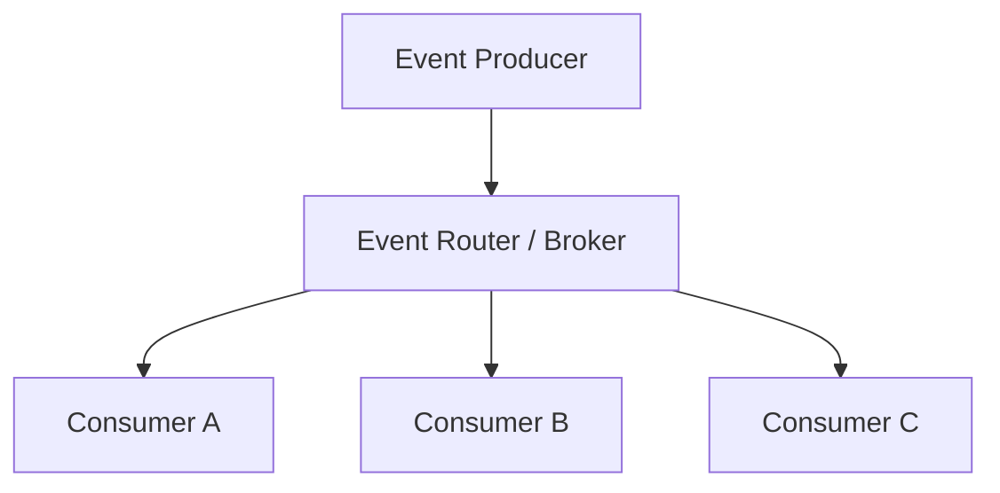
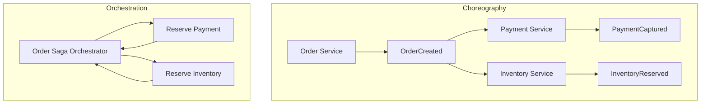
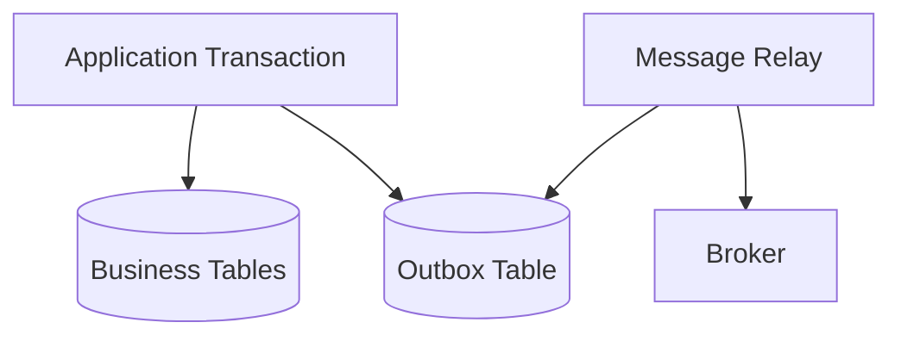
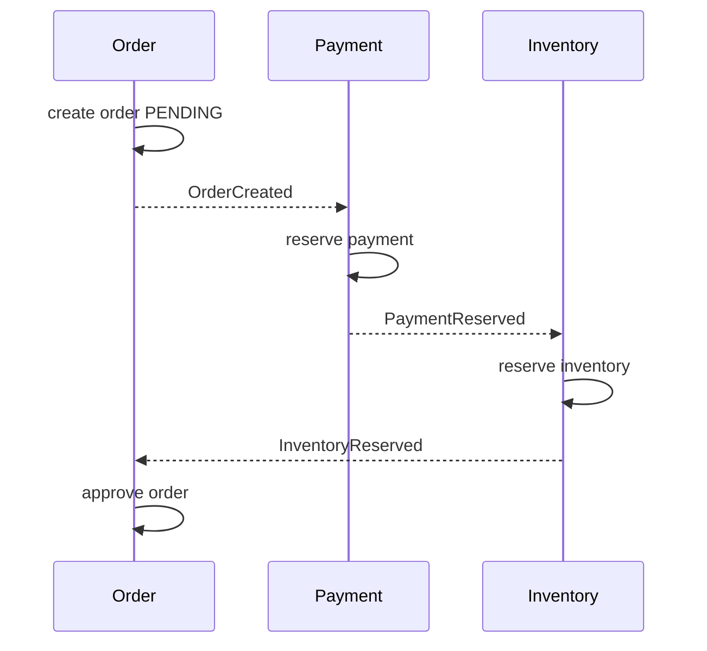

# 事件驱动

- Event-driven architecture - EDA - 事件驱动架构。
- 核心思想：系统通过“事件”表达状态变化，生产者发布事件，消费者异步响应事件。
- 适合：解耦、多消费者、实时响应、异步工作流、审计、数据同步、流处理。
- 不适合：简单同步 request/response、强一致跨服务事务、团队缺乏异步系统运维经验的场景。

## 基本概念

| 概念 | 说明 |
| --- | --- |
| Event | 已发生的事实，例如 `OrderCreated`、`MessageSent` |
| Producer | 事件生产者，只负责发布事件，不关心谁消费 |
| Consumer | 事件消费者，订阅并处理事件 |
| Channel | 事件通道，例如 topic、queue、stream、event bus |
| Broker / Router | 事件路由与分发组件，例如 Kafka、NATS、RabbitMQ、EventBridge |
| Handler | 事件处理逻辑，通常要求幂等 |
| Subscription | 订阅关系，决定哪些消费者收到哪些事件 |
| Offset / Cursor | 消费进度，常见于 event stream |
| DLQ | Dead Letter Queue，处理失败事件的隔离队列 |

:::tip

事件应该命名为“已经发生的事实”，通常用过去式：`UserRegistered`、`PaymentCaptured`。命令则表达“希望发生的动作”：`CreateOrder`、`CapturePayment`。

:::

## Event vs Command vs Message

| 类型 | 含义 | 方向 | 例子 |
| --- | --- | --- | --- |
| Event | 已发生的事实 | 1 对多广播，生产者不指定处理者 | `OrderCreated` |
| Command | 要求某个组件执行动作 | 通常 1 对 1，有明确处理者 | `ReserveInventory` |
| Message | 通用消息载体 | 可承载 event 或 command | broker 中的一条记录 |

## 基本结构

- Producer 与 Consumer 解耦。
- Consumer 之间也解耦，可以独立部署、扩缩容、失败恢复。
- Broker/Router 作为缓冲和路由层，提供过滤、持久化、重试、DLQ、回放等能力。

## 常见模式

| Pattern | 说明 | 适用场景 |
| --- | --- | --- |
| Pub/Sub | 发布到 topic/event bus，多个订阅者都能收到 | 多系统响应同一事件 |
| Queue / Competing Consumers | 多个消费者实例竞争处理同一消息，每条通常只处理一次 | 后台任务、削峰填谷 |
| Event Streaming | 事件写入持久化日志，消费者按 offset 读取，可回放 | 审计、同步、流处理、重建状态 |
| Event Processing | 单个事件触发一个动作 | 发通知、更新缓存 |
| Stream Processing | 对事件流做窗口、聚合、join、模式识别 | IoT、风控、实时指标 |
| Event Sourcing | 状态由事件序列推导，事件是事实源 | 审计强、状态可回放的领域 |
| CQRS | Command 写模型与 Query 读模型分离 | 读写形态差异大、复杂查询 |
| Saga | 跨服务长事务，由本地事务和补偿动作组成 | 订单、支付、库存等分布式业务流程 |
| Transactional Outbox | 业务写库和事件发布原子化 | 避免 DB 成功但事件丢失 |

## Pub/Sub vs Event Stream

| 维度 | Pub/Sub | Event Stream |
| --- | --- | --- |
| 存储 | 通常事件投递后不长期保存 | 事件写入持久日志 |
| 新消费者 | 通常看不到历史事件 | 可从任意 offset 开始消费 |
| 顺序 | 依赖 broker 和 topic 设计 | 通常分区内有序 |
| 回放 | 通常不支持或有限 | 支持回放、重处理 |
| 典型系统 | SNS、EventBridge、RabbitMQ topic | Kafka、Pulsar、NATS JetStream、Event Hubs |
| 适合 | 通知、触发、集成 | 审计、同步、流计算、事件溯源 |

## Broker topology vs Mediator topology

| 拓扑 | 说明 | 优点 | 风险 |
| --- | --- | --- | --- |
| Broker / Choreography | 组件广播事件，其他组件自行响应 | 解耦强、扩展容易、动态 | 流程分散，排障困难，一致性和补偿复杂 |
| Mediator / Orchestration | 中心协调者控制流程并发送命令 | 流程清晰、错误处理集中、易恢复 | 协调者可能成为耦合点、瓶颈或单点 |

选择建议：

- 简单事件响应、多消费者通知：优先 Choreography。
- 有明确流程、补偿、超时、人工介入：优先 Orchestration。
- 复杂业务常混合使用：领域事件广播 + 关键流程编排。

## 事件负载设计

| 方式 | 说明 | 优点 | 缺点 |
| --- | --- | --- | --- |
| Fat Event | 事件包含消费者需要的大部分字段 | 消费者无需回查，低延迟 | payload 大，schema 演进复杂，可能复制敏感数据 |
| Thin Event | 事件只包含 ID 和少量 metadata | 契约稳定，数据源单一 | 消费者需要回查，性能和可用性依赖源服务 |
| Snapshot Event | 包含某一刻的状态快照 | 适合同步读模型 | 需要处理旧快照覆盖新状态 |
| Delta Event | 只包含变化字段 | payload 小 | 消费者需要已有状态，乱序时处理复杂 |

常见字段：

| 字段 | 说明 |
| --- | --- |
| `event_id` | 全局唯一 ID，用于幂等和追踪 |
| `event_type` | 事件类型，例如 `OrderCreated` |
| `event_version` | schema 版本 |
| `occurred_at` | 业务发生时间 |
| `published_at` | 发布时间 |
| `producer` | 生产者服务 |
| `aggregate_type` | 聚合类型，例如 `Order` |
| `aggregate_id` | 聚合 ID |
| `partition_key` | 分区键，通常影响顺序 |
| `correlation_id` | 业务链路关联 ID |
| `causation_id` | 触发当前事件的上游消息 ID |
| `traceparent` | OpenTelemetry trace context |
| `payload` | 业务数据 |

## 顺序与分区

- 全局有序成本很高，通常只追求“聚合内有序”。
- Kafka/Pulsar/Event Hubs 等系统通常保证 partition 内有序，不保证跨 partition 全局有序。
- 分区键常用 `aggregate_id`、`tenant_id`、`conversation_id`、`order_id`。
- 如果同一聚合事件可能由多个实例发布，要确保序号或版本单调递增。

| 需求 | 设计 |
| --- | --- |
| 订单状态流有序 | 用 `order_id` 作为 partition key |
| 用户事件均衡扩散 | 用 `user_id` hash 分区 |
| 高吞吐且可乱序 | 使用更细粒度 key 或随机 key |
| 消费端并行 | 多 partition + consumer group |

## 投递语义

| 语义 | 说明 | 实践 |
| --- | --- | --- |
| at-most-once | 最多一次，可能丢 | 非关键通知、可容忍丢失的 telemetry |
| at-least-once | 至少一次，可能重复 | 最常见；消费者必须幂等 |
| exactly-once | 精确一次 | 通常限制多、成本高；更多是 broker 内部或特定拓扑中的 exactly-once |

工程上常追求：

- 传输层 at-least-once。
- 消费者幂等。
- 业务效果 exactly-once。

幂等策略：

- 消费记录表：记录已处理 `event_id`。
- 业务唯一约束：例如 `payment_id` 唯一。
- 状态机防倒退：只允许合法状态转换。
- 版本号/CAS：`version` 必须递增。

## Transactional Outbox

问题：服务需要在一个业务事务中同时更新数据库并发布事件。如果 DB commit 成功但进程在发事件前崩溃，就会丢事件；如果先发事件再回滚 DB，就会发布不存在的事实。

做法：

1. 在同一个 DB transaction 中写业务表和 outbox 表。
2. 独立 relay 进程读取 outbox。
3. relay 发布到 broker。
4. 发布成功后标记 outbox 已发送或删除。

注意：

- relay 可能重复发布，consumer 仍需幂等。
- outbox 表需要清理、分区或归档。
- 需要保证同一 aggregate 的事件发布顺序。
- relay 可用 polling publisher 或 transaction log tailing 实现。

## Saga

Saga 用于跨服务长事务：每一步是本地事务，失败时执行补偿动作。

| 类型 | 说明 | 适合 |
| --- | --- | --- |
| Choreography Saga | 每个服务发布事件，其他服务响应 | 流程简单、参与者少 |
| Orchestration Saga | 编排器发 command 并等待结果 | 流程复杂、需要补偿/超时/可观测 |

示例：

Saga 的核心不是“自动回滚”，而是“显式补偿”。例如支付已预授权但库存不足，则执行 `CancelPaymentAuthorization`。

## 错误处理

| 机制 | 说明 |
| --- | --- |
| Retry | 临时失败重试，注意指数退避和最大次数 |
| DLQ | 多次失败后进入死信队列，人工或专门流程处理 |
| Poison Message | 永远处理失败的坏消息，要隔离，避免阻塞队列 |
| Timeout | Saga 或 command 等待超时后进入补偿或人工状态 |
| Backpressure | 消费慢时限流、扩容、降级或暂停生产 |
| Replay | 修复 bug 后重放历史事件，要求 handler 可重入和幂等 |

重试注意：

- 不要无限重试压垮下游。
- 区分可重试错误和不可重试错误。
- 重试可能打乱顺序；严格有序场景需要单独设计。
- 失败事件要带上错误原因、重试次数和最后失败时间。

## Schema 演进

事件一旦发布，历史事件可能长期存在，因此 schema 演进比同步 API 更敏感。

建议：

- 事件增加字段优先，避免删除/改名。
- Consumer 忽略未知字段。
- 字段语义不要悄悄改变。
- 使用 `event_version` 或 schema registry。
- 新老事件并行一段时间，避免同时升级所有消费者。
- 对长期保留的 stream，准备 upcaster / migration 逻辑。

## 可观测性

EDA 的链路不再是单个同步调用栈，需要显式携带上下文。

| 字段 | 用途 |
| --- | --- |
| `trace_id` / `traceparent` | 分布式追踪 |
| `correlation_id` | 同一业务流程关联 |
| `causation_id` | 当前事件由哪个事件/命令触发 |
| `event_id` | 幂等、排障、审计 |
| `consumer_group` | 消费组定位 |
| `partition` / `offset` | stream 排障和回放 |

常见指标：

- publish rate / consume rate
- consumer lag
- processing latency
- end-to-end latency
- retry count
- DLQ count
- handler error rate
- outbox pending count
- event payload size

## 安全与治理

- 事件可能被多个消费者看到，不要把敏感信息随意放入 payload。
- 对 event bus/topic 设置 publish/subscribe 权限。
- 加密传输与存储。
- 明确数据保留周期和删除策略。
- 记录 schema owner、事件 owner、消费者清单。
- 对跨边界事件定义稳定契约，不要泄漏内部表结构。

## 适用场景

- 多个子系统需要响应同一事实。
- 需要近实时处理但不要求同步完成。
- 需要削峰填谷、异步解耦。
- IoT、日志、埋点、监控、风控等高吞吐事件流。
- 需要审计、回放、重建读模型。
- 异构系统集成，例如 SaaS、内部系统、第三方 webhook。

## 不适用场景

- 简单 CRUD 同步调用已经足够。
- 强一致事务要求高，无法接受最终一致窗口。
- 团队缺乏 broker、重试、DLQ、可观测性运维能力。
- 业务流程很短且必须立即返回最终结果。
- 事件量很小，但引入 EDA 后复杂度远高于收益。

## 优点

- Decoupling - 解耦。
- Scalability - 生产者/消费者可独立扩缩容。
- Resilience - 消费者失败不必拖垮生产者。
- Elastic buffer - broker 可削峰填谷。
- Real-time workflows - 近实时工作流。
- Auditability - 事件天然适合审计和追溯。
- Extensibility - 新消费者可在不改生产者的情况下接入。

## 挑战

- Eventual consistency - 最终一致，需要业务接受短暂不一致。
- Ordering - 顺序通常只在分区内保证。
- Duplicate delivery - 重复投递常见，必须幂等。
- Debugging - 链路分散，排障依赖 trace/correlation。
- Schema evolution - 事件契约长期存在，演进困难。
- Error handling - 异步错误需要 DLQ、补偿、人工流程。
- Operational complexity - broker、lag、重试、回放都需要运维能力。

## 常见坑

- 把事件当 RPC，用异步消息强行等待同步结果。
- 事件 payload 泄漏敏感数据或内部表结构。
- 没有 `event_id`，消费者无法幂等。
- 没有 `correlation_id`，跨服务排障困难。
- DB 写成功但事件发布失败，没有 outbox。
- 消费者直接假设事件全局有序。
- 重试没有退避和上限，导致故障放大。
- DLQ 无人处理，最终变成数据黑洞。
- 事件粒度过细导致风暴，过粗又导致无关消费者被唤醒。

## FAQ

### 事件应该是 Fat Event 还是 Thin Event？

看消费者需求：

- 消费者多、对延迟敏感、源服务不适合频繁回查：偏 Fat Event。
- 数据敏感、契约要稳定、源数据一致性重要：偏 Thin Event。
- 常见折中：事件包含 ID、关键展示字段、版本号和必要上下文，敏感/大字段回查。

### EDA 是否等于 Event Sourcing？

不是。

- EDA 是架构风格，强调组件通过事件异步协作。
- Event Sourcing 是状态持久化模式，强调事件是事实源，当前状态由事件回放得到。
- 可以使用 EDA 而不做 Event Sourcing；也可以在局部领域使用 Event Sourcing。

### 事件是否必须可靠投递？

取决于业务：

- 订单、支付、账务、库存事件通常必须可靠。
- 埋点、在线状态、typing、非关键通知可以允许丢失或采样。
- 可靠投递通常意味着持久化、ACK、重试、DLQ、幂等和补偿。

### 如何选择 topic？

常见维度：

- 按领域：`order-events`、`payment-events`。
- 按事件类型：`order-created`、`order-cancelled`。
- 按用途：`integration-events`、`audit-events`。
- 按租户/地域分片：高隔离或合规场景。

避免 topic 过细导致治理困难，也避免所有事件都塞进一个 topic 导致权限、保留、消费策略无法区分。

## 相关

- [Webhook](./design-webhook.md)
- [IM](./design-im.md)
- [KEDA](../../devops/kubernetes/platform/keda.md)
  - Kubernetes-based Event Driven Autoscaling
- [Event-driven architecture style](https://learn.microsoft.com/en-us/azure/architecture/guide/architecture-styles/event-driven)
- [What is an Event-Driven Architecture?](https://aws.amazon.com/event-driven-architecture/)
- [Pattern: Saga](https://microservices.io/patterns/data/saga.html)
- [Pattern: Transactional outbox](https://microservices.io/patterns/data/transactional-outbox.html)
- [Event-driven architecture](https://en.wikipedia.org/wiki/Event-driven_architecture)
- <https://spring.io/event-driven/>
- <https://blog.hubspot.com/website/event-driven-architecture>
- <https://www.tibco.com/reference-center/what-is-event-driven-architecture>
