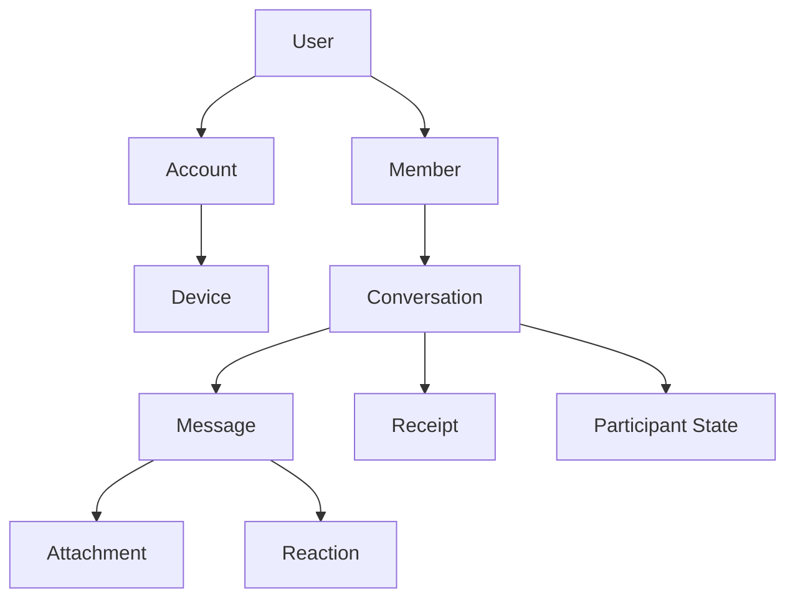
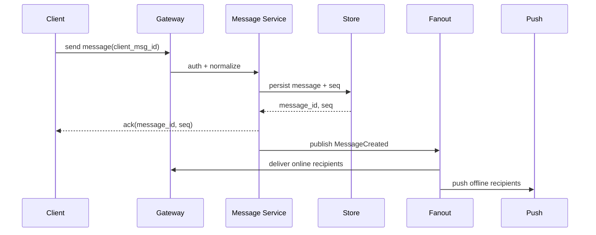

# IM

> IM - Instant Messaging - 即时通讯

- 目标：低延迟消息投递、可靠同步、多端一致、可追溯、可治理。
- 核心难点：在线状态、离线消息、多端同步、消息顺序、已读未读、推送、撤回/编辑、群扩散、风控与合规。
- 参考
  - [Event driven](./design-event-driven.md)
  - [Webhook](./design-webhook.md)

## 概念模型

| 概念                 | 说明                                         |
| -------------------- | -------------------------------------------- |
| User                 | 自然人或主体，通常用于身份、资料、关系链     |
| Account              | 登录账号，可与 User 一对一或多对一           |
| Device               | 设备实例，用于多端同步、推送 token、在线连接 |
| Conversation         | 对话容器，承载一组相关消息                   |
| Member / Participant | Conversation 参与者，带角色、权限、入退时间  |
| Message              | 消息实体，包含内容、发送者、时间、序号、状态 |
| Receipt              | 投递、已读、已消费等回执                     |
| Thread               | 消息下的子讨论，适合话题化协作               |

## 核心对象

### Conversation

Conversation 是 IM 里最稳定的抽象，常见类型：

| type      | 说明     | 例子                    |
| --------- | -------- | ----------------------- |
| `direct`  | 单聊     | A 与 B 私聊             |
| `group`   | 群聊     | 项目群、兴趣群          |
| `room`    | 房间     | 直播间、活动聊天室      |
| `channel` | 频道     | 公告、广播、订阅频道    |
| `thread`  | 线程     | 围绕某条消息展开讨论    |
| `bot`     | Bot 对话 | 用户与机器人/Agent 对话 |

常见字段：

| 字段              | 说明                               |
| ----------------- | ---------------------------------- |
| `id`              | 会话 ID                            |
| `type`            | 会话类型                           |
| `title`           | 展示名称，可为空或动态生成         |
| `owner_id`        | 创建者 / 所有者                    |
| `created_at`      | 创建时间                           |
| `last_message_id` | 最后一条消息，用于会话列表排序     |
| `last_seq`        | 会话内递增序号                     |
| `metadata`        | 扩展字段，例如头像、公告、业务关联 |

### Message

消息通常需要同时满足展示、同步、审计和搜索需求。

| 字段              | 说明                                           |
| ----------------- | ---------------------------------------------- |
| `id`              | 全局消息 ID，通常雪花/ULID/UUIDv7              |
| `conversation_id` | 所属会话                                       |
| `seq`             | 会话内单调递增序号，用于排序和增量同步         |
| `sender_id`       | 发送者                                         |
| `client_msg_id`   | 客户端生成 ID，用于幂等去重                    |
| `type`            | `text`、`image`、`file`、`system`、`custom` 等 |
| `body`            | 消息内容，建议结构化 JSON                      |
| `status`          | 正常、撤回、删除、屏蔽等状态                   |
| `created_at`      | 服务端接收/落库时间                            |
| `edited_at`       | 编辑时间                                       |
| `deleted_at`      | 删除时间，通常为软删除                         |

:::tip

消息排序应优先依赖服务端生成的 `seq`，不要只依赖客户端时间。客户端时间适合展示“发送时刻”，不适合作为最终顺序依据。

:::

### Reaction

Reaction 是对某条消息的轻量回应，例如 👍、😂、❤️。

- 常见于 Slack、Discord、Telegram、飞书、企业微信等现代 IM / 协作产品。
- 通常不建模为普通消息，而是 `MessageReactionAdded` / `MessageReactionRemoved` 事件。
- 展示层一般聚合为：某个 emoji 有多少人点过、前几个用户是谁、当前用户是否点过。
- 适合低打扰反馈，减少“收到”“赞同”“+1”这类噪声消息。

常见字段：

| 字段 | 说明 |
| --- | --- |
| `message_id` | 被回应的消息 |
| `conversation_id` | 冗余会话 ID，便于分片和权限判断 |
| `user_id` | 做出 reaction 的用户 |
| `emoji` | 标准 emoji 或自定义表情 ID |
| `created_at` | 创建时间 |

设计注意：

- 幂等键通常是 `message_id + user_id + emoji`，同一用户对同一消息同一 emoji 只能点一次。
- 删除 reaction 不应删除消息，只是移除用户的互动状态。
- reaction 变更需要同步给在线成员，但一般不计入未读数。
- 大群里 reaction 聚合要避免每次全量广播用户列表，可只广播计数变化和当前用户状态。
- 自定义 emoji / sticker 需要额外的资源表和权限控制。

### Participant State

参与者状态用于支持会话列表、未读数和权限控制。

| 字段                 | 说明                             |
| -------------------- | -------------------------------- |
| `joined_at`          | 加入时间                         |
| `left_at`            | 离开时间                         |
| `role`               | owner / admin / member / guest   |
| `mute`               | 是否免打扰                       |
| `pinned`             | 是否置顶                         |
| `last_read_seq`      | 已读到的会话序号                 |
| `last_delivered_seq` | 已投递到设备/用户的序号          |
| `visible_from_seq`   | 可见起点，用于入群前历史是否可见 |

## 消息生命周期

常见状态：

| 状态        | 说明                       |
| ----------- | -------------------------- |
| `pending`   | 客户端本地发送中           |
| `sent`      | 服务端已接收并持久化       |
| `delivered` | 已投递到接收端连接或设备   |
| `read`      | 接收方明确已读             |
| `failed`    | 发送失败，可重试           |
| `recalled`  | 已撤回                     |
| `deleted`   | 对某个用户不可见或全局删除 |

## 投递语义

| 语义          | 说明               | IM 中的做法                                    |
| ------------- | ------------------ | ---------------------------------------------- |
| at-most-once  | 最多一次，可能丢   | 不适合核心消息                                 |
| at-least-once | 至少一次，可能重复 | 常见，依赖 `client_msg_id` / `message_id` 去重 |
| exactly-once  | 精确一次           | 分布式下成本高，通常通过幂等实现“效果上一次”   |

关键设计：

- 发送幂等：`sender_id + client_msg_id` 唯一约束。
- 投递幂等：客户端按 `message_id` 或 `conversation_id + seq` 去重。
- 增量同步：客户端保存每个会话的 `last_seq`，重连后拉取 `seq > last_seq`。
- ACK 分层：发送 ACK、投递 ACK、已读 ACK 不要混为一谈。

## 架构组件

| 组件                 | 说明                                                         |
| -------------------- | ------------------------------------------------------------ |
| Gateway              | 长连接接入，WebSocket / TCP / QUIC，负责鉴权、心跳、连接管理 |
| Session Service      | 维护 user-device-connection 映射和在线状态                   |
| Message Service      | 消息校验、落库、分配序号、状态变更                           |
| Conversation Service | 会话、成员、权限、未读数、置顶免打扰                         |
| Fanout Service       | 在线投递、群消息扩散、事件广播                               |
| Push Service         | 离线推送，APNs / FCM / 厂商推送                              |
| Media Service        | 图片、文件、语音、视频上传和转码                             |
| Search / Index       | 消息搜索，异步索引                                           |
| Moderation / Risk    | 内容审核、反垃圾、频控、封禁                                 |

## 群消息扩散

| 模式     | 说明                               | 适用场景                       |
| -------- | ---------------------------------- | ------------------------------ |
| 写扩散   | 发送时为每个成员写 inbox           | 小群、读多写少、会话列表要求快 |
| 读扩散   | 只写一份消息，读取时按成员关系过滤 | 大群、频道、直播间             |
| 混合扩散 | 小群写扩散，大群读扩散             | 通用 IM 系统                   |

设计取舍：

- 小群：写扩散可简化未读数和会话列表。
- 大群：写扩散成本随成员数线性增长，通常需要读扩散或分层 fanout。
- 超大房间：不一定保证所有消息必达，可能更像实时流或弹幕。

## 未读数

常见口径：

| 口径            | 说明                                                |
| --------------- | --------------------------------------------------- |
| 会话未读        | `conversation.last_seq - participant.last_read_seq` |
| 用户总未读      | 所有未静音会话未读聚合                              |
| at mention 未读 | 单独记录提及用户的消息序号                          |
| 系统通知未读    | 通常独立于聊天未读                                  |

注意：

- 未读数是用户状态，不是消息状态。
- 多端已读需要同步到所有设备。
- 大群未读数可只显示“99+”或只统计 at mention，避免高成本精确计算。

## 多端同步

- 每个设备维护自己的连接状态，但用户级别共享会话状态。
- 发送端也应该通过服务端回放/ACK 确认最终消息内容和 `seq`。
- 编辑、撤回、删除、reaction 都应建模为事件，客户端按事件更新本地状态。
- 重连后优先按 `conversation_id + last_seq` 增量拉取，必要时全量修复。

## Presence

Presence 表示在线、离线、忙碌、正在输入等临时状态。

| 状态            | 特点                                 |
| --------------- | ------------------------------------ |
| online/offline  | 可由连接和心跳推导，但多端场景要聚合 |
| typing          | 短 TTL 临时事件，不应持久化为消息    |
| last_seen       | 隐私敏感，可能需要用户开关           |
| device presence | 用于选择投递连接，不一定对外展示     |

Presence 通常用内存 KV / Redis / pub-sub 维护，不作为强一致核心数据。

## Room vs Group

- Room - 聊天室、房间
  - 强调场所、空间、Host。
  - 场景：会议、活动、直播、临时讨论。
  - 特点：
    - 成员动态。
    - 可能看不到历史消息。
    - 一般有 Host / Moderator 概念。
    - 可弱化未读数和强一致投递。
- Group - 群组
  - 强调集合、组织。
  - 场景：团队协作、兴趣小组、项目组。
  - 特点：
    - 成员相对稳定。
    - 面向组织结构。
    - 通常需要历史消息、未读数、权限和成员管理。

## Chat vs Conversation

- Chat
  - 更偏 UI / 使用场景。
  - 适合表示即时通信行为：个人聊天、群聊、客服聊天。
  - 常用于产品语言，例如“打开 chat”。
- Conversation
  - 更偏数据模型 / 领域模型。
  - 表示一组相关消息，是完整对话上下文。
  - 可以包含 direct chat、group、thread、ticket、agent session。

## Channel vs Topic vs Thread

| 概念    | 说明                                               |
| ------- | -------------------------------------------------- |
| Channel | 频道，强调订阅和广播，例如 Slack channel、公告频道 |
| Topic   | 话题，强调语义分类，可跨会话或在房间内切换         |
| Thread  | 线程，强调从某条消息派生出的子讨论                 |

## 设计建议

- 用 `Conversation` 作为核心聚合根，避免把 `Chat`、`Group`、`Room` 写死成互斥模型。
- 消息内容用 typed payload，例如 `type + body`，为富文本、附件、卡片、Bot 消息留扩展空间。
- 消息顺序使用服务端 `seq`，全局 ID 只用于唯一性和追踪。
- 所有可变动作建模为事件：`MessageCreated`、`MessageEdited`、`MessageRecalled`、`ReactionAdded`。
- 大群、房间、频道单独设计投递和未读策略，不要套用小群精确未读模型。
- 权限判断应基于成员关系和消息可见区间，例如 `visible_from_seq`、`joined_at`。

## 常见坑

- 用客户端时间排序，导致多端和弱网下乱序。
- 未区分发送成功、投递成功、已读成功。
- 群消息一开始只按小群写扩散设计，后续大群成本爆炸。
- 未设计 `client_msg_id`，重试后产生重复消息。
- 删除、撤回、编辑直接改消息体，缺少审计和同步事件。
- Presence 强一致化，导致在线状态链路复杂且收益有限。
- 未读数和消息列表耦合过深，导致修复和多端同步困难。

# FAQ

## 入群前历史消息是否可见？

常见策略：

- 不可见：设置 `visible_from_seq = current_last_seq + 1`。
- 可见全部：适合公开群、频道、知识库型讨论。
- 可见最近 N 条：适合兼顾上下文和隐私。

## 撤回和删除有什么区别？

- 撤回：发送者或管理员让所有人看到“该消息已撤回”，通常有时间窗口。
- 删除：对某个用户隐藏，或管理员全局删除；可见性变化不一定改变消息事实。
- 合规场景下通常需要保留审计记录。

## 已读回执要不要精确到每条消息？

- 单聊、小群可以精确。
- 大群通常只记录 `last_read_seq` 或只显示大致人数。
- 超大房间一般不做已读回执。
