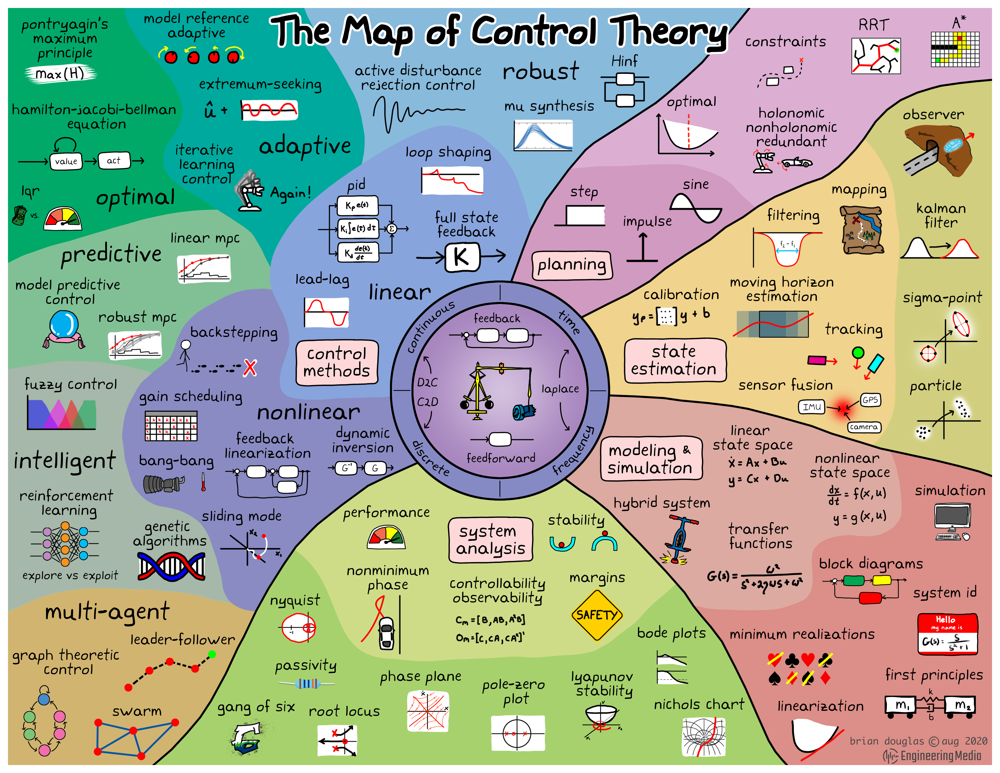

# 控制理论

- [Control theory](https://en.wikipedia.org/wiki/Control_theory)
  - 基础理论
- Controller
- System
- Sensor
- [PID controller](https://en.wikipedia.org/wiki/PID_controller)
  - proportional–integral–derivative controller
  - 比例-积分-微分控制器
  - 工业控制应用中常见的反馈回路部件

| Glossary              | Desc                                        |
| --------------------- | ------------------------------------------- |
| PID controller        | Proportional–Integral–Derivative controller |
| Non-Linear Control    |                                             |
| Linear Control        |                                             |
| LPV                   | Linear Parameter Varing                     |
| Gain Schedule         |                                             |
| transient-free switch | 在指定时间内完成 switch                     |
| feedback controller   |                                             |

## Learn

- [Engineering Media](https://engineeringmedia.com/videos)
- [Why Learn Control Theory](https://youtu.be/oBc_BHxw78s)
  - Building models
  - Simulating preditions
  - Dynamic interactions
  - Filtering / Rejecting noise
  - Sekcting / Building hardware/controller
  - Testing
  - Understanding your system
