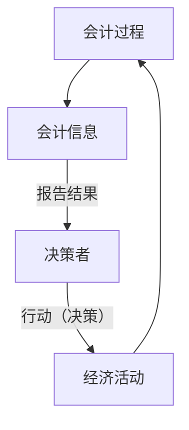
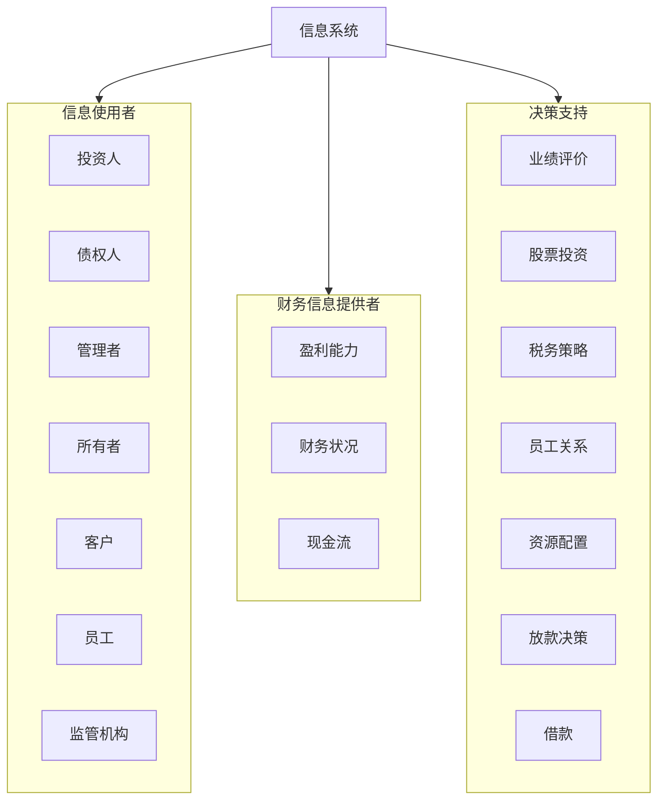

---
tags:
  - Book
---

# 会计学：企业决策的基础（财务会计分册）

- Financial & Managerial Accounting
  - Jan Williams

## Ch1

- 商业语言
- 财务会计 - 对外
- 管理会计 - 对内
- 提供有助于决策者的信息

会计信息
: 是 _计量和沟通经济事项_ 的 **手段**
: 反应经济活动 实质
: 其形成需要利用 假设 和 计量方法
: 与 各种决策 密切相关
: 影响因素:

- 组织规模
- 是否为公众公司
- 管理层对信息的需求

- 会计信息分类
  - 财务会计 - financial accounting
    - 反应经济主体财务资源、责任和经营活动
    - “财务状况” - 某个时间的财务资源和责任
    - “经营成功” - 一年内财务活动
    - 帮助 投资者和债权人 决定 _如何安排其稀缺的投资资源_
    - 所得税纳税申报
    - “一般用途” 的会计信息
  - 管理会计 - management or mangagerial accounting
    - 形成并解释专门用以 帮助管理层经营企业 的会计信息
      - 辅助 制订总体目标、评价部分个人业绩、决定结构调整
    - 按决策者需要 进行组织
  - 税务会计
    - 编制纳税申报表

会计系统 - Accounting System
: 包括被组织用于 _形成_ **会计信息** 并将这些信息 _传递_ 给 **决策制定者** 的 人员、程序、设备、记录
: 目的: 尽可能有效的满足组织对信息需求
: 讲究 成本效益原则

- 产生信息的价值 应超过其 产生成本
  : 基本职能
- 解释并记录 企业交易 的影响
- 类似交易的影响进行归类，形成对管理层有用并可用于会计报告的 各项总计 和 小计
- 汇总并向决策者沟通 会计系统 所包含的信息

内部控制 - internal control
: 为了确保组织财务报告可靠、符合法律法规并确保报告编制有效并合理
: 《内部控制-整合框架：2013》

- 五要素: 控制环境、风险评估、控制活动、信息与沟通、监督活动

控制环境 - control environment
: 所有要素基，为组织设定基调。
: 主要因素:

1. 公司能够恪守正直并坚持伦理价值观
2. 董事会独立于管理层并对公司的内部控制具有监督权
3. 在董事会监督下，管理层享有一定的权力和义务
4. 对吸引、培养和保留具有竞争力的员工做出组织承诺
5. 员工对工作绩效负责

风险评估 - risk assessment
: 识别、分析和管理威胁组织目标实现的风险

控制活动 - control activities
: 管理层针对 风险评估过程所识别的风险 而设置的政策和程序
: 例如： 批注、授权、验证、协调、复核经营业绩、保障资产安全和职责分离

信息与沟通 - information and communication
: 开发信息系统以 捕捉和沟通 企业经营所需 的与 经营、财务、法规遵循 有关的信息
: 促进信息流动

监督活动 - monitor acvitities
: 使公司对一段时间内对 内部控制系统 的 有效性 进行评估

《萨班斯–奥克斯利法案》的要求之一就是 公众公司发布的 年度报告 必须表明公司 是否具有对财务报告进行内部控制 的有效系统。

### Ch 1.3 财务会计信息

财务会计提供 有关企业 财务资源、责任和经营活动的信息，主要为外部决策者（当前和<mark>未来</mark>投资者和债权人）所用。

- 现金流预测 - cash flow prospects
- 投资收益 - return of investment - ROI
- 财务报告目标
  - 提供用于制定投资和信贷决策的信息。
  - 提供用于评估未来现金流量金额、时间和不确定性的信息。
- 对外财务报告
  - 最具体的目标是 提供关于资源、对资源的要求权 以及 资源与要求权如何随时间变化的信息
  - 财务报告 - 一种手段
  - 历史性特征
  - 通用信息
  - 通过解释可增加有用性
- 财务报告 vs 财务报表
  - 报告范围更广
  - 报表 是报告的 内容之一
- 资源 - 资产

财务报表 - financial statement
: 披露公司认为的真实情况
: 短于一年的 称为 中期财务报表

- 主要财务报表
  - 资产负债表 - balance sheet
    - 反应特定日期的财务状态
    - 财务状况表 - 基于财务或货币的 企业快照
  - 利润表 - income statement
    - 反应某个时期经营活动的具体情况和结果
  - 现金流量表 - statement of cash flow
    - 反应公司在某个时期内现金活动的具体情况

### Ch 1.3 管理会计信息

长期计划、研发成果、资本预算详情、竞争战略，属于公司机密，必须严格保密。

**每位员工** 都会使用内部会计信息，例如： 工资通过会计信息生成。

- 主要服务于 计划 和 控制决策
- 管理会计信息的特征
  1. 及时
     - 计划
     - 监督 & 控制
  1. 决策者的身份 - 提供给有权利纠正问题的决策者
  1. 面向未来 - 促使管理人员制定对企业最有利，与企业目的、目标和使命相一致的未来决策
  1. 效率与效度衡量指标
  1. 一种手段

### Ch 1.5 会计信息的公允性

公允性 - integrity
: 全面、万兆、无损、健全、诚实、可信

- 制度特征
  1. 编制会计信息标准
     - GAAP - Generally Accepted Accounting Principles - 一般公认会计原则
  1. 证券交易委员会 - Securities and Exchange Commission - SEC
     - 采纳 FASB 建议
  1. 财务会计准则委员会 - Financial Accounting Standards Board - FASB
     - 私有机构
  1. 国际会计准则理事会 - International Accounting Standards Board - IASB
     - 美国政府机构
     - IFRS - 国际财务报告准则
     - AICPA - 注册会计师协会
  1. 公众公司会计监管委员会 - Public Company Accounting Oversight Board - PCAOB
     - 政府机构
     - 监督公众会计职业
  1. 财务报表审计
  1. 立法
- 职业组织
  - 美国注册会计师协会 - American Institute of CPI - AICPA
  - 管理会计师协会 - Institute of Management Accountants - IMA
  - 管理会计师认证 - Certificate in Management Accounting - CMA
  - 内部审计师协会 - Institute of Internal Auditors - IIA
    - 内部审计师认证（Certificate in Internal Auditing，CIA）
  - 美国会计学会 - American Accounting Association - AAA
  - 反虚假财务报告赞助组织委员会 - COSO
    - 民间组织
    - 《内部控制：整合框架》 2013

审计 - Auditing
: 通过调查公司 财务报表 来确定报表的 **公允性**

### Ch 1.6 会计职业

- 领域
  1. 公共会计
  2. 管理会计
     - CAO - 总会计师 - 主计长
     - 主要专业领域：财务预测、成本会计、内部审计
  3. 政府会计
     1. 审计总署：审计政府
        - GAO - Government Accountability Office
     1. 美国国税局：审计所得税申报表
        - IRS - Iternal Revenue Service
     1. 美国证券交易委员会：负责监察财务报告
  4. 会计教育

簿记 - bookkeeping
: 是指会计的文书工作，即记录常规交易并逐日记账，目前主要由计算机和专业文书人员完成。

职业会计师主要进行解释和使用，而不是 实际生成。

- 评价运行效率
- 解决复杂的财务报告问题
- 预测未来经营成果
- 审计
- 税务筹划
- 设计有效率的会计系统

> 会计是**商业语言**，不懂会计信息去运作企业好比不懂规则去参加体育比赛。

公司治理 - corporate governance
: 包括公司结构和监督公司事务的程序，其中包括董事会监督高层管理人员的行为，从而确保公司的经营是以股东利益最大化为目标的。

## Ch2 基本财务报表

财务报表（financial statement）是对假设为真实的企业信息的货币表达。

- 财务状况表（statement of financial position） - 资产负债表（balance sheet）
- 利润表（income statement）
- 现金流量表（statement of cash flows）

钩稽关系（articulation）

- 所有者权益
  - 股本
  - 留存收益
    - 以前年度累计收益留存在企业的部分

$$
\color{orange} 资产=负债+所有者权益
$$

企业主体 - business entity
: 是从事可明确的经营活动的经济单位。
: 与所有者个人活动分离

资产 - asset
: 是企业拥有并预期能使未来经营受益的经济资源。
: 一般公认会计原则提倡对资产负债表中的许多资产以成本而不是以现值计价。

- 会计原则
  1. 成本原则 - cost principal
     - 土地、建筑、商品、设备 - 历史成本，初始金额
     - **流动性强**（可能很快变现） 的资产不适用成本原则
     - 因此 资产负债表 不反映企业当前价值
  1. 持续经营假设 - gonging concern
  1. 客观性原则
  1. 币值稳定假设 - stable-dollar assumption
     - 通过膨胀 - inflation - 货币单位价值下降
     - 通过紧缩 - deflation - 货币单位价值上升
