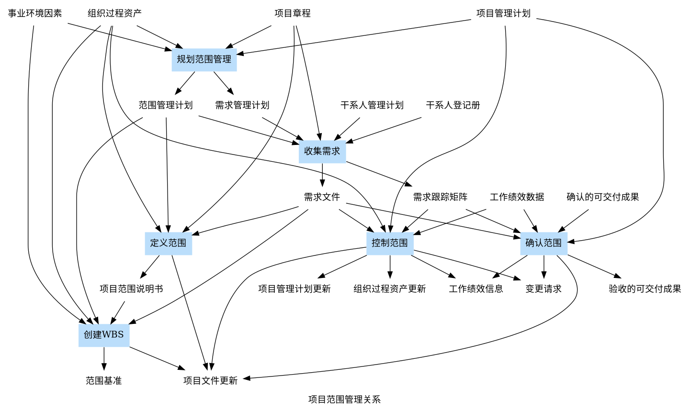

# 项目管理课本笔记

**项目管理主要内容（13 项）**

- 立项
- 整体
- 范围
- 进度
- 成本
- 质量
- 人力资源
- 沟通 & 干系人
- 风险
- 采购
- 合同
- 信息文档 & 配置
- 变更

## 1. 信息系统项目管理基础

### 1.1 基础

- **项目概念**： 项目是为提供一项独特的产品、服务或成果所做的 临时性 努力
- **项目特点** - 临时性（一次性）、独特性、逐步完善、目的性、资源限制
  - 临时性
    - 时间上有开始结束
    - 团队也是临时的
  - 独特性 - 独特的产品、服务或成果
    - 能交付的前提
  - 目的性
    - 面向目标
    - 考量 时间、成本、质量
- 项目 vs 日常运作
  - 项目的特点区别于日常运作
- 项目 & 战略规划
  - **战略规划步骤**： 战略制定、战略实施、战略评价
- 信息系统项目特点
- **项目管理定义**： 把各种知识、技能、手段和技术应用于项目活动之中以 达到 项目要求
  - 是一种管理方法体系/模式
  - 管理一系列临时任务
  - 与其他管理职能一样
  - 运用系统理论和思想
  - 管理职能由 项目经理 执行
- 项目管理特点
  - 复杂
  - 有创造性
  - 需要专门项目组织
  - 项目负责人/经理 很重要
  - 影响 经济、政治、文化、自然环境

### 1.2 知识体系构成

- 项目管理+应用领域（知识、标准、规定/规则）+项目环境+通用/一般管理+软技能
- 应用领域
  - 标准 - 一致同意，由公认机构批准，可重复使用
  - 规则 - 政府强制要求
- 项目环境 - 社会、政治、自然
- 通用管理技能
  - 财会、购买采购、销售营销、合同法律、制造分配、后勤供应、战略战术运作计划、健康安全
  - 组织架构+组织行为+人事+薪资+福利+职业规划
- 软技能 - 沟通、影响、领导、激励、谈判和冲突管理、问题解决

### 1.3 组织结构 & 项目

- 分为 合同类 和 项目类
- 组织有自己 独特、可描述 文化
- 组织结构类型
  - 职能
    - 一个明确上级
  - 矩阵 - 弱、平衡、强
    - 职能+项目
  - 项目
- 紧密矩阵=集中办公/作战室

### 1.4 信息系统项目的生命周期

### 1.5 信息系统项目典型声明周期模型

- 瀑布
- 螺旋
- 迭代
- V
- 原型化
- 敏捷

### 1.6 单个项目管理过程

## 2. 项目立项管理

### 2.1 立项管理内容

- 包含 项目建议书、项目可行性研究、项目招标与招投标等
- 项目建议书 / 立项申请
  - 包含 项目必要性、项目市场预测、产品方案或服务市场预测、项目建设必须条件
- 可行性研究 - 特性 预见、公正、可靠、科学
  - 投资必要性
  - 技术 可行性
  - 财务 可行性
  - 组织 可行性
  - 经济 可行性
  - 社会 可行性
  - 风险因素 & 对策
- 项目招标与招投标 - 招标、投标、评标、选择承建方
  - 招标
    - 类型 公开招标、邀请招标、议标
  - 投标
    - 少于 3 人从新招标
    - 流程 编制标书、递交标书、标书签收
      - 递交标书 最好是 直接送达 或 委托代理人送达
  - 评标
    - 评标委员会 负责
      - 高级职称或同等专业水平的技术、经济等 相关领域专家 - 至少 5 人
      - 技术、经济等专家不少于 2/3
  - 选择承建方
    - 30 内 订立书面合同

<!-- 《招投标法》 -->

### 2.2 可行性研究

### 2.3 项目评估与论证

## 3. 项目整体管理

### 3.1 项目整体管理概述

- 项目管理主要包括 8 个方面： 范围、进度、成本、质量、人力资源、沟通、风险、采购
  - 相互影响和制约
- 识别、确定、结合、统一、协调 各项目管理过程组内活动
- “整体管理” 有 统一、合并、结合 等特征
- 项目管理 5 个阶段 6 个过程
  - 启动 - 制定项目章程
  - 计划 - 制订项目管理计划
  - 执行 - 指导和管理项目执行
  - 监控 - 监控项目工作、整体变更控制
  - 收尾 - 结束项目或阶段

### 3.2 制订项目章程

- 项目章程是 正式批准 项目/阶段 的文件
  - 标志项目正式启动
  - 授权 项目经理 使用资源
    - 项目经理在 规划开始之前 被委派 - 最好在制定项目章程之时
  - 建立 项目与组织日常活动 关系
  - 由 项目 以外/外部 人员批准/签发
- 包含内容
  - 项目目的 或 项目批准的原因
  - 可测量的 项目目标 和 相关的成功标准
  - 项目的 总体要求
  - 概括性的 项目描述
  - 项目的 主要风险
  - 总体里程碑进度计划
  - 总体预算
  - 项目审批要求
  - 委派的 项目经理 及其职责和职权
  - 发起人 或 其他批准项目章程的 人员姓名和职权

```pre title="项目章程示例"
项目名称:
总体里程碑进度表: XXXX年XX月XX日开工，XXXX年XX月XX日结束
项目经理： XXX ；联系电话： 123
项目立项依据：
项目目标：
项目干系人：
  1. 张三：发起和赞助人；负责监督
  2. 李四：项目经理；负责监控，计划

  签名：（以上所有干系人）
```

#### 3.2.1 过程

- 制订项目章程过程 验证 原来为项目制定与颁发项目章程所做的 各种决定
- “制定项目章程” 的项目管理过程有 5 个依据，2 个工具技术 得到 项目章程
  - 专家判断
  - 引导技术
- 启动者或发起人 具有一定职权，能为项目 提供资金。亲自 或 委托项目经理 编制 项目章程

#### 3.2.2 依据

- 5 个依据 - 合同/协议、项目工作说明书、商业论证、事业环境因素、组织过程资产
- 协议/合同/子合同/采购单
  - 项目初衷
  - 合同符合 《合同法》
- 项目工作说明书
  - 由项目提供的 产品或服务 的 文字说明
  - 一般包含事项之一
    - 业务需求
    - 产品范围说明书
    - 战略计划
- 商业论证
  - 决定项目是否 值得投资
  - 通常包含 业务需求、成本效益分析
  - 论证方向
    - 市场 需求
    - 组织 需要
    - 客户 要求
    - 技术 进步
    - 法律 要求
    - 生态 影响
    - 社会 需要
  - 可定期审核，确保商业利益
- 事业环境因素
  - 存在于项目周围 并对项目 成功 有影响的组织事业环境因素与制度
- 组织过程资产
  - 影响项目 成功 的资产
  - 可分为 2 类
    - 组织进行工作的 过程与程序
    - 组织整体信息存储检索知识库

#### 3.2.3 专家判断

- 评价 制度项目章程的 依据

#### 3.2.4 项目选择方法

- 确定 组织选择哪一个项目
  - 效益测定方法
  - 数学模型
- 财务考量
  - 净现值 - NPV - Net present value
    - 预期未来现金流折算为 现值，计算预期净货币收益与损失
    - 分析跨越多年的项目
    - 折现率/要求收益率/筛选率/资本机会成本 - 可接受的 最低投资回收率
  - 投资收益率 - ROI - Return on investment
    - 净收入除以投资额
  - 投资回收率/投资回收期
    - 净现金 流入补偿 净投资 所用的时间
    - 累计收益 超过 累计成本 及 后续成本 的时间

**NPV**

$$
NPV = \sum_{t=1}^{n}A/(1+r)^t
$$

- t - 现金流持续时间
- A - 每年现金流
- r - 折现率

**ROI**

$$
ROI = 总收益率 = (总折现收益 - 总折现成本)/折现成本
$$

#### 3.2.5 项目启动会议

- 项目启动会议 是 项目的开始
- 目的： 使项目 主要利益相关者 明确项目的 目标、范围、需求、背景、各自职责与权限
- 5 个主要方面
  - 确定会议目标
  - 会议前准备工作
  - 明确并通知参加会议的人员
  - 明确会议的主要议题
  - 会议记录 - 做好记录

#### 3.2.5 项目目标

- 目标是 具体的、可度量的、可达到的、与企业战略目标相关的、有时间限制的
  - 衡量目的是否达到
  - 可以有多个
- 目的是 想要达到的 地点、境地、结果
  - 目的可能只有一个
- 项目目标 费用、时间、性能指标、材料用量等
- 约束目标 < 成果目标
- 层次分析法 - AHP - Analytic hierarchy process
- 项目管理是 规划、组织、指导、控制 项目的 逐步发展 和 逐步完善，使其能够以可能 最优 的方式，取得 最优 的结果而实现项目的 要求 和 预期目的。

:::tip

- 区分 成功目标 和 约束目标
- 区分 目的 和 手段
- 制定定 无法量化 或 无法实现 的目标
- 不转移 项目管理人员 的 努力方向

:::

#### 3.2.7 引导技术

- 用于指导项目章程制定
- 帮助团队和个人完成项目活动
- 例如 头脑风暴、冲突处理、问题解决、会议管理

### 3.3 制定项目管理计划

#### 3.3.1 项目管理计划

- 主要内容 范围、进度、成本、质量、过程改进、人员配备、沟通、风险、采购 等管理计划
- 常见内容
  1. 项目 名称
  2. 项目 背景
  3. 项目 范围管理计划 / 范围基准
  - 范围说明书
    - 项目经理 有权 更新发布
    - 制定 项目 WBS 的基础和依据
    - 更改或调整可能引起 合同变更
  4. 项目 进度管理计划 / 进度基准
  5. 项目 成本管理计划 / 成本基准
  6. 项目 质量管理计划
  - CMMI 三级
  7. 项目 人力资源计划
  8. 项目 沟通计划
  9. 项目 风险管理计划 / 风险登记册
  - 技术风险、经营风险、管理风险、市场风险
  10. 项目 采购计划
- 项目管理计划
  - 确定了 执行、监视、控制、结束 项目的方式方法
  - 包括 项目执行的过程、项目生命周期、里程碑、阶段划分 等全局内容
  - 是项目管理的 主计划/总体计划
  - 是其他 子计划制订 的依据和基础
  - 不能理想化期望一步到位

:::info CMMI

- CMMI/希迈 - 能力成熟度模型集成 - Capability Maturity Model Integration
- 一种改进过程的方法
- 协助提升组织的绩效
- 向组织提供用于有效的过程改进的基本元素
- 5 个级别
  1. Initial - 初始
  2. Managed - 已管理
  3. Defined - 已定义
  4. Quantitatively Managed - 已量化地管理
  5. Optimizing - 优化中

:::

#### 3.3.2 制订 项目管理计划 过程

- 将 确定、协调、综合 所有 部分计划 所需要的行动 形成文件
  - 成为项目管理计划
- 过程依据
  - 项目章程
  - 其他过程输出结果
  - 事业环境因素
  - 组织过程资产

#### 3.3.3 项目管理信息系统

- 由 用于归纳、综合、传播 项目管理程序输出的 工具和技术 **组成**。
- 提供 从项目开始到最终完成，包括 人工系统 和 自动系统 的所有 信息。
- 信息处理 贯穿项目 全过程
- MMDB - 多媒体数据库
- PMIS - 项目管理信息系统
- 配置管理系统
- 变更控制系统
  - 正式形成文件的过程的全体

:::info 参考

- [PMIS](https://en.wikipedia.org/wiki/Project_management_information_system)
  Project management information system

:::

### 3.4 指导与管理项目执行

- 受 项目领域 影响
- 实施
  - 纠正措施
  - 预防措施
  - 缺陷补救请求
- 遵循 “工作核准制度”
  - 审批制度、人员、权限、表格或其他书面文件
  - 可成立 工作核准小组委员会 - 审查和批准工作
  - 保证凡事 “一次做好” - 保证时间、顺序、不返工
  - 经过 书面批准 才开始具体项目活动
- 整体协调
  - 协调 解决的问题
  - 协调 采取的行动
- 项目经理权利体现 - 权限、感化影响、知情力

#### 3.4.1 依据

- 项目管理计划
- 批准的变更请求
  - 实施 整体变更控制 的过程输出
  - 被批准的 纠正措施、预防措施、缺陷补救
- 事业环境因素
- 组织过程资产

#### 3.4.2 工具与技术

- 专家判断
- 项目管理信息系统
- 会议
  - 类型
    - 交换信息
    - 头脑风暴、方案评估、方案设计
    - 制定决策
  - 会后 形成书面 会议纪要 和 行动方案

#### 3.4.3 成果

- 可交付成果
- 工作绩效数据
  - 原始观察结果和测量值
- 变更请求
  - 纠正措施 - 工作绩效从新与 项目管理计划一致
  - 预防测试 - 项目工作的未来绩效 符合项目管理计划
  - 缺陷补救 - 修正不一致的产品或服务组件
- 项目管理计划更新
- 项目文件更新

### 3.5 监控项目工作

- 监视 和 控制

#### 3.5.1 依据

- 项目管理计划
- 进度预测
- 成本预测
- 确认的变更
- 工作绩效信息
- 事业环境因素
- 组织过程资产

#### 3.5.2 工具与技术

- 专家判断
- 分析技术
- 项目管理信息系统
- 会议

#### 3.5.3 成果

- 变更请求
- 工作绩效报告
- 项目管理计划更新
- 项目文件更新
  - 进度和成本预测、工作绩效报告、问题报告

### 3.6 实施整体变更控制

- 贯穿项目始终
- 配置管理活动
  - 配置识别
  - 配置状态记录
  - 配置核实与审计

#### 3.6.1 依据

- 项目管理计划
- 工作绩效报告
  - 资源可用情况、进度和成本数据、挣值管理/EVM 报告、燃烧图/燃尽图
- 变更请求
- 事业环境因素
- 组织过程资产

#### 3.6.2 工具与技术

- 专家判断
- 会议
  - CCB 审查变更请求，批准、否决或其他决定，可以审查 配置管理活动
- 变更控制工具

#### 3.6.3 结果

- 批准的变更请求
- 变更日志
  - 记录项目过程中出现的变更，包括 否决的
- 项目管理计划更新
- 项目文件更新

### 3.7 结束项目或阶段

- **作用**： 总结经验教训、正式结束项目工作、为开展新工作而释放组织资源
- 涵盖 行政收尾 所需全部活动

#### 3.7.1 依据

- 项目管理计划
- 验收的可交付成果
- 组织过程资产

#### 3.7.2 工具与技术

- 专家判断
- 分析技术
  - 回归分析、趋势分析
- 会议
  - 经验教训总结会、收尾会、用户小组会、用户审查会

#### 3.7.3 成果

- 最终产品、服务或成果移交
- 组织过程资产更新

## 4 项目范围管理

- 项目范围/Scope 为了达到项目目标 规定要做的工作
  - 项目目标更具体的表达

### 4.1 范围管理概述

- 主要工作
  - 明确项目边界
  - 对项目执行工作进行监控
  - 防止项目范围发生蔓延

#### 4.1.1 产品范围与项目范围

- 产品范围 - 产品或服务包含的 功能
- 项目范围 - 为了能够交付产品，项目必须做的 工作
- 范围基准/Scope baseline - 项目范围说明书、WBS、WBS 词典
  - 衡量项目是否完成
- 产品描述衡量 产品范围 是否完成

#### 4.1.2 范围管理 重要性

- 衡量项目达到成功的必要标准
  - 范围管理及控制的有效性
- 提高对项目成本、进度、资源估算的 准确性
- 影响项目成功

#### 4.1.2 范围管理 过程

| 过程         | 过程组 | 解释                                                         |
| ------------ | ------ | :----------------------------------------------------------- |
| 规划范围管理 | 规划   | 编制范围管理计划，书面描述如何定义、确认和控制项目范围过程   |
| 收集需求     | ^      | 为实现项目目标而确定、记录并管理干系人的需要和需求的过程     |
| 定义范围     | ^      | 制定项目和产品详细描述的过程                                 |
| 创建 WBS     | ^      | 将项目可交付成果和项目工作分解为较小的、更易于管理组件的过程 |
| 确认范围     | 监控   | 正式验收已完成的项目可交付成果的过程                         |
| 控制范围     | ^      | 监督项目和产品的范围状态，管理范围基准变更过程               |

---

| 规划范围管理 | 内容                                               |
| ------------ | -------------------------------------------------- |
| 输入         | 项目管理计划、项目章程、事业环境因素、组织过程资产 |
| 输出         | 范围管理计划、需求管理计划                         |
| 工具与技术   | 专家判断、会议                                     |

| 收集需求   | 内容                                                                                                             |
| ---------- | ---------------------------------------------------------------------------------------------------------------- |
| 输入       | 范围管理计划、需求管理计划、干系人管理计划、项目章程、干系人登记册                                               |
| 输出       | 需求文件、需求跟踪矩阵                                                                                           |
| 工具与技术 | 访谈、焦点小组、引导式研讨会、群体创新技术、群体决策技术、问卷调查、观察、原型法、标杆对照、系统交互图、文件分析 |

| 定义范围   | 内容                                           |
| ---------- | ---------------------------------------------- |
| 输入       | 范围管理计划、项目章程、需求文件、组织过程资产 |
| 输出       | 项目范围说明书、项目文件更新                   |
| 工具与技术 | 专家判断、产品分析、备选方案生产、引导式研讨会 |

| 创建 WBS   | 内容                                                               |
| ---------- | ------------------------------------------------------------------ |
| 输入       | 范围管理计划、项目范围说明书、需求文件、事业环境因素、组织过程资产 |
| 输出       | 范围基准、项目文件更新                                             |
| 工具与技术 | 分解、专家判断                                                     |

| 确认范围   | 内容                                                                 |
| ---------- | -------------------------------------------------------------------- |
| 输入       | 项目管理计划、需求文件、需求跟踪矩阵、确认的可交付成果、工作绩效数据 |
| 输出       | 验收的可交付成果、变更请求、工作绩效信息、项目文件更新               |
| 工具与技术 | 检查（审查、产品评审、审计、走查、巡检）、群体决策技术               |

| 控制范围   | 内容                                                                     |
| ---------- | ------------------------------------------------------------------------ |
| 输入       | 项目管理计划、需求文件、需求跟踪矩阵、工作绩效数据、组织过程资产         |
| 输出       | 工作绩效信息、变更请求、项目管理计划更新、项目文件更新、组织过程资产更新 |
| 工具与技术 | 偏差分析                                                                 |



### 4.2 规划范围管理

- 规划范围管理/PlanScope Management - 编制范围管理计划
  - 对如何管理范围提供 指南和方向

#### 4.2.1 范围管理计划

#### 4.2.1 需求管理计划

- 需求管理 贯穿信息系统集成项目整个过程
- 需求管理计划/Requirements Management Plan - 描述如何分析、记录、管理需求
  - 对项目需求 定义、确定、记载、核实管理、控制 的 行动指南
- 内容
  - 如何规划、跟踪和汇报各种需求活动
  - 需求管理需要使用的资源
  - 培训计划
  - 项目干系人参与需求管理的策略
  - 判断项目范围与需求不一致的准则和纠正规程
  - 需求跟踪结构
  - 配置管理活动

### 4.3 收集需求

### 4.4 定义范围

### 4.5 创建工作分解结构（WBS）

### 4.6 确认范围

### 4.7 控制范围

## 5 项目进度管理

### 5.1 概述

### 5.2 项目进度管理过程

### 5.3 项目进度管理的技术和工具

## 6 项目成本管理

### 6.1 概述

### 6.2 项目成本管理过程

### 6.3 项目成本管理的技术和工具

## 7 项目质量管理

### 7.1 质量管理基础

### 7.2 项目质量管理过程

### 7.3 项目质量管理的技术和工具

## 8 项目人力资源管理

### 8.1 项目人力资源管理概念

### 8.2 项目人力资源管理过程

### 8.3 项目人力资源管理工具

### 8.4 项目人力资源管理文件

### 8.5 项目人力资源管理案例

### 9 项目沟通管理和干系人管理

### 9.1 项目沟通管理基础

### 9.2 项目沟通管理过程

### 9.3 项目沟通管理的技术和工具

### 9.4 项目干系人管理基础

### 9.5 项目干系人管理过程

### 9.6 项目干系人管理的技术和工具

## 10 项目风险管理

### 10.1 项目风险管理概述

### 10.2 规划风险管理

### 10.3 识别风险

### 10.4 实施定性风险分析

### 10.5 实施定量风险分析

### 10.6 规划风险应对

### 10.7 控制风险

## 11 项目采购管理

### 11.1 概述

### 11.2 战略合作管理

### 11.3 采购管理过程

### 11.4 采购管理技术和工具

### 11.5 案例例题

## 12 项目合同管理

### 12.1 合同管理相关基础概念

### 12.2 合同管理过程

## 13 信息文档管理与配置管理

### 13.1 信息系统项目文档及其管理

### 13.2 配置管理

### 13.3 文档管理、配置管理工具

## 14 项目变更管理

## 参考

- [能力成熟度模型集成](https://zh.wikipedia.org/wiki/能力成熟度模型集成)
