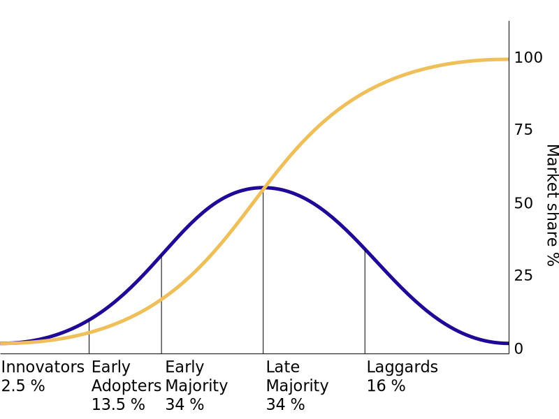

# 创新扩散理论

- 创新扩散理论 - Diffusion of innovations
  - 传播学 理论
  - 传播过程: 知晓、劝服、决策、证实
- 参考
  - wikipedia [Diffusion of innovations](https://en.wikipedia.org/wiki/Diffusion_of_innovations)

- 黄色: 市场份额
- 蓝色: 阶段
- early adpoter 和 early majority 之间为鸿沟
