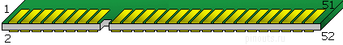

# 硬件接口

## USB

- [系统结构](https://en.wikipedia.org/wiki/USB#System_design)
  - Host + one or more downstream ports + multiple peripherals
  - Hubs - 最多 5 层
  - 一个 host 可以有多个控制器，每个控制器可以有一个或多个端口
  - 一个 host 最多 127 设备
  - 一个设备可以有多个逻辑设备 - device functions
  - 组合设备可提供多个功能 - webcam + microphone
  - 复合设备连接逻辑设备到内建 Hub

## PCIe

- [PCI Express](https://en.wikipedia.org/wiki/PCI_Express)

## Mini PCIe

> 
>
> [pinout](https://pinoutguide.com/Slots/mini_pcie_pinout.shtml)

- [PCI Express Mini 接口](https://en.wikipedia.org/wiki/PCI_Express#Electrical_interface)
  - PCIe/PCI Express ×1 - 带 SMBus
  - USB 2.0
  - 诊断 LEDs - 例如 WiFi 网络状态
  - SIM 卡 - 针对 GSM, WCDMA 应用 - UIM signals on spec
  - 未来扩展 PCIe lane
  - 1.5v, 3.3v 供电
- 参考
  - [WiFi module says “mini PCI-e format” with “USB host interface” - what does this mean?](https://electronics.stackexchange.com/questions/26961)
    - PCIe 接口
    - USB2 data 使用 pin 36, 38

# HDMI

- HDMI 2.1 4K60 HDR10, Dolby Vision
- HDMI 2.0a 2160p, Dolby Vision, HDR10
- HDMI 1.4 720p 1080p
