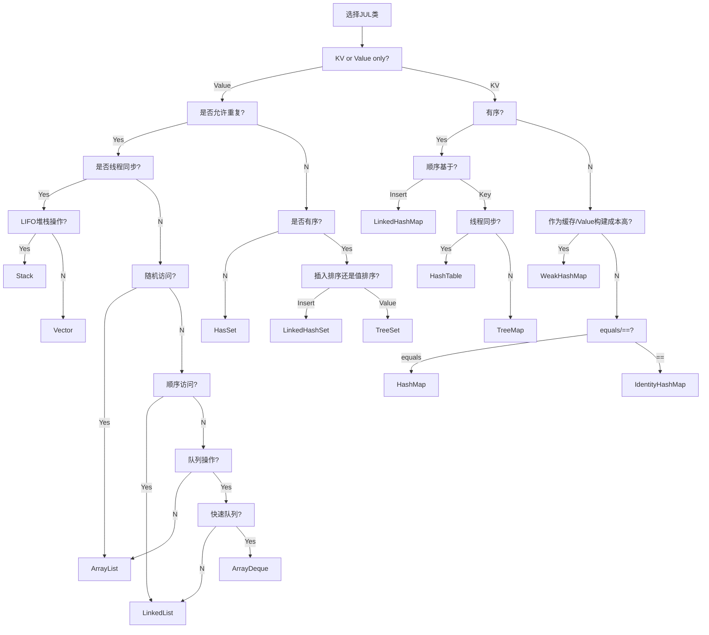

# Java FAQ

## javac 乱码

强制使用 UTF-8

```bash
javac -J-Dfile.encoding=UTF-8
```

## 环境变量

- JAVA_TOOL_OPTIONS
  - java, javac, jar 会用
  - 例如 `-agentlib:hprof`
  - JVMTI 定义
- `_JAVA_OPTIONS`
  - 类似 JAVA_TOOL_OPTIONS，但优先级更高
  - 针对 Hotspot
- JAVA_OPTS
  - 由其他工具使用
  - java 不用
- JDK_JAVA_OPTIONS
  - jdk9+
  - 类似 JAVA_TOOL_OPTIONS，但只有 java 会用
  - java
- JAVA_HOME

---

- https://docs.oracle.com/javase/8/docs/platform/jvmti/jvmti.html#tooloptions

## Property

```ini
file.encoding=UTF-8
user.language=en
user.country=US
user.variant=
java.io.tmpdir=
javax.net.ssl.keyStore=
javax.net.ssl.keyStorePassword=
javax.net.ssl.keyStoreType=
javax.net.ssl.trustStore=
javax.net.ssl.trustStorePassword=
javax.net.ssl.trustStoreType=
com.sun.management.jmxremote=
```

## 选择 JUL 类逻辑



## Why is generic of a return type erased when there is an unchecked conversion of a method parameter in Java 8?

- [Why is generic of a return type erased when there is an unchecked conversion of a method parameter in Java 8?](https://stackoverflow.com/q/30918308/1870054)

Collection
http://fastutil.di.unimi.it/
http://pcollections.org/
https://github.com/hrldcpr/pcollections

https://mvnrepository.com/artifact/org.eclipse.collections/eclipse-collections
https://github.com/eclipse/eclipse-collections

http://java-performance.info/hashmap-overview-jdk-fastutil-goldman-sachs-hppc-koloboke-trove-january-2015/

https://mvnrepository.com/open-source/collections

```xml
<dependency>
    <groupId>com.carrotsearch</groupId>
    <artifactId>hppc</artifactId>
    <version>0.8.1</version>
</dependency>
```

https://github.com/carrotsearch/hppc

## Proxy performance

https://stackoverflow.com/q/1856242/1870054

## deploy

- `-Dspring.profiles.active=development`
- `SPRING_PROFILES_ACTIVE`

## Memory usage

## A fatal error has been detected by the Java Runtime Environment

```
# A fatal error has been detected by the Java Runtime Environment:
#
#  SIGSEGV (0xb) at pc=0x00000000000207f6, pid=1, tid=0x00007f9256df8b38
#
# JRE version: OpenJDK Runtime Environment (8.0_345-b01) (build 1.8.0_345-b01)
# Java VM: OpenJDK 64-Bit Server VM (25.345-b01 mixed mode linux-amd64 compressed oops)
# Derivative: IcedTea 3.24.0
# Distribution: Custom build (Tue Nov  8 21:00:08 UTC 2022)
# Problematic frame:
# C  0x00000000000207f6
```

- netty musl
  - -Dio.micrometer.shaded.io.netty.transport.noNative=true
  - -Dio.grpc.netty.shaded.io.netty.transport.noNative=true
  - -Dorg.apache.rocketmq.shaded.io.grpc.netty.shaded.io.netty.transport.noNative=true
  - Netty 4.1.77.Final+ 避免 segfaulting
    - [netty#11701](- https://github.com/netty/netty/issues/11701)

```bash
apk add gcompat
export LD_PRELOAD=/lib/libgcompat.so.0
```
