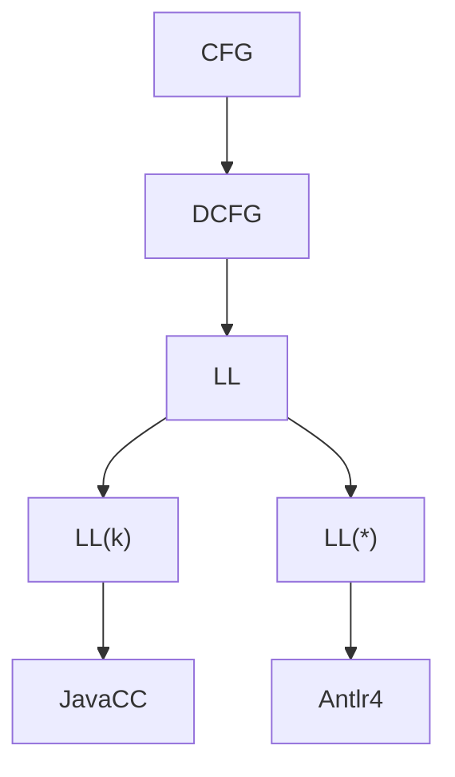

# Parser Glossary

| Abbr.           | Word                                           | cn                             |
| --------------- | ---------------------------------------------- | ------------------------------ |
| BNF             | Backus–Naur form                               | 巴科斯范式 - 1959 John Backus  |
| EBNF            | extended BNF                                   | 扩展巴科斯范式 - ISO-14977     |
| DFA             | Deterministic finite automaton                 | 确定有限状态自动机             |
| NFA             | Nondeterministic finite automaton              | 非确定有限状态自动机           |
| CFG             | Context free grammar                           | 上下文无关语法                 |
| TDPL            | Top-Down Parsing Language                      |
| [LL(k)]         | Left-to-right, Leftmost derivation             | top-down - 1970s               |
| LLR             | LL-regular                                     |
| LR              | Left-to-right, Rightmost derivation in reverse | bottom-up - 1965 Donald Knuth  |
| DCFG            | Deterministic Context Free Grammar             |
| [PEG]           | Parsing expression grammar                     | 解析表达文法 - 2004 Bryan Ford |
| ANTLR           | ANother Tool for Language Recognition          |
| LALR            | Look-Ahead LR parser                           | 简化版的 LR                    |
| SLR             |
| Canonical LR(1) |
| Minimal LR(1)   |
| GLR             | Generalized LR parser                          | 广义 LR 解析器                 |
| RPN             | Reverse Polish notation                        |
| AST             | Abstract Syntax Tree                           | 抽象语法树                     |
| CST             | Concrete Syntax Tree                           | 具体语法树                     |
| CSG             | Context-sensitive grammar                      | 上下文相关语法                 |

| en         | cn     |
| ---------- | ------ |
| grammar    | 语法   |
| syntax     | 语法   |
| semantics  | 语义   |
| expression | 表达式 |
| term       |

[ll(k)]: https://en.wikipedia.org/wiki/LL_parser
[peg]: ./peg.md

- LL 区分 `LL(*)` 和 `LL(k)`
  - Lookahead 是否有限
  - JavaCC 默认 `LL(1)` - 可设置 lookahead 变为 `LL(k)`
- PEG 类似 CFG 但并不是子集
- DFA - flex, regex, jflex
- context-sensitive parsing
  - [Off-side rule](https://en.wikipedia.org/wiki/Off-side_rule)
  - https://github.com/harc/ohm/issues/158
    - https://ohmlang.github.io/pubs/dls2016/modular-semantic-actions.pdf
- PEG 手写 right recursion

## 右递归 {#right-recursion}

- `A -> αA | β`
- 不会导致无限递归，更容易处理。
- 可能会导致更深的递归调用栈，但现代的 Parser 能优化这种情况。

## 左递归 {#left-recursion}

- `A -> Aα | β`
  - A 递归调用自己
- [Left recursion](https://en.wikipedia.org/wiki/Left_recursion)
  - Direct left recursion
  - Indirect left recursion

## Packrat

- 动态规划
- 在解析过程中缓存(memoization)中间结果
- 适合处理具有无限前瞻能力的语法。
- 优点
  - 能够处理左递归和右递归。
  - 解析速度快，适合实时解析。
- 缺点
  - 需要额外的内存空间。
- [Packrat parsing](https://en.wikipedia.org/wiki/Packrat_parser)
