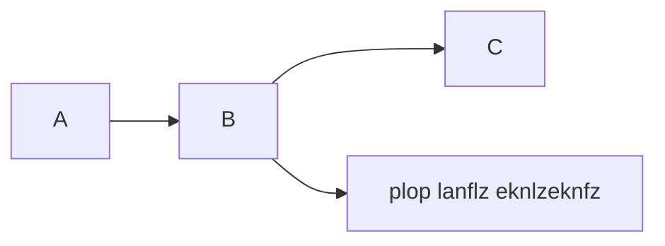

# Docusaurus

- [facebook/docusaurus](https://github.com/facebook/docusaurus)
  - 技术文档、博客静态网站
- https://docusaurus.io/community/resources
- [easyops-cn/docusaurus-search-local](https://github.com/easyops-cn/docusaurus-search-local)
- [rohit-gohri/redocusaurus](https://github.com/rohit-gohri/redocusaurus)
  - OpenAPI and Redoc
- https://www.markdownguide.org/tools/docusaurus
  - docusaurus 支持的 markdown 特性
  - 不支持
    - Definition Lists
    - Task Lists
    - Highlight
    - Subscript, Superscript
    - Extend Table

:::tip

- 默认第一个段落内容作为 description

:::

:::caution

- ~~Support ESM config file [#5379](https://github.com/facebook/docusaurus/issues/5379)~~
  - 无法使用 remark-defin, remark-image
- Migration to ES Modules [#6520](https://github.com/facebook/docusaurus/issues/6520)
- ~~React 18 [#7264](https://github.com/facebook/docusaurus/issues/7264)~~
- ~~MDX 2.0 [#4029](https://github.com/facebook/docusaurus/issues/4029)~~
- ~~OOTB Mermaid code block [#1258](https://github.com/facebook/docusaurus/issues/1258)~~
  - v2.2

:::

## 目录结构

- /
  - blog
  - docs
  - src
    - theme
    - css
      - custom.css
    - pages
      - styles.module.css
      - index.js
  - static/
    - img/
  - docusaurus.config.js
  - package.json
  - sidebars.js

:::tip

- 支持 `\`\`\`\`` - 方便包含 markdown codeblock

:::

```bash
# [name] [template]
# @docusaurus/preset-classic
# @docusaurus/preset-bootstrap
npx @docusaurus/init@next init my-website classic
```

:::tip

- link href 可指向 md, Docusaurus 会去掉 md 后缀
  - ./link - 无后缀也可以
  - ./link.md -> ./link - github 上也能识别
  - 绝对路径 - Github 上不可用
    - 基于内容目录 - `/a/b.md` -> `/docs/a/b.md`
    - 也可以直接写 `/docs/a/b.md`

:::

- 注册的自定义组件
  - https://github.com/facebook/docusaurus/blob/main/packages/docusaurus-theme-classic/src/theme/MDXComponents/index.tsx

## 自定义

添加在文档开头

```html
---
title: My Doc
---

<head>
  <html className="some-extra-html-class" />
  <body className="other-extra-body-class" />
  <title>Head Metadata customized title!</title>
  <meta charset="utf-8" />
  <meta name="twitter:card" content="summary" />
  <link rel="canonical" href="https://docusaurus.io/docs/markdown-features/head-metadata" />
</head>

# My Doc
```

## Docs

- https://v2.docusaurus.io/docs/markdown-features

```yaml
# 默认为文件名
id: doc-markdown
# 也支持 slug 控制 - 但一般不用
# slug: part1.html
# 默认为 id
title: Markdown Features
# hide_title 是否隐藏顶部标题 - 如果 markdown 本身包含了 title 可以考虑隐藏
hide_title: false
# 隐藏目录
hide_table_of_contents: false
# 默认为 title - 显示在左侧 sidebar 和上下文章位置
sidebar_label: Markdown :)
# 编辑地址 - 默认 editUrl 传递给 docusaurus-plugin-content-docs 插件
custom_edit_url: https://github.com/facebook/docusaurus/edit/master/docs/api-doc-markdown.md
# 描述信息 - <meta name="description" content="..."/> <meta property="og:description" content="..."/>
# 默认为内容第一行
description: How do I find you when I cannot solve this problem
keywords:
  - docs
  - docusaurus
# thumbnail
image: https://i.imgur.com/mErPwqL.png
```

### 支持提示信息

:::note

The content and title _can_ include markdown.

:::

:::tip 自定义标题

Heads up! Here's a pro-tip.

:::

:::info

Useful information.

:::

:::caution

Warning! You better pay attention!

:::

:::danger

Danger danger, mayday!

:::

### 代码块支持标题

```jsx {2-3} title="/src/components/HelloCodeTitle.js"
function HelloCodeTitle(props) {
  // Hello there
  return <h1>Hello, {props.name}</h1>;
}
```

### Mermaid

```bash
npm add @docusaurus/theme-mermaid
```

```js title="docusaurus.config.js"
module.exports = {
  markdown: {
    mermaid: true,
  },
  themes: ['@docusaurus/theme-mermaid'],
};
```

**mermaid 支持 theme**

```
%%{init: { "theme": "forest" } }%%
```



### JSX Mermaid

```bash
yarn add mermaid
```

```jsx title="src/theme/Mermaid.js"
import React, { useEffect } from 'react';
import mermaid from 'mermaid';

mermaid.initialize({
  startOnLoad: true,
});

const Mermaid = ({ chart }) => {
  useEffect(() => {
    mermaid.contentLoaded();
  }, []);
  return <div className="mermaid">{chart}</div>;
};

export default Mermaid;
```

```mdx title="doc.md"
import Mermaid from '@theme/Mermaid';

<Mermaid
  chart={`
  graph LR;
    A-->B;
    B-->C;
    B-->D[plop lanflz eknlzeknfz];
`}
/>
```

import Mermaid from '@theme/Mermaid';

<Mermaid
  chart={`
  graph LR;
    A-->B;
    B-->C;
    B-->D[plop lanflz eknlzeknfz];
`}
/>

## docusaurus.config.js

- [docusaurus.config.js](https://docusaurus.io/docs/next/api/docusaurus-config)
- https://docusaurus.io/docs/api/plugins/@docusaurus/plugin-content-docs#configuration
- https://docusaurus.io/docs/installation#project-structure-rundown
  - /blog/
  - /docs/
  - /src/
    - pages/
  - /static/
  - /docusaurus.config.js
  - /sidebar.js

## Docs

- [sidebar](https://docusaurus.io/docs/sidebar)
- autogenerated
  - 支持 index.md, README.md, `{__dirname}.md` 作为 index
  - 使用 `_category_.{json,yml,yaml}` 作为类目元数据
- export 多个 sidebar 则显示匹配的那一

  组

:::caution

- 默认移除 数字 前缀 - `01-Intro.md` -> `intro`

:::

```ts
type SidebarItemDoc =
  | {
      type: 'doc';
      id: string;
      label: string;
      className?: string;
      customProps?: object; // 自定义属性 for swizzled sidebar item
    }
  | string;

type SidebarItemLink = {
  type: 'link';
  label: string;
  href: string;
  className?: string;
};

type SidebarItemCategory = {
  type: 'category';
  label: string; // Sidebar label text.
  items: SidebarItem[]; // Array of sidebar items.
  className?: string;

  // Category options:
  collapsible: boolean; // Set the category to be collapsible
  collapsed: boolean; // Set the category to be initially collapsed or open by default
  link: SidebarItemCategoryLinkDoc | SidebarItemCategoryLinkGeneratedIndex;
};

type SidebarItemAutogenerated = {
  type: 'autogenerated';
  dirName: string; // Source folder to generate the sidebar slice from (relative to docs)
};

type SidebarItemRef = {
  type: 'ref';
  id: string;
};
```

- [Markdown Frontmatter](https://docusaurus.io/docs/api/plugins/@docusaurus/plugin-content-docs#markdown-frontmatter)

```yaml title="frontmatter"
id:
title:
description:
image:
slug:
tags: []

pagination_next: getting-started
pagination_prev: null
pagination_label: Label in pagination

sidebar_label: Easy
sidebar_position: 2
sidebar_class_name: green

hide_title: false
hide_table_of_contents: false
toc_min_heading_level: 2
toc_max_heading_level: 3

parse_number_prefixes: true
custom_edit_url:
keywords: []
```

### Generator

- [packages/docusaurus-plugin-content-docs/src/sidebars/generator.ts](https://github.com/facebook/docusaurus/blob/main/packages/docusaurus-plugin-content-docs/src/sidebars/generator.ts)
  - 如果没有元数据则用 文件名 作为 label

```js
module.exports = {
  plugins: [
    [
      '@docusaurus/plugin-content-docs',
      {
        // 自定义
        async sidebarItemsGenerator({ defaultSidebarItemsGenerator, ...args }) {
          const sidebarItems = await defaultSidebarItemsGenerator(args);
          return reverseSidebarItems(sidebarItems);
        },
      },
    ],
  ],
};
```

```yaml title="_category_.yml"
position: 2.5
label: 'Tutorial'
collapsible: true
collapsed: true
className: red
# 作为 index 的 doc 信息
link:
  type: generated-index
  title: Tutorial overview
```

## Blog

```yaml title="frontmatter"
title: Welcome to my blog
description: First blog
slug: welcome
authors:
  - name: wener
    title: Writer
    url: https://github.com/wenerme
    image_url: https://github.com/wenerme.png
tags: [hello, story]
image: https://github.com/wenerme.png
hide_table_of_contents: false
hide_reading_time: false

# 旧的方式
author:
author_title:
author_url:
author_image_url:

# 预定义 author
# website/blog/authors.yml
# website/i18n/[locale]/docusaurus-plugin-content-blog/authors.yml
authors: wener
authors: [wener]
```

## magicComments

```ts
type MagicCommentConfig = {
  className: string;
  line?: string;
  block?: { start: string; end: string };
};
```

```js
module.exports = {
  themeConfig: {
    prism: {
      magicComments: [
        // Remember to extend the default highlight class name as well!
        {
          className: 'theme-code-block-highlighted-line',
          line: 'highlight-next-line',
          block: { start: 'highlight-start', end: 'highlight-end' },
        },
        // highlight-start
        {
          className: 'code-block-error-line',
          line: 'This will error',
        },
        // highlight-end
      ],
    },
  },
};
```

## 参考

- [docusaurus-remark-plugin-npm2yarn](https://github.com/facebook/docusaurus/blob/main/packages/docusaurus-remark-plugin-npm2yarn/src/index.ts)
  - 实现简单的 codeblock 处理
- https://github.com/drudru/ansi_up

# Version

- React Server Components
  - https://github.com/facebook/docusaurus/issues/9089

## Docusaurus v3

- MDX 1 -> 3
  - `npx docusaurus-mdx-checker `
  - https://github.com/remarkjs/remark-directive
- CommonMark
  - `siteConfig.markdown.format: 'detect'`
    - `.md` 使用 CommonMark
    - `.mdx` 使用 MDX
  - 部分功能不可用
    - https://github.com/facebook/docusaurus/issues/9092
  - https://docusaurus.io/docs/markdown-features#mdx-vs-commonmark
- 支持更多 markdown 配置
  - markdown.preprocessor
- React 18 / Automatic JSX runtime
  - 不需要 `import React from 'react';`
- ESM + TS Config
  - `docusaurus.config.ts`
  - `sidebars.ts`
- Unlisted content
  - 不同于 `draft: true`, `unlisted: true` 会构建
- TypeScript 5
  - tsconfig `"extends": "@docusaurus/tsconfig"`
  - `@docusaurus/types`
- Mermaid 10
- Node 18
- prism-react-renderer 2.x
- react-live 4.x
  - sucrase - 支持 TypeScript
- import-fresh v3 ➡️ jiti v1
- remark-emoji v2 ➡️ v4
- https://docusaurus.io/blog/releases/3.0
