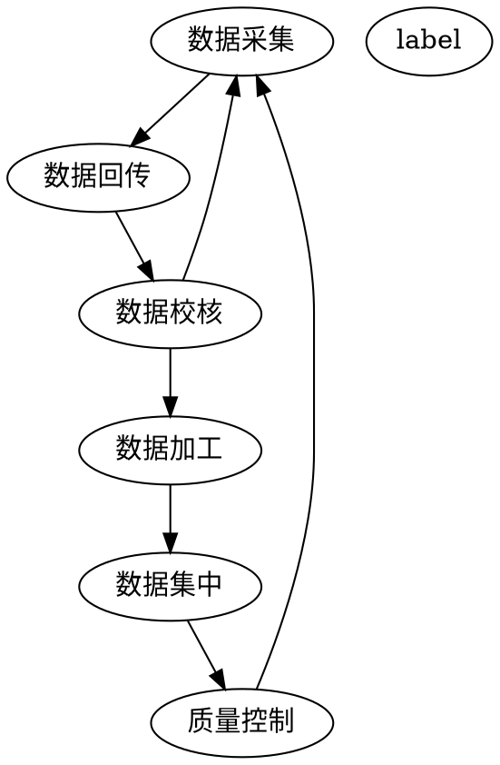

# GB/T 36106

- GB/T 36106-2018
  法人和其他组织统一社会信用代码数据管理规范
- 定义了数据有效性判断规则
  - 非空字段
  - 字段校验规则

```graphviz
digraph G {
  数据采集 -> 数据回传 -> 数据校核
  数据校核 -> 数据加工 -> 数据集中 -> 质量控制
  质量控制 -> 数据采集 {label:"反馈质疑数据"}
  数据校核 -> 数据采集 {label:"反馈质疑数据"}
}
```
