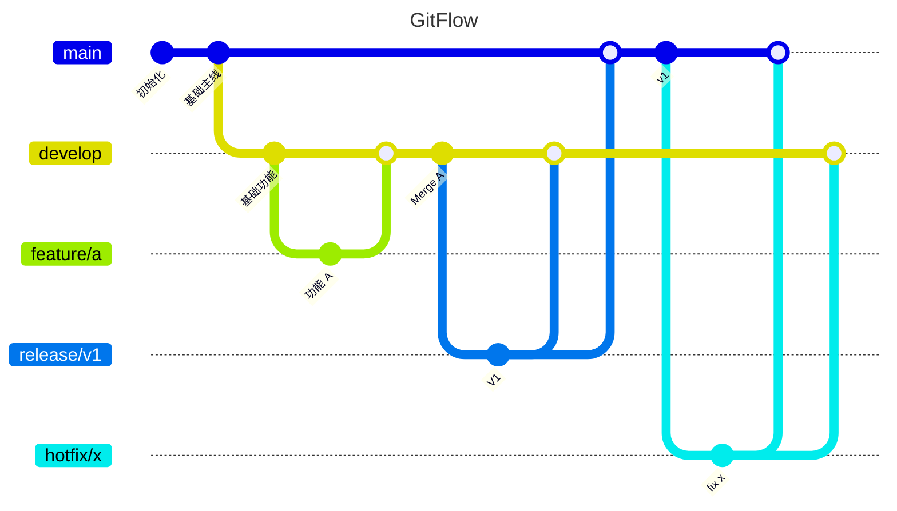
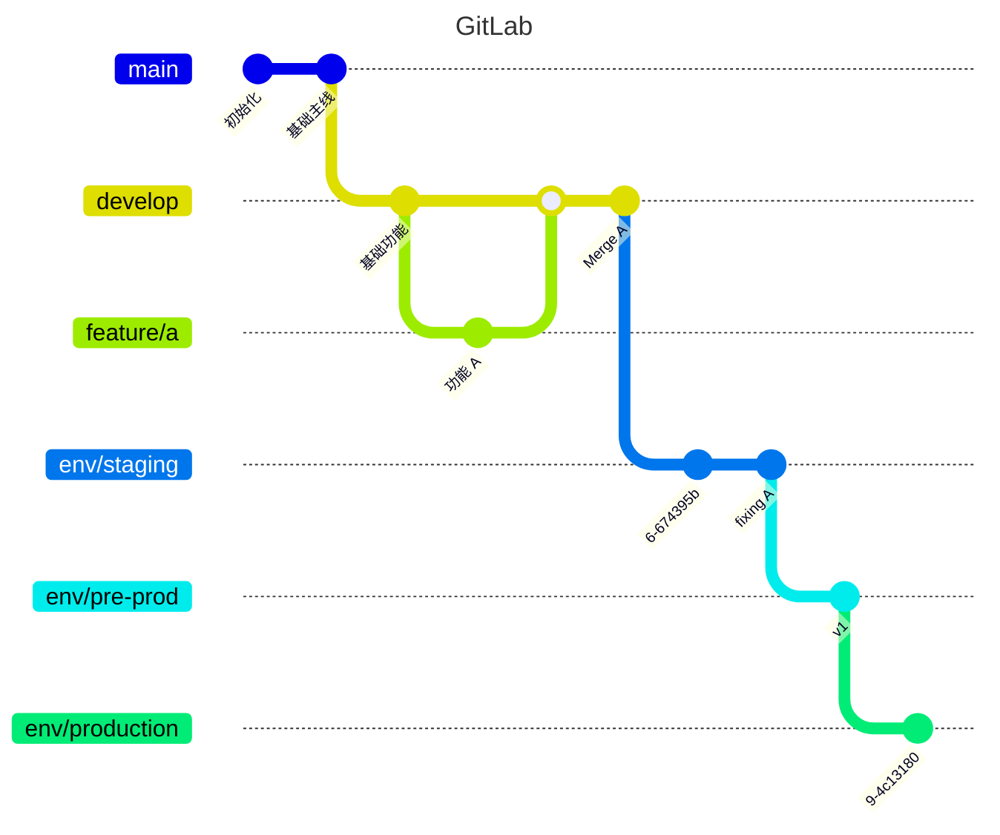

# gitflow

- [petervanderdoes/gitflow-avh](https://github.com/petervanderdoes/gitflow-avh)
  - 2019 停止维护
  - a collection of Git extensions to provide high-level repository operations for Vincent Driessen's branching model.
  - adds more functionality to the existing git-flow and several of the internal commands have been rewritten to speed up the software.
- [nvie/gitflow](https://github.com/nvie/gitflow)
  - 2012 停止维护
- [A successful Git branching model](http://nvie.com/posts/a-successful-git-branching-model)
- [git-flow 工作流程](https://www.git-tower.com/learn/git/ebook/cn/command-line/advanced-topics/git-flow)
- branches
  - bugfix hotfix release feature support
- actions
  - delete finish list publish rename start track
  - rebase

```bash
brew install git-flow-avh

git flow init -d
git push --set-upstream origin develop

git checkout develop
git flow release start v2021.1.1
git flow release finish v2021.1.1
git push --tags
```

## standard

- 单分支 - GitHub flow
  - master
- 功能分支
  - master, `feature/*`
  - `feature/*` -> master
- gitflow
  - master, develop, `feature/*`, `release/*`,`hotfix/*`
  - `release/*`, `hotfix/*` -> master
  - `feature/*`, `release/*`, `hotfix/*` -> develop
- GitLab
  - master, `feature/*`, `*-stable`, `env/*`
  - `feature/*` -> master






- https://docs.github.com/en/get-started/quickstart/github-flow
  - frequently deploying
  - minimize the amount of unreleased code
- https://docs.gitlab.com/ee/topics/gitlab_flow.html
- https://en.wikipedia.org/wiki/Feature-driven_development
- https://martinfowler.com/bliki/FeatureBranch.html
- 操作规范
  - rebase
  - squash
