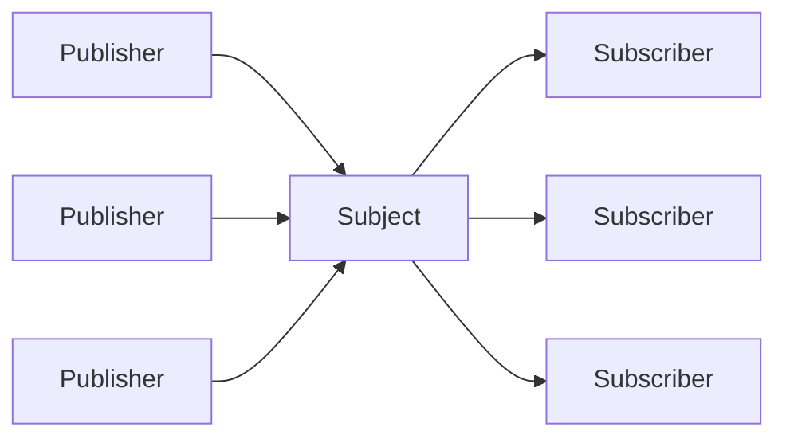
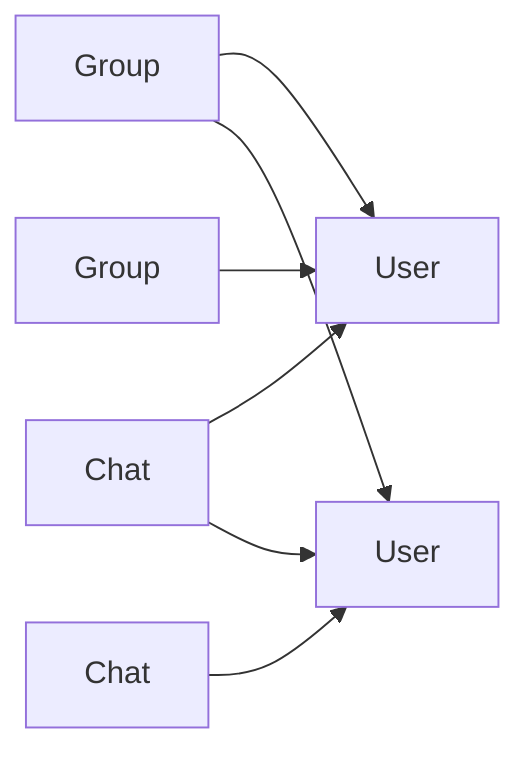
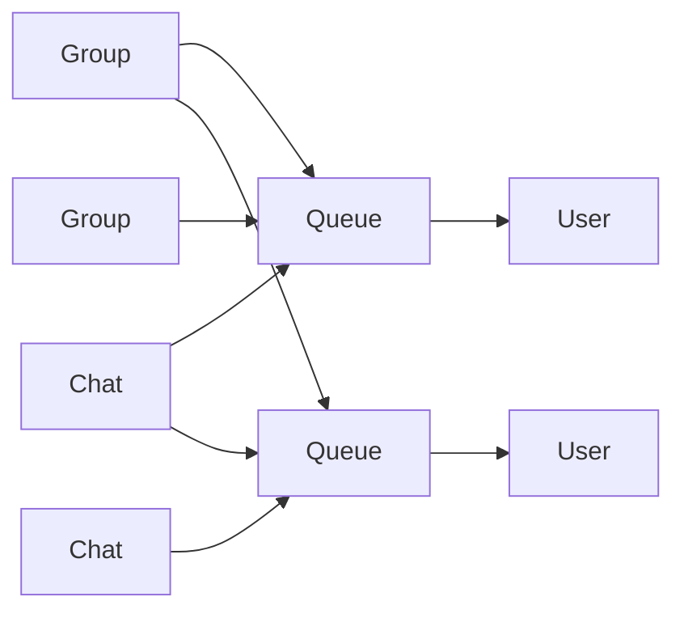

---
tags:
  - FAQ
---

# IM FAQ

- https://docs.nats.io/nats-concepts/overview/compare-nats

## fan-in vs fan-out

- fan in
  - N Producer -> 1 Broker
- fan out
  - one-to-many
  - PubSub
  - PushPull
  - 1 Broker -> N Consumer
- fan out write
  - 1 Broker -> N Consumer
- fan out read
  - 1 Consumer -> N Broker

- 一个会话一个队列 - 独立单一
- 多消费
- 订阅时合并 - 逻辑复杂
- 相对可控性高

- 服务器多存、多处理
- 单一消费
- 权限好控制
- 变动小 - 可控性低
