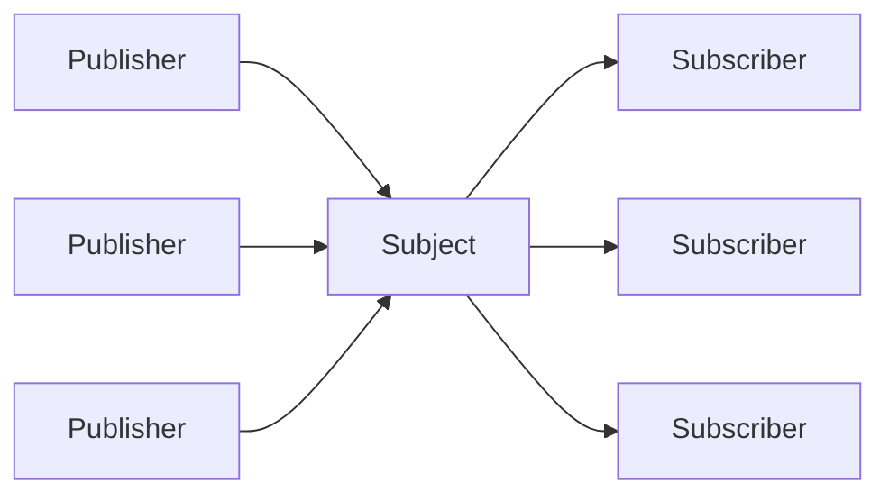
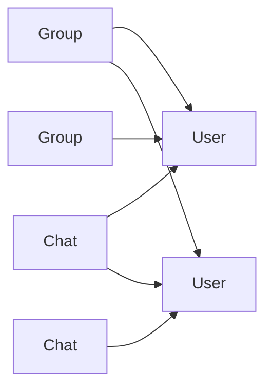
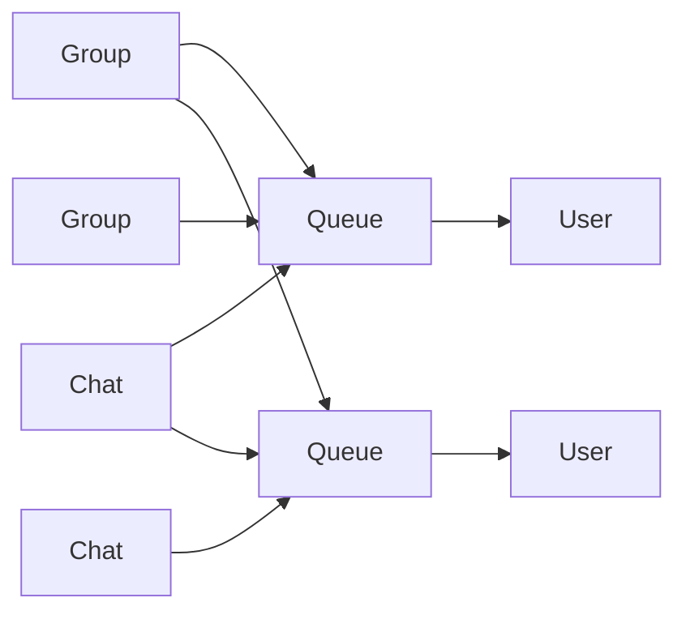

---
tags:
  - FAQ
---

# IM FAQ

- https://docs.nats.io/nats-concepts/overview/compare-nats

## fan-in vs fan-out

- fan in
  - N Producer -> 1 Broker
  - 多个发送者向一个接收者发送消息
  - 对性能影响较小，但需要确保服务端能够有效处理并发连接和数据的汇总。
  - 确保服务器能够处理高并发请求并在出现故障时快速恢复
- fan out
  - 1 Broker -> N Consumer
  - 一个发送者向多个接收者发送消息
  - 大规模聊天应用中可能会遇到性能瓶颈，特别是在实时广播大量消息时。
  - 使用 消息队列、发布/订阅模式 来缓冲消息并异步分发
  - 需要设计高可用的消息分发系统，避免单点故障导致的消息丢失。
  - one-to-many
  - PubSub
  - PushPull
- fan out write
  - 1 Broker -> N Consumer
- fan out read
  - 1 Consumer -> N Broker

- 一个会话一个队列 - 独立单一
- 多消费
- 订阅时合并 - 逻辑复杂
- 相对可控性高

- 服务器多存、多处理
- 单一消费
- 权限好控制
- 变动小 - 可控性低
