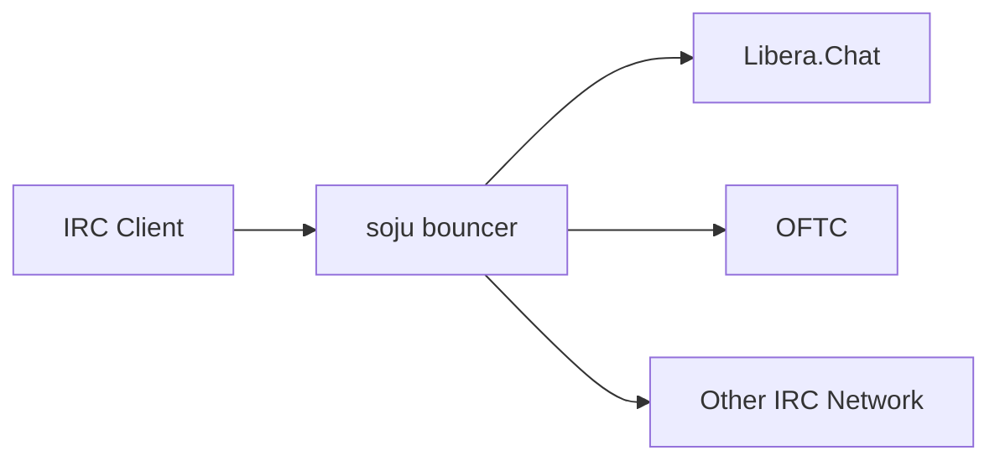

# soju

- [emersion/soju](https://codeberg.org/emersion/soju)
  - AGPLv3, Go
  - user-friendly IRC bouncer
- 官网：<https://soju.im>
- 适合小型到大型 IRC bouncer 部署

## 概述

- soju 是 IRC bouncer：常驻连接上游 IRC server，客户端连接 soju，而不是直接连接 IRC network。
- 用途
  - 多设备共享同一 IRC session
  - 断线后保留 channel / network 状态
  - chat history playback
  - detached channels
  - 多用户部署
  - 支持多种 IRCv3 扩展



## 安装

依赖：

- Go
- BSD/GNU make
- C89 compiler - 可选，用于 SQLite
- scdoc - 可选，用于 man pages

```bash
make
sudo make install
```

开发运行：

```bash
go run ./cmd/soju
```

构建选项：

```bash
# 使用系统 libsqlite3
GOFLAGS='-tags=libsqlite3' make

# 禁用 SQLite
GOFLAGS='-tags=nosqlite' make

# 使用不依赖 CGO 的 SQLite 实现
GOFLAGS='-tags=moderncsqlite' make

# 启用 PAM auth
GOFLAGS='-tags=pam' make
```

## 组件

| 名称 | 说明 |
| --- | --- |
| soju | bouncer server |
| upstream | soju 连接的上游 IRC server / network |
| downstream | 用户 IRC client 到 soju 的连接 |
| user | soju 内部用户账号 |
| network | 用户配置的 IRC network |
| channel | IRC channel，例如 `#soju` |
| history | 消息历史，用于 playback / 多端同步 |

## 使用建议

- 对公网暴露时优先启用 TLS。
- 多用户部署时注意认证方式、数据库和备份。
- 如果需要 Web UI，可搭配 The Lounge、gamja 等 IRC Web client。
- 如果只是单用户轻量使用，重点关注配置、数据目录、证书和 systemd service。

## 参考

- <https://codeberg.org/emersion/soju>
- <https://soju.im>
- Libera Chat：`#soju`
