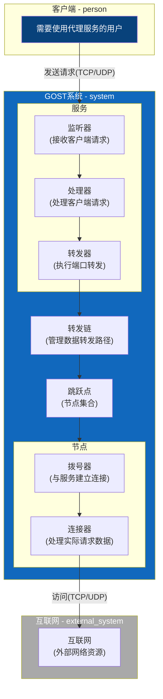

# gost

- [go-gost/gost](https://github.com/go-gost/gost)
  - MIT, Go
  - v3 还没正式发布
  - GO Simple Tunnel
  - https://gost.run/
  - 上游/连接器 协议支持: http, http2, socks4, socks5, ss, ssu, sni, sshd
  - 监听 协议支持: tcp, udp, tls, mtls, ws, mws. mwss, http2, h2c, grpc, quic, pht, http3, kcp, ssh, sshd, red, redu, rtcp, rudp, dns, tun, tap, icmp, ohttp, otls, ftcp
  - mws -> 多路复用 websocket - 基于 Path 分流
  - ssu -> Shadowsocks UDP
  - red -> REDIRECT+tproxy
  - redu -> UDP iptables+tproxy
  - rtcp, rudp - 远程端口转发
  - ohttp, otls - HTTP 伪装握手
  - ftpc - [tcpraw](https://github.com/xtaci/tcpraw) 模拟 tcp
  - 支持
    - HTTP - Connect/Plain HTTP Tunnel/Websocket/HTTP2 CONNECT/gRPC/HTTP3 CONNECT/WebTransport
    - SOCKSv4/v5
    - Shadowsocks
    - KCP
    - SSH
    - SNI Proxy
    - PROXY 协议
    - TPROXY/REDIRECT
    - TUN/TAP
    - ICMP Tunnel
    - DNS 代理
    - WebAPI
- [ginuerzh/gost](https://github.com/ginuerzh/gost)
  - MIT, Go
  - https://v2.gost.run/

:::caution

- 新协议支持的少
  - tuic
  - hysteria
  - trojan

:::

```bash
# https://github.com/go-gost/gost/releases/
# macOS
curl -LO https://github.com/go-gost/gost/releases/download/v3.0.0/gost_3.0.0_darwin_amd64.tar.gz
tar zxvf gost*.tar.gz gost

# Linux
curl -LO https://github.com/go-gost/gost/releases/download/v3.0.0/gost_3.0.0_linux_amd64.tar.gz
tar zxvf gost*.tar.gz gost

./gost -V
sudo mv gost /usr/local/bin/

# v3
# -L 监听
# -F 转发，支持配置多个，作为转发链
gost -L http://:8080 -L socks5://:1080 -F http://192.168.1.1:8080

gost -L http://:1080 -F ss://chacha20-ietf-poly1305:pass@:8338

# SNI proxy
gost -L sni://:80 -L sni://:443 -F socks5://192.168.1.1:1080
gost -L sni://:8080 -L sni://:8443
# flag -> config
gost -L sni://:80 -L sni://:443 -F socks5://192.168.1.1:1080 -O yaml > gost.yaml
gost

docker run --rm -it \
  gogost/gost

# 测试下来两个端口都可以 proxy-protocol 和不 proxy-protocol
# service,handler,listener 都加了 proxyProtocol=1
gost -L tcp://:8000/:8080 -L tcp://:8080/example.com:80?proxyProtocol=1
curl -H 'Host: example.com' 127.0.0.1:8000 -v
curl --haproxy-protocol -H 'Host: wener.me' 127.0.0.1:8080 -v

# 发送 HAProxy protocol / send-proxy
# 目前只有 rtcp 和 rudp 会处理
gost -L rtcp://:8080/127.0.0.1:80?proxyProtocol=1
```

- `-L tcp://:8080/192.168.1.1:80`
  - 端口映射
- rudp -> remote udp - 远程映射到本地

## Notes

- 四大模块
  - 服务(Service)
    - Listener+Handler
  - 转发链(Chain)
    - N\*Hop -> Selector+Bypass -> Route
  - 跳跃点(Hop)
    - N\*Node
  - 节点(Node)
    - Dialer+Connector
- 五个子模块：监听器(Listener)，处理器(Handler)，转发器(Forwarder)，拨号器(Dialer),连接器(Connector)
- 辅助模块：节点选择器(Selector)，准入控制器(Admission)，分流器(Bypass)，域名解析器(Resolver)，主机映射器(Hosts)，限速器(Limiter)等组成。
- https://gost.run/concepts/architecture/



## Config

- `-C`
- gost.yml, gost.json
  - $PWD
  - /etc/gost
  - $HOME/.gost

```yaml
# -L
services:
  - name: service-0
    # -L 的 hostname
    addr: 'localhost:8080'
    handler:
      # -L 的 schema
      type: http
      chain: chain-0
      # -L 的 auth 信息
      auth:
        username: gost
        password: gost
      metadata:
        foo: bar
    listener:
      # -L 的 schema
      type: tcp
      metadata:
        foo: bar
    metadata:
      preUp:
        - echo pre-up
      postUp:
        - echo post-up
      preDown:
        - echo pre-down
      postDown:
        - echo post-down
# -F
# schema -> connector, dialer
chains:
  - name: chain-0
    hops:
      - name: hop-0
        nodes:
          - name: node-0
            addr: 192.168.1.1:8080
            connector:
              type: socks5
              auth:
                username: gost
                password: gost
              metadata:
                bar: baz
            dialer:
              type: tls
              metadata:
                bar: baz

api:
  addr: :1234
```

## Auth

- HTTP -> Redis -> 文件 -> 内联
- Redis
  - hash
- HTTP
  - 返回和文件一样的内容
- https://gost.run/concepts/auth

## WebAPI

- https://gost.run/tutorials/api/overview/
- https://gost.run/swagger-ui/
