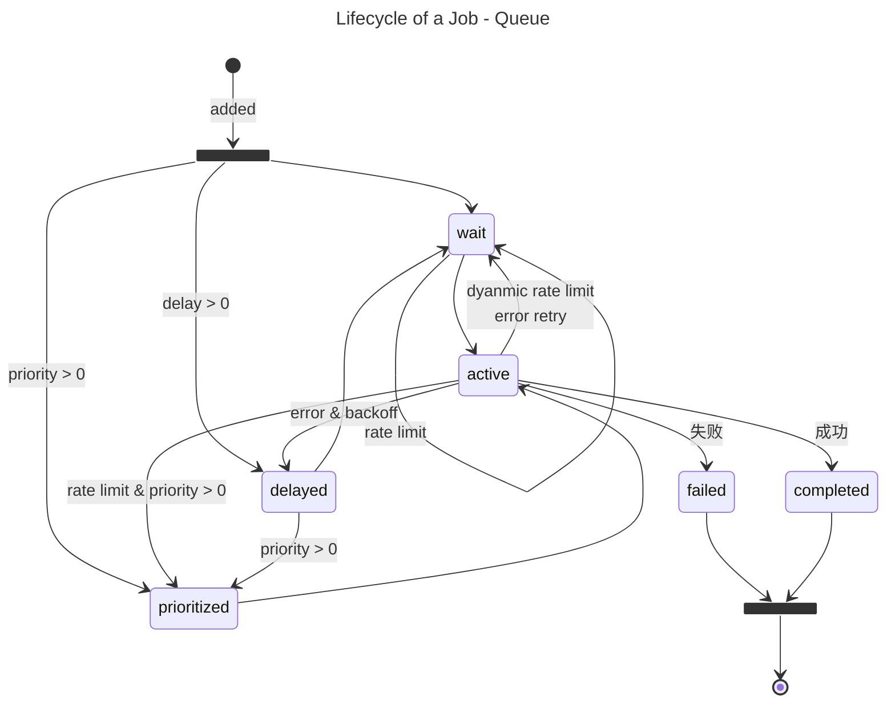

---
tags:
  - NodeJS
---

# BullMQ

:::tip

- 只依赖 Redis
- 支持 delay, debounce, flow(parent,children), repeat, rate limit

:::

- [taskforcesh/bullmq](https://github.com/taskforcesh/bullmq)
  - MIT, TS, Redis
- [OptimalBits/bull](https://github.com/OptimalBits/bull)
  - MIT, JS, Redis
  - maintenance mode, 推荐 BullMQ
- queueName vs jobName
  - Worker 使用 queue 来区分
  - job 包含 jobName - 不能用来分流给 Worker，但可以让 Worker 处理多种 job
    - 如果希望细粒度分流可以考虑创建多个 Queue，例如 `Email:Send`, `Email:Receive`
    - pro 支持 group 概念
    - https://docs.bullmq.io/patterns/named-processor
- 去重机制
  - debounce - 会生成 debounced 事件
  - jobId - 会生成 duplicated 事件

**Client**

```ts
import { Queue } from 'bullmq';

const queue = new Queue('Paint');

queue.add('cars', { color: 'blue' });
```

**Worker**

```ts
import { Worker } from 'bullmq';

const worker = new Worker('Paint', async (job) => {
  if (job.name === 'cars') {
    await paintCar(job.data.color);
  }
});
```

**Listener**

```ts
import { QueueEvents } from 'bullmq';

const queueEvents = new QueueEvents('Paint');

queueEvents.on('completed', ({ jobId }) => {
  console.log('done painting');
});

queueEvents.on('failed', ({ jobId, failedReason }: { jobId: string; failedReason: string }) => {
  console.error('error painting', failedReason);
});
```

## Notes

```ts
export type FinishedStatus = 'completed' | 'failed';
export type JobState = FinishedStatus | 'active' | 'delayed' | 'prioritized' | 'waiting' | 'waiting-children';
export type JobType = JobState | 'paused' | 'repeat' | 'wait';
```

- QueueEvents
  - `XREAD BLOCK 10000 STREAMS $key $lastEventId`
- 处理中可以 job.moveToDelayed 然后 throw DelayedError
  - 让 job 进入等待状态
- 处理中可以 job.moveToWaitingChildren 然后 throw WaitingChildrenError
  - 让 job 进入等待 children 的状态
- throw UnrecoverableError 可以避免 retry
- throw throw Worker.RateLimitError 可以实现手动 rate-limit
- repeatable jobs -> delayed jobs
  - jobId 用于生成 deplayed job，而不用于本身 job 去重
    - `repeat:KEY:1724148000000`
  - key
    - 默认通过 options 生成，自定义 key 创建相同配置的 repeatable job
    - 相同 key 创建可以覆盖之前的 options

**job.toJSON**

```json
{
  "name": "pull",
  "opts": {
    "attempts": 0,
    "delay": 30121,
    "repeat": {
      "every": 90000,
      "key": "WecomArchivePull",
      "count": 1
    },
    "jobId": "repeat:WecomArchivePull:1724148000000",
    "timestamp": 1724147969879,
    "prevMillis": 1724148000000
  },
  "id": "repeat:WecomArchivePull:1724148000000",
  "progress": 0,
  "returnvalue": null,
  "stacktrace": null,
  "attemptsStarted": 0,
  "attemptsMade": 0,
  "delay": 30121,
  "repeatJobKey": "WecomArchivePull",
  "timestamp": 1724147969879,
  "queueQualifiedName": "bull:WecomArchive"
}
```

## Lifecycle

- priority 0 - 2^21
  - 0 最高
- Worker Pickup - prioritized > wait
  - pickup 后变为 active



```mermaid---
title: Lifecycle of a Job - Flow Producer
---

stateDiagram-v2

state added <<fork>>
    [*] --> added: added

    state no_children <<fork>>
        added --> no_children: 无 children
        no_children --> delayed: delay > 0
        no_children --> prioritized: priority > 0

    waiting_children: waiting-children
    added --> waiting_children: 有 chdilren


    waiting_children --> wait: children completed
    waiting_children --> delayed: delay > 0
    waiting_children --> prioritized: priority > 0
    waiting_children --> failed: child fail & failParentOnFailure

    wait --> wait: rate limit
    wait --> active

    active --> wait: dyanmic rate limit <br/> error retry
    active --> delayed: error & backoff
    active --> prioritized: rate limit & priority > 0
    active --> failed: 失败
    active --> completed: 成功

    prioritized --> active
    delayed --> prioritized: priority > 0
    delayed --> wait

state finished <<join>>
    failed --> finished
    completed --> finished
    finished --> [*]: finished
```

- 参考
  - https://docs.bullmq.io/guide/architecture

# FAQ

## BullMQ vs Bull

| vs                          | bullmq                           | bull   |
| --------------------------- | -------------------------------- | ------ |
| Year                        | 2019                             | 2013   |
| job event                   | stream                           | pubsub |
| Workers and Event listeners | separate                         | same   |
| Scheduler Process           | 单独 Scheduler                   | same   |
| Job Dependencies            | 有                               | 无     |
| Priority Queueing           | 有,支持 rate-limited, scheduling | 有     |
