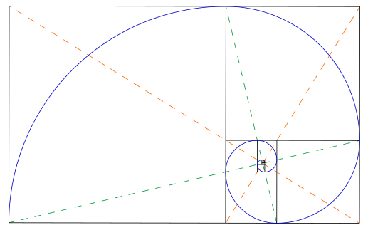

---
tags:
  - FAQ
---

# Design FAQ

## Golden Ratio

- 黄金比例, 黄金分割比
- 常数 - 1.618
- 1:2, 2:3, 3:5, 5:8
  - 33:66, 40:60

$$
\frac {a + b} {a} = \frac a b = \varphi
$$

a > b > 0

$$
\varphi = \frac {1 + \sqrt 5} 2 = 1.6180339887498948482...
$$

$$
\frac 1 \varphi = \varphi - 1
$$

**贵金属分割**

$$
\frac {n + \sqrt {n^2 + 4}} 2
$$

- n=1 黄金分割 - 1.61803398874989
- n=2 白银分割 - 2.41421356237309
- n=3 青铜分割 - 3.30277563773199

<!-- const r = (n)=>(n+Math.sqrt(n**2 + 4)) / 2 -->

**黄金矩形**

---

- https://en.wikipedia.org/wiki/Golden_ratio

## Web 设计 vs 平面 设计

**相同点**

都需要考虑视觉，颜色，美观。

**不同点**

- 平面设计 - 给人看的
  - 在静态的 2D 平面进行设计
    - 任何元素都精确定位 - 以拖拉为主
  - 不需要考虑客户端环境
    - 不存在兼容问题
    - 可任意使用本地资源
      - 字体、颜色、图片
  - 设计可以随心所欲，相同元素之间可以完全不同
  - 无交互
- Web 设计 - 给人用的
  - 在动态的 2D 环境进行布局
    - 元素布局是嵌套在一层一层的流式容器中
  - 需要考虑客户端环境
    - 设备大小 - 响应式
    - 网络带宽 - 资源优化
    - 使用人群 - 可访问性 - 残障人群、键盘、鼠标、屏幕、触摸板、屏幕阅读器
    - 浏览器 - 系统、字体、版本兼容
  - 设计需要考虑元素组件，相同元素组件保持相同 - 便于实现和用户发现功能
  - 有交互
- 工业设计 - 产品设计 - 物理层面 - 给人用的

## Logotype vs Logomark vs Logo

- Logotype - 文字标志 - 带文字的Logo - Wordmark
- Logomark - 图形标志 - 不带文字的Logo - 图形标志 - Brand Mark
- Combination Mark - 组合标志 - 同时包含了文字和图标/符号
- Logo - 统称

## Icon margin

图标的 margin（间距）设计通常有如下实践：

- **相对尺寸比**：常采用图标的 1/4、1/5 或 1/6 作为外部留白（例如 24px 图标，常用 4px~6px margin）。
- **几何留白**：确保图标本身不是“顶格画满”，内部有净空区（通常 Icon SVG 四周会预留 1~2px）。
- **统一视觉**：同一组图标 margin 必须保持一致，便于对齐和整齐排版。
- **响应比例**：在大尺寸 (如 48px, 64px) 时适当加大 margin，防止元素拥挤。
- **产品实践**：
    - Material Design 推荐图标外边距为 2dp~4dp（8px icon 推荐 2px，24px icon 推荐 4px）
    - Ant Design 建议图标行内用时间距为 8px
    - 常用设计规范如 Figma、Sketch 内的 icon component 通常默认最小 2px 到 4px 的 padding/margin

**经验值参考**：

- 一般 margin 设置为 icon 尺寸的 15%~25%，例如 24px icon 建议 4px~6px
- 行内 icon 与文本对齐时，左右间距比上下略大，以保持视觉均衡

**示例**：

| 图标尺寸 | 常用 margin 示例 | 推荐区间      |
|---------|-----------------|--------------|
| 16px    | 2px ~ 4px       | 12% ~ 25%    |
| 24px    | 4px ~ 6px       | 16% ~ 25%    |
| 32px    | 6px ~ 8px       | 18% ~ 25%    |

**注意事项**：

- 保证图标和文本垂直居中对齐
- 不同风格的 icon 集可能有特殊公式，要以设计规范为准
- 行内 icon 不要挤占文本行高，避免折行问题
