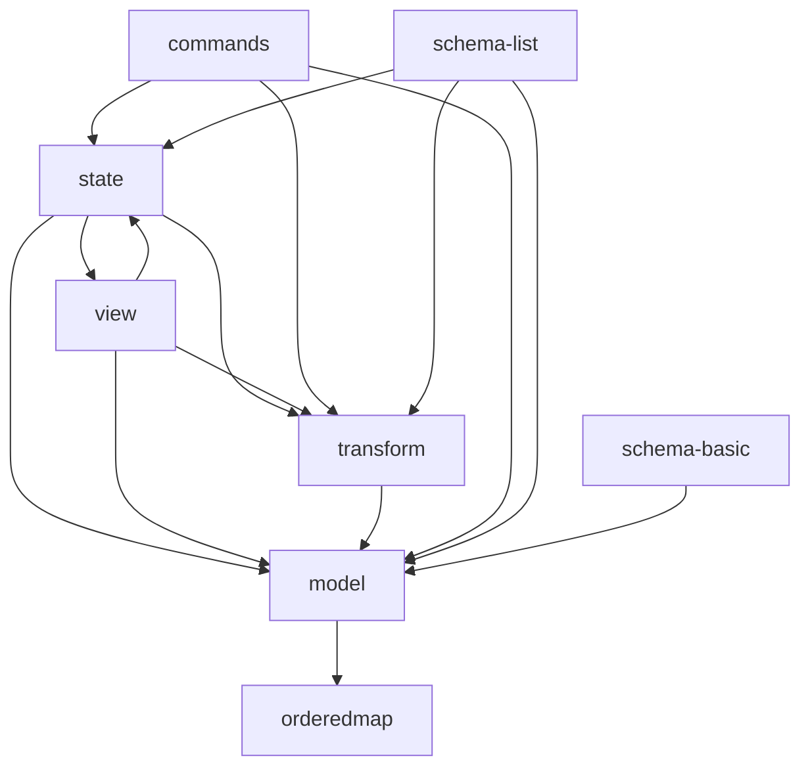

---
tags:
  - Insight
---

## ProseMirror Inside



> **Note** view 和 state 相互依赖

- 所有模块 https://github.com/orgs/ProseMirror/repositories
- 模块 - `prosemirror-<module>`
- prosemirror-model - 定义文档模型
  - Slice
  - ResolvedPos
  - NodeRange
  - Schema
  - ContentMatch
  - DOMParser
  - DOMSerializer

```ts
type Attrs = Record<string, any>;

class NodeType {
  name: string;
  schema: Schema;
  spec: NodeSpec;
  create(attrs?: Attrs, content?: Fragment | Node | readonly Node[] | null, marks?: readonly Mark[]): Node;
  isBlock: boolean;
  isTextBlock: boolean;
  inlineContent: boolean;
  isInline: boolean;
  isText: boolean;
  isLeaf: boolean;
  isAtom: boolean; // 整体操作
}
class Node {
  type: NodeType;
  attrs: Attrs;
  marks: readonly Mark[];
  content: Fragment;
  text: string;
  readonly nodeSize: number;
  readonly childCount: number;

  toJSON(): any;
  static fromJSON();
}

// node's collection of child nodes
class Fragment {}

class MarkType {
  name: string;
  schema: Schema;
  spec: MarkSpec;
  create(attrs?: Attrs): Mark;
}
class Mark {
  type: MarkType;
  attrs: Attrs;
}
```

- prosemirror-transform - 状态事务
  - 让修改 可记录、可重返、重排序
  - Step - ReplaceStep, ReplaceAroundStep, AddMarkStep, RemoveMarkStep
    - 原子修改
    - 可序列化
    - 每个 Step 的 class prototype 上有 jsonID 来跟踪
  - StepResult
  - Mappable - StepMap, Mapping
  - MapResult
  - Transform

```ts
abstract class Step {
  abstract apply(doc: Node): StepResult;
  abstract invert(doc: Node): Step;
  abstract map(mapping: Mappable): Step;
}

class Transform {
  steps: Step[];
  docs: Node[];
  mapping: Mapping;
  doc: Node;
  before: Node;
  after: Node;
  docChanged: boolean;
}
```

- [prosemirror-state](https://github.com/ProseMirror/prosemirror-state) - 编辑器状态
  - EditorState
  - Transaction
  - Selection - from,to - anchor,head
    - TextSelection
    - NodeSelection - node
    - AllSelection
  - Plugin
  - PluginKey

```ts
// 是一个很轻量的对象
class EditorState {
  doc: Node;
  selection: Selection;
  storedMarks: readonly Mark[]; // 下次输入会应用的 mark
  schema: Schema;
  plugins: readonly Plugin[];
  apply(tr: Transaction): EditorState;
  applyTransaction(rootTr: Transaction): {
    state: EditorState;
    transactions: readonly Transaction[];
  };
  readonly tr: Transaction; // 开启一个事务
  // 保留状态
  reconfigure(config: Object): EditorState;

  static create(config: EditorStateConfig): EditorState;

  // 序列化 - 大致结构
  // {doc,selection,storedMarks?, [pluginField] = plugin.spec.state?.toJSON?.()}
  toJSON(pluginFields?: Object<Plugin>): any;
  // 反序列化
  // doc=Node.fromJSON, selection = Selection.fromJSON
  // storeMarks=schema.markFromJSON
  // plugin.spec.state?.fromJSON
  static fromJSON(config: Object, json: any, pluginFields?: Object<Plugin>): EditorState;
}

interface EditorStateConfig {
  schema?: Schema;
  doc?: Node;
  selection?: Selection;
  storedMarks?: readonly Mark[];
  plugins?: readonly Plugin[];
}

// 包含针对 EditorState 的操作
// 能存储额外的 meta 信息
class Transaction extends Transform {}

type Command = (
  state: EditorState,
  dispatch?: (tr: Transaction) => void, // dry run 时没有
  view?: EditorView,
) => boolean; // 返回 false 表示不适用

interface PluginSpec<PluginState> {
  key?: PluginKey;
  props?: EditorProps<Plugin<PluginState>>;
  state?: StateField<PluginState>;

  // DOM 交互
  view?: (view: EditorView) => PluginView;
  // 可以取消 tr
  filterTransaction?: (tr: Transaction, state: EditorState) => boolean;
  appendTransaction?: (
    transactions: readonly Transaction[],
    oldState: EditorState,
    newState: EditorState,
  ) => Transaction;

  [key: string]: any;
}

interface StateField<T> {
  init: (config: EditorStateConfig, instance: EditorState) => T;
  apply: (tr: Transaction, value: T, oldState: EditorState, newState: EditorState) => T;

  toJSON?: (value: T) => any;
  fromJSON?: (config: EditorStateConfig, value: any, state: EditorState) => T;
}
type PluginView = {
  update?: (view: EditorView, prevState: EditorState) => void;
  destroy?: () => void;
};

class Plugin<PluginState = any> {
  constructor(spec: PluginSpec<PluginState>);
  spec: PluginSpec<PluginState>;
  props: EditorProps<Plugin<PluginState>>;
  getState(state: EditorState): PluginState;
}
class PluginKey<PluginState = any> {
  constructor(name: string = 'key');
  get(state: EditorState): Plugin<PluginState>;
  getState(state: EditorState): PluginState;
}
```

- prosemirror-view - Web 编辑器 - DOM <-> State
  - EditorView
  - Decoration
  - DecorationSet

```ts
class EditorView {
  state: EditorState;
  dom: HTMLElement;
  editable: boolean;

  dispatchEvent(event: Event): void;
  dispatch(tr: Transaction): void;
}
interface EditorProps<P = any> {}
interface NodeView {
  dom: DOMNode;
  contentDOM?: HTMLElement;
}
```

- prosemirror-commands - 预设的 state 操作
  - joinBackward
  - selectNodeBackward
  - joinForward
  - selectNodeForward
  - joinUp
  - joinDown
  - lift
  - newlineInCode
  - exitCode
  - deleteSelection
  - selectAll
  - selectTextblockStart - 移动光标到 block 开头
  - selectTextblockEnd
  - setBlockType
  - toggleMark
- prosemirror-keymap
- prosemirror-history
- prosemirror-inputrules - 输入特定内容，触发命令 - 实现 Markdown 输入语法
  - InputRule
- prosemirror-collab
- prosemirror-gapcursor
- prosemirror-schema-basic - 类 CommonMark 的 Schema, 不包含 list
  - nodes - doc, paragraph, blockquote, horizontal_rule, heading, code_block, text, image, hard_break
  - marks - line, em, strong, code
- prosemirror-schema-list - 类 CommonMark 的 列表 schema
  - orderedList, bulletList, listItem
- prosemirror-markdown
- prosemirror-menu
- prosemirror-dropcursor
- prosemirror-table
- prosemirror-changeset

```json title="model"
{
  "type": "",
  "attrs": {},
  "content": {},
  "marks": [
    {
      "type": "",
      "attr": {}
    }
  ]
}
```

```ts
// 数组 - ['tag',{},0]
type DOMOutputSpec = string | DOMNode | { dom: DOMNode; contentDOM?: HTMLElement } | [string, ...any];
// 供 DOMSerializer 使用
type NodeToDOM = (node: Node) => DOMOutputSpe;
type MarkToDOM = (mark: Mark, inline: boolean) => DOMOutputSpec;
```
