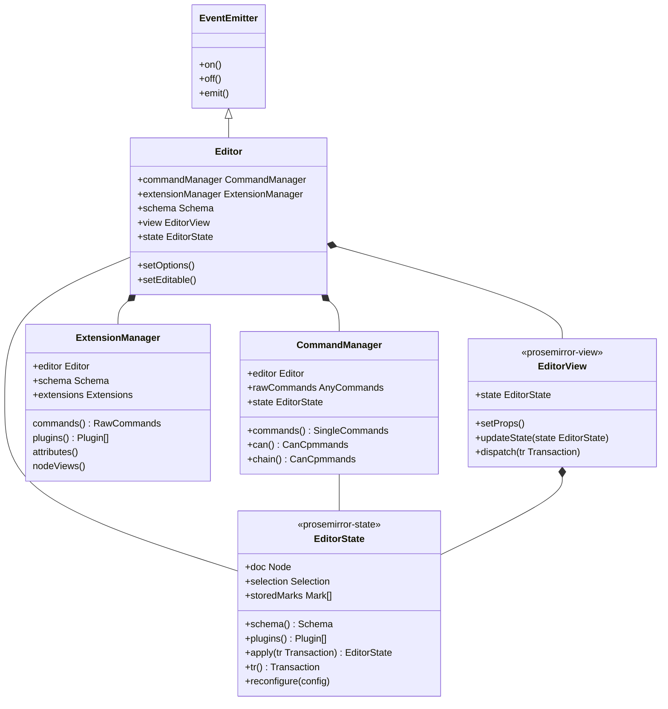

---
tags:
  - Insight
---

# Tiptap Inside



- 传参使用对象， prosemirror 使用独立参数
- Editor
  - 封装所有相关对象
  - EditorView, Extension, Command
- ExtensionManager
  - 插件系统
  - 包含了 prosemirror 的 Plugin 逻辑
  - Extension 包含了非 prosemirror Plugin 的功能
    - 添加 command
    - 事件
    - 一些额外 hook
  - 事件
    - beforeCreate, create, update, selectionUpdate, transaction
    - focus, blur
    - destroy
- CommandManager
  - 将离散的 commands 封装在一起
  - 提供 can 和 chain 辅助操作

```ts
import { EditorView } from 'prosemirror-view';

class Editor extends EventEmitter<EditorEvents> {
  commandManager!: CommandManager;
  extensionManager!: ExtensionManager;
  css!: HTMLStyleElement;
  schema!: Schema;
  view!: EditorView;
  isFocused = false;
  extensionStorage: Record<string, any> = {};

  options: EditorOptions;

  get storage(): Record<string, any>;
  get commands(): SingleCommands;
  chain(): ChainedCommands;
  can(): CanCommands;
  setOptions(options: Partial<EditorOptions> = {}): void;
  setEditable(editable: boolean): void;
  get isEditable(): boolean;
  get state(): EditorState;

  registerPlugin(plugin: Plugin, handlePlugins?: (newPlugin: Plugin, plugins: Plugin[]) => Plugin[]): void;
  unregisterPlugin(nameOrPluginKey: string | PluginKey): void;

  getJSON(): JSONContent {
    return this.state.doc.toJSON();
  }
  getHTML(): string;
  getText(options?: { blockSeparator?: string; textSerializers?: Record<string, TextSerializer> }): string;
  get isEmpty(): boolean;
  destroy(): void;
  get isDestroyed(): boolean;
}

class ExtensionManager {
  editor: Editor;
  schema: Schema;
  extensions: Extensions;
  constructor(extensions: Extensions, editor: Editor);
  get commands(): RawCommands;
  get plugins(): Plugin[]; // inputRules, pasteRules, others
  get attributes();
  get nodeViews();

  static resolve(extensions: Extensions): Extensions;
  static flatten(extensions: Extensions): Extensions;
  static sort(extensions: Extensions): Extensions;
}
class CommandManager {
  editor: Editor;
  rawCommands: AnyCommands;
  customState?: EditorState;
  constructor(props: { editor: Editor; state?: EditorState });
  get state(): EditorState;
  get commands(): SingleCommands;
  get chain(): () => ChainedCommands;
  get can(): () => CanCommands;
}

type CommandProps = {
  tr: Transaction;
  editor: Editor;
  view;
  state: ChainableState;
  dispatch?;
  chain: () => ChainCommands;
  can: () => CanCommands;
  get commands();
};
```
