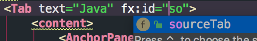

## 概述

Java 11 自 2018.9.25 发布以来，已经好几个月了，在还没正式 GA 之前都习惯性的去 [java-countdown.xyz](http://www.java-countdown.xyz/) check 发布倒计时。Java 11 有比较多的新功能，而其中最吸引我的

- Java 11 是 LTS 版本
  - 这意味着体验 Java9 带来的模块特性变得更有意义
- JavaFX 从 JDK 中移除，作为独立模块

在 11 发布时，JavaFX 也发布了 11 的 GA 版本。JavaFX 本身并不新奇，但自 Java9 模块化后，JavaFX 得益于 jlink 的能力，能够将 JavaFX 封装为独立的 GUI 应用，**不要求安装 JDK** 。这使得在桌面应用开发的场景，除了 Electron、Mono、QT 等跨平台开发框架，Java 也能作为其中的一项选择了。在 Swing 时代，Java 的桌面应用开发体验也不差（曾经做过的小游戏 [wenerme/GTetris](https://github.com/wenerme/GTetris)），但由于累赘的 JDK （大约 150m）使得开发一个小应用变得不切实际。

JLink 可以将项目依赖的模块加上基础 VM 来生成一个新的 JDK，应用的体积能够大大减小，如果还能再配合 progard，那体积还能再缩小一圈。

## Motivation

基于体验 Java11 和 JavaFX 的前提（每个 Java 程序员都会写界面是常识？），将生成 奥格人群服务化接口文档 的生成器做成了一个 GUI 工具，源码在 wener.cyw/tools。

doc/screenshot-java.png

doc/screenshot-markdown.png

<!-- 图片位于仓库，缺失 -->

工具下载地址见附件 - 只打包了 Mac 版应用，因为没有 Windows。

## 安装

从 Java 11 开始，Oracle 的 JDK 便不再建议使用了，因此首选 OpenJDK，而 OpenJDK 的二进制提供方也有不少，在这里推荐使用 [adoptopenjdk](https://adoptopenjdk.net/)，与 Oracle 不同的是，在这里下载的 JDK 都是压缩包，无须安装，解压就能使用，当然也不会有自动更新的能力。

**[点击前往下载](https://adoptopenjdk.net/archive.html?variant=openjdk11&jvmVariant=hotspot)**

下载后我解压到了 `~/jdk` 目录，然后建立软连接 `~/jdk/11` 指向到了该版本。

## 开发

总结一下在整个过程中遇到的问题

1. 项目搭建 - 10%
2. 应用开发 - 20%
3. 生成 JDK - 非模块依赖转模块依赖 - 50%
4. 应用打包 - 20%

### 项目搭建

搭建一个 Java 11 的 Maven 项目与搭建一个普通的项目区别并不大，只是会多一些配置，并且所有的依赖都需要使用最新的。

父 POM 的 build/plugins 配置说明

```xml
<!-- 对 Java 11 持有基本的尊敬 -->
<plugin>
    <groupId>org.apache.maven.plugins</groupId>
    <artifactId>maven-compiler-plugin</artifactId>
    <version>3.8.0</version>
    <configuration>
        <release>11</release>
        <source>11</source>
        <target>11</target>
    </configuration>
</plugin>

<!-- 打包时打包到 modules 目录 -->
<plugin>
    <groupId>org.apache.maven.plugins</groupId>
    <artifactId>maven-jar-plugin</artifactId>
    <version>3.1.0</version>
    <configuration>
        <outputDirectory>
            ${project.build.directory}/modules
        </outputDirectory>
    </configuration>
</plugin>
<!-- 将依赖拷贝到 modules 目录 -->
<plugin>
    <groupId>org.apache.maven.plugins</groupId>
    <artifactId>maven-dependency-plugin</artifactId>
    <version>3.1.1</version>
    <executions>
        <execution>
            <phase>package</phase>
            <goals>
                <goal>copy-dependencies</goal>
            </goals>
            <configuration>
                <outputDirectory>
                    ${project.build.directory}/modules
                </outputDirectory>
                <includeScope>runtime</includeScope>
            </configuration>
        </execution>
    </executions>
</plugin>

<!-- 因为并不是所有依赖都是模块化的，所以可能会出现 illegal-access 的问题 -->
<plugin>
    <groupId>org.apache.maven.plugins</groupId>
    <artifactId>maven-surefire-plugin</artifactId>
    <version>2.22.0</version>
    <configuration>
        <argLine>
            --illegal-access=permit
        </argLine>
        <forkCount>0</forkCount>
    </configuration>
</plugin>
<plugin>
    <groupId>org.apache.maven.plugins</groupId>
    <artifactId>maven-failsafe-plugin</artifactId>
    <version>2.22.0</version>
    <configuration>
        <argLine>
            --illegal-access=permit
        </argLine>
    </configuration>
</plugin>
```

应用项目的 build 配置

```xml
<build>
    <!-- 因为用到了 fxml，且 fxml 是放在类旁边的，所以需要手动指定该类资源 -->
    <resources>
        <resource>
            <directory>src/main/java</directory>
            <includes>
                <include>**/*.fxml</include>
            </includes>
        </resource>
        <resource>
            <directory>src/main/resources</directory>
        </resource>
    </resources>
    <plugins>
        <!-- 确保 jar 中生成正确的信息 -->
        <plugin>
            <groupId>org.codehaus.mojo</groupId>
            <artifactId>exec-maven-plugin</artifactId>
            <version>1.6.0</version>
            <executions>
                <execution>
                    <id>module-main-class</id>
                    <phase>package</phase>
                    <goals>
                        <goal>exec</goal>
                    </goals>
                    <configuration>
                        <!-- 因为 PATH 中的 jar 是 Java8，所以这里指定的绝对路径 -->
                        <executable>/Users/wener/jdk/11/Contents/Home/bin/jar</executable>
                        <arguments>
                            <argument>
                                --update
                            </argument>
                            <argument> --file=${project.build.directory}/modules/${project.build.finalName}.jar
                            </argument>
                            <!-- 启动类 -->
                            <argument> --main-class=me.wener.tools.app.AppMain
                            </argument>
                            <argument> --module-version=${project.version}
                            </argument>
                        </arguments>
                    </configuration>
                </execution>
            </executions>
        </plugin>
    </plugins>
</build>
```

最终的配置在 `mvn package` 后，会在 `target/modules` 目录下看到所有的 jar 包。这里的 jar 在生成 JDK 时会用到。

在项目搭建好后，建立出对应的子模块，且在子模块中 `src/main/java` 设置好 `module-info.java`

### 应用开发

JavaFX 的开发非常有意思，因为可以使用 FXML，开发的过程体验与 React/Vue/Angular 这样的前端开发体验非常相似，只需要在 FXML 做好布局，在 css 中定义好样式，然后绑定好交互处理方法即可。

应用的启动类

```java
public class AppMain extends Application {
    public static void main(String[] args) {
        launch(args);
    }

    @Override
    public void start(Stage stage) throws Exception {
        Parent root = FXMLLoader.load(getClass().getResource("scene/Main.fxml"));

        Scene scene = new Scene(root, 640, 480);
        stage.setTitle("@文迩 的小工具");
        stage.setScene(scene);
        stage.show();
    }
}
```

因为是基于 fxml，启动类只需要将该场景初始化展示即可。

一个 fxml 的基本框架

```xml
<?xml version="1.0" encoding="UTF-8"?>

<?import javafx.scene.control.*?>
<?import javafx.scene.layout.*?>
<?import javafx.stage.Screen?>
<AnchorPane fx:id="masterPane"
            xmlns="http://javafx.com/javafx/8.0.121"
            xmlns:fx="http://javafx.com/fxml/1"
            fx:controller="me.wener.tools.app.scene.MainScene">
</AnchorPane>
```

其中比较关键的是 `fx:controller` 绑定了控制类 `me.wener.tools.app.scene.MainScene`。

因此在后续的 `action` 定义中可直接引用控制类上的方法，或者将页面元素直接关联到控制类。

绑定元素


元素关联


Intellij 比较智能，可直接在这两个地方互相跳转。

```xml
<!-- 按钮点击关联控制类上的方法 doConvert -->
<Button mnemonicParsing="false" onAction="#doConvert" text="生成文档"/>
```

### 生成 JDK

在 APP 开发完成后，即可为该 APP 生成一个定制的 JDK，该 JDK 只需要包含 APP 所需依赖，生成的 JDK 可重复使用，除非 APP 的依赖变更。

```bash
# 确保下面的 Java 命令是 Java 11 的
export PATH=$JAVA_11_HOME/bin:$PATH

# 查看打包拷贝的模块
# 其中会发现很多 automatic 的模块
java --list-modules -p target/modules/

# 查看主应用 jar 的依赖请求
jdeps  --module-path target/modules/ target/modules/tools-app-1.0-SNAPSHOT.jar

# 生成 JDK 到该目录 jdk/Contents/Home/jre
# add-modules 的列表来自于 module-info 的定义
jlink --strip-debug --compress 2 \
    --no-header-files --no-man-pages \
    --output jdk/Contents/Home/jre \
    -p $PWD/target/modules \
    --add-modules javafx.controls,javafx.fxml,com.google.common,com.github.javaparser.core,com.github.javaparser.symbolsolver.logic,com.github.javaparser.symbolsolver.model,me.wener.tools.core
```

但在生成 JDK 时会发现异常

```
Error: automatic module cannot be used with jlink: com.github.javaparser.symbolsolver.logic from xxx.jar
```

异常的原因是 jlink 不支持 automatic 的模块，所谓 automatic 模块，指的是没有 module-info 的模块，但在 jar 的 `META-INF/MANIFEST.MF` 中定义了 `Automatic-Module-Name` 信息。

针对这类 jar，唯一能比较好的处理方式

1. 生成 module-info.java
2. 解包
3. 编译 module-info.java
4. 更新 jar

一下以 javax.inject 为案例

```bash
wget http://central.maven.org/maven2/javax/inject/javax.inject/1/javax.inject-1.jar

# 查看依赖情况，非模块化的 jar 依赖和模块化 jar 的依赖现实不同
# 输出: javax.inject-1.jar -> java.base
# 模块化的 jar 输出: javax.inject -> java.base
jdeps javax.inject-1.jar


# 生成 module-info.java
jdeps --generate-open-module info javax.inject-1.jar
# 解压 jar
unzip javax.inject-1.jar -d classes/
# 编译 module-info.java
javac -p javax.inject -d classes/ info/javax.inject/module-info.java
# 更新 jar
jar uf javax.inject-1.jar -C classes/ module-info.class
# 再次查看依赖
jdeps javax.inject-1.jar
```

其中 `info/javax.inject/module-info.java` 的内容为

```
open module javax.inject {
}
```

接下来的一段时间便是将所有用到的依赖进行这样的转换，其中需要注意的是 **间接依赖也需要模块处理**。其中最难处理的是 guava，因为需要将 guava 模块化，也需要它依赖的所有模块都存在。

```
open module com.google.common {
    requires j2objc.annotations;
    requires java.logging;
    requires jdk.unsupported;
    requires jsr305;

    requires transitive error.prone.annotations;

}
```

因此为了将 guava 模块化，需要从 maven 上下载所有的这些 jar 并进行模块化。

完成所有的模块化后，再次通过 jlink 生成 jdk 到 `jdk/Contents/Home/jre`，之所以生成到这样的一个目录，是因为在应用打包时能符合默认的 Java 目录结构。

```bash
# 使用生成的 JDK 来运行应用
./jdk/Contents/Home/jre/bin/java -Xmx64m --upgrade-module-path target/modules -m me.wener.tools.app

# 生成的 JDK 大约 50m - 对此已经非常满意了，Electron 一般都是 100m 左右
du -s jdk/
```

### 应用打包

应用打包主要是将现在已经能运行的 jdk 环境打包为一个 macOs 的 app。打包器有不同的选择，但用下来还是 jar2app 比较好用。如果需要打包其它平台应用，需要选择其它平台的打包器。

```bash
git clone https://github.com/Jorl17/jar2app
# jar2app 是 Python 脚本，因此需要 Python 环境
# 打包，使用自定义 jdk target/jdk
./jar2app/jar2app ./target/modules/tools-app-1.0-SNAPSHOT.jar -r target/jdk/ -b me.wener.tools -n WenerTools -j "-Xmx64M --upgrade-module-path $APP_ROOT/Contents/PlugIns/jdk/modules"

# 最终打包后的应用约 50m
# 50M     WenerTools.app
du -s WenerTools.app

# 双击启动或命令行启动
open WenerTools.app
```

一切大功告成，一个 APP 就此诞生了！如果还想要提交到 AppStore，这个过程还会需要其他的不少步骤，在这就不详细说明啦。

## 总结

应用开发过程，打包过程都还是比较愉快的，最困难的是模块化 jar 的处理，因为很多模块都还没有 module-info.java，导致大部分的 jar 都得先处理一遍，不过这个过程是可以累计的，被处理过的 jar 可以被重复利用。如果不需要配合 jlink，那么是不需要处理的。

Java 11 意味着 Java 9、10、11 的所有新特性，JavaFX 开发也异常的简单，整个过程还是很爽的！
