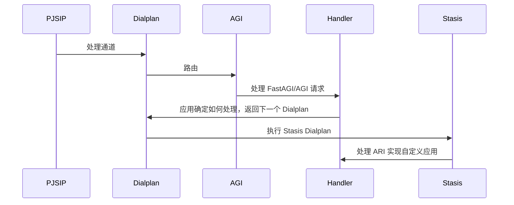

# 如何选择 Asterisk 接口

Asterisk 自 1999 年发展到现在，已经成为业界标准的 PBX 实现底层，但这 20 多年的发展也让 Asterisk 实现非常多的接口。

<!-- more -->

## 接口简介

| API | Protocol            | Async | Block | Access Dialplan |
| --- | ------------------- | ----- | ----- | --------------- |
| AGI | Shell/Socket        | ⛔️   | ✅    | ✅              |
| AMI | TCP/5038/Event      | ✅    | ⛔️   | ⛔️             |
| ARI | HTTP/REST/WebSocket | ✅    | ✅    | ✅              |

AGI, AMI 功能完全不同，但 ARI 和 AGI，AMI 都有所重叠。

- AGI - Asterisk Gateway Interface
  - 简单
  - 作为 Dialplan 函数
- AMI - Asterisk Manager Interface
  - 修改或创建 Channel
- ARI - Asterisk RESTful Interface
  - **Asterisk 12+**
  - HTTP Websocket - 事件, Stasis 应用
  - RESTful 接口 - 控制底层资源

## 接口使用场景

```
AMI - ARI - AGI
呼叫控制
      自定义通信应用
            Dialplan 执行
```

- AGI - 扩展 Dialplan 处理
  - 建议实现 通用 - 独立 - 特性无关 的 Dialplan 函数
  - 例如 呼叫建立、拆除；外线控制；CDR
- AMI - 适用于通话时通道管控
- ARI
  - ARI 包含 AMI 和 AGI 主要功能
  - 自定义 Dialplan 应用
  - 高度定制

开发使用一定要缺少边界，因为很多功能是这也可以那也可以。



## 其他接口

- Asterisk CLI
  - 开发使用简单方便
  - 功能有一定限制
- Call File
  - 0 耦合
  - 从目录拉取呼叫请求 `<astspooldir>/outgoing` - `/var/spool/asterisk/outgoing/`
    - 类似打印机 pool
    - 适用于自动发起呼叫
  - 生成文件放到目录由 chan_pickup 去获取然后发起呼叫
  - 语法与 HTTP Header 相同，支持 `#` 和 `;` 作为注释
  - 注意 ⚠️ - 先创建好文件然后 移动 到目录，避免在目录直接创建
- CDR - 呼叫记录
  - 每一通呼叫可以记录到 DB
  - 可通过查询 cdr 实现呼叫记录功能
  - 开发使用非常方便
  - 避免自行记录
- CEL - 事件日志
  - 日志量取决于配置，可能非常多
  - 通过处理日志能够分析出当前的通道状态
  - 实时处理日志能实现用户通知和提醒
  - 避免操作 AMI 或 ARI
- SNMP
  - 基本服务监控
- Statd
  - 服务指标监控
  - 通话数量，坐席数量
- Realtime DB
  - 管理通道坐席
  - 模块配置
- Function_CURL
  - Dialplan 里使用 CURL 请求外部系统
  - 实现非常简单的系统集成
- 后端接口
  - LDAP
  - cURL
  - ODBC, SQLite, PostgreSQL, MySQL

```bash
# 使用 CLI 发起呼叫
asterisk -rx 'channel originate SIP/6003 extension 10086@sip-6003'
```

**/var/spool/asterisk/outgoing/hello.call**

```ini
Channel: SIP/trunkname/6001
; Callerid: <callerid>
; WaitTime: <number>
; MaxRetries: <number>
; RetryTime: <number>
; Account: <account>

; 执行的应用和参数
Application: Playback
Data: hello-world

; Context+Extension
; Context: <context>
; Extension: <exten>
; Priority: <priority>
; Setvar: <var=value>

; yes 会归档到 outgoing_done
; 归档后还会记录状态
; Archive: <yes|no>
; Status: <exitstatus>

; 重试状态
; StartRetry: <pid> <retrycount> (<time>)
; EndRetry: <pid> <retrycount> (<time>)
```

## 总结

- 使用 Stasis 替代 Dial
- 避免 Asterisk 包含复杂路由逻辑
- 通过 ARI 接耦
- 没有 ARI 的低版本 Asterisk 只能使用 AMI 来进行实时管理

## 参考

- [ARI and AGI, a powerful combination](https://www.slideshare.net/JranVinzens/ari-and-agi-a-powerful-combination)
