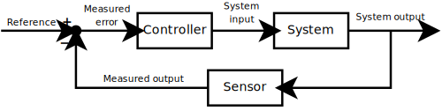

# 从新学习

最近开始学习 PMP，管理，对我来说是一个“全新”的领域。

<!-- more -->

学习去学习，是这次学习开始老师讲的主题，因此也产生了自己的一些思考。
学习去学习，我认为是 meta-learning。学习，应该从未停止过，当我们从猴子开始，我们就在学习去熟悉、了解、掌握新的工具、环境、事物。

不需要学习的思考，是潜意识的提升。对学习过程进行思考归纳总结是，得到的是过程改进方式，因此两个人学习一天的结果会有所不同。

让给我联想到英语的两个单词，study & learn。study 强调的只是过程，learn 强调的是结果内容，应该思考平时学习是 study 还是 learn。

> 带思考的学习更容易获取一项技能知识。

## 管理

管理，对我来说是一个 “全新” 的领域，作为技术研发，从未从管理学的概念去思考过问题。
但之所以是“全新”，是因为，生活无处不是管理，家庭纠纷、生活规划、日常工作。

我理解的管理，是控制。

控制理论的 反馈循环（feedbak loop） 图。

精益生产的 PDCA 循坏图。

项目管理 5 大过程组。

虽然是不同领域里的主题，但表达的却是相同的内容。

控制，减少变量，提升可预测性。

控制，是为了 提升/改进 现有过程。

What happened is happened,but what we can learn from the past ?

## 学习

为了更好理解和管理自己的学习，我梳理了我的学习过程，希望能从无意识变成有意识的学习。

**我的学习过程**

- Repeat - 重复 - 抄写重复最为浅显的内容
- Refactor - 重构 - 按照自己的理解从新组织内容语言
- Realize - 从新意识 - 对照生活、工作、现实、跳出固化场景
- Regain - 从新获取 - 掌握

:::caution

并不是所有主题都会经历所有的过程。学以致用，无以致用的主题只会停留在早期阶段。

:::

> ~~We learn from teacher.~~
>
> Teacher teached us.
>
> Whatever teaches us is our teacher.

老师、书本、文章、源码、事件都可能触发我们的“提升”。

**Repeat**

这时候我会进行简单的记录，好记性不如烂笔头。

在 https://github.com/wenerme/wener 这里我记录了感兴趣的很多内容，有的可能是工作相关的，例如：技术；可能是工作无关的，例如：[医学]。

:::tip Repeat阶段 内容的特点

- 浅显
- 离散
- 精简

:::

- 浅显 - You get what you see
- 离散
- 精简 - 知识索引

[医学]: https://github.com/wenerme/wener/blob/958471ae9d9e2399e3c901f68380cea3c3154e82/notes/healthcare/disease/rheumatoid-arthritis.md

**Refactor**

有时候，我们会重复遇到相同的问题，抱有相同的疑问，需要参考相同的话题。

此时参考简单记录的内容已经不足以回答或解决问题，因此，会对内容进行重新重构。

重构意味着重新梳理内容知识，从新调整“索引”内容，按照自己的“脑回路”对问题域进行理解分析。

使用 git 进行笔记的好处是它能记录你的“[过程]”。

[过程]: https://github.com/wenerme/wener/commits/master/notes/devops/kubernetes

:::tip Refactor阶段 内容的特点

- 发散的单个主题牵引出新的主题
- 按照自己的“脑回路”组织的内容结构
- 部分内容会进行细化

:::

**Realize**

意识阶段有两个方式：

1. 自身
2. 跨域

自身，我们通常讲从失败学习，更多的是意识到了问题点，问题点在不经历的时候是不会发现的，而当遇到问题，解决问题这个循环进行多次后，会基于基本的理论知识抽取出属于自己的经验结论。

跨域，学习和成长不可能是一条路走到头的，有所成就的人绝不可能只会精通一门学科，理解不同领域事物的相关性是意识提升的关键。

**Regain**

之所以叫 regain，是因为已经经历过早期的 gain 过程，regain 时，才是我们真正的有所掌握，学以致用。

:::tip Ragain 阶段的体现

- 独立决策
- 预测行为

:::

这时候我愿称之为： 专家/Master。

## 思维模式

通常学习分为两种场景：

1. 工具技术学习 - 实
2. 思想方法论学习 - 虚

因为我的主要职责是软件开发，管理对我来说是个“虚”技能，因为并不能直接指导工作。但对于项目经理来说，管理是个“实”技能，而计算机理论则是“虚”技能。

学习项目管理，是更多是为了去了解项目管理的思维模式。

:::tip 模式=锤子=工具

当我们手里拿着锤子时，看到所有东西都是钉子。

-- 工具定律

:::

<!-- 马斯洛的锤子 《科学的心理学》 -->

项目管理思维模式 和 软件设计模式 非常相似，是当我们解决问题时的参照。

但当你没有这个参照，没有这把锤子时，就会陷入困境，不断重复错误。

## 学习主题

学习是一个动作，必然会有目标，学习的主题可以是大而广的，也可以是小而精的。不如说，我们都需要把自己的知识储备磨练成 T 型结构。

![](https://kroki.io/excalidraw/svg/eNrdls1u20YQgN-Fvars_v_opjiOrdR1XNiFHRhCsRbX0tYUSZArWbLha1-gt158aq-9Bn2eBO1jdEjqD6LSCE7ToNVJuzucmZ35dmbuAz_LbNAO7LRvYhfl5varfuyyq9TkUdAKbGxHNvFF0L68D1wEgpHz12PHJ53vh_34ZO-wc6WPLEjO9Zg8T29hOQ3anLOQaa6YFkhTyVvBLGgTqUItNWEKMaHKzVsX-WHQpoiGCsEJoYIShQkcDa0bDH3QRq3AJIPYVv8Kn6c3di-N0xzsfYGqH1i8Mv2bQZ6Ok2hx5nOTFJnJ4QJwfu3i-NTPSi3B0PSH47x0u9Z2XvuAF-uFXJFCTEAK1A6GiS0gDqQVpJnpOw-XwQj8KW1m3agMUW_5_dDkWS0fVC6VlqyF-GGhicYaSdkKJjYvXJrApkLL1XGa9ME01lxIwjQCn1zxHPLgy8-vTVxYuGupc3-Zm2Qcx61gnEXG1zao1gzCzwUGM1nq6gxeohbqtS63RBr1wPXYFH4vHY2cBy0n5UcLzYU3uX_mksglg8WeTaKNnUqqU-Z_aE20Jre2N-fjoTWniT4zL7_pdvvadrPvzu72z05u7iZbaRKahUhLjISmlGuq5jjhUDHKGFOEEbwOFFrxg7UOBUMIM8FAuhT63_BEFZacKoHXeUKswRMwQSBOVD6dJ64gCU2eUKsR38-A0wYxy1gQQTdjobAC8un2p1Vh-e3gIp3-wPeywy_ZgZrI8-TV-etPmPMVjSXpgoZCIiwEwlyQRd1EALrEVDKOscT66eA234cUIYFSQTRFYAee06pacQK1iiu9O5cbLJXCDZKkqI3sBMIHQNoNkW3YNq7d6_0dSZThxqvCAiGOSJmO96BEOjOD2aE9OPdndpQM85sL--LfQkkSHjJCOBNQISRWi6JJQoyZBJoo01J8PErQ5zEUIQRcKokEdJ4VXJqEEjiWUBkg9YirBVyEUwzWMf5n2YJGoOjnZmtLQBpxqGmrIJnuvT5Jzgf7t9PJeEzNy4wd6_6qDXo79XUXlEKHME5xiYnSaFkcOA5hsFJI8XrQmuelbAqLNBD1X256Rfl_1fQY3JYiCO1602OqOURRSaki8ulNT2ClNSiuUtAO_nj85c_ffnz3-FjGIk38qbsDOwTVqxdm5OJZFYJSvhO7ATgWxPba14XEO5iyF9s-zaqIFzZ2SakFPuuDFgOrvLtELs3dwCUmPtv0YK1WzQFZlSrRLFUUmrMQMD29t1SZztHR9CLqjM5y__zg9PTV19fj409fqhi8C0KV0gpRxYSumyCDIVXCoCewxgxIr0CnWoUw6Smp64L28V1w84nMAQPLBPoww7ujuUNtEgQjincgB9S-ffPT2zc_v_v91wYjO6P1YZhWRh56VZ4teH7_8PAXflh1kw==)

:::tip 俗话说

东方不亮西方亮。

:::

不同的角度、观点都会让学习更加容易。

## 学习过程

学习是持续的不是一次性的，没有时间限制，没有领域限制，没有思维限制。

学习的驱动却肯定是有根因的，每个人都有所不同。

> We are who we are.

学习的参考不应该是别人，而是自己。今天的自己期望明天的自己对比昨天的自己能有所提升，而达成这样提升的就是学习。
