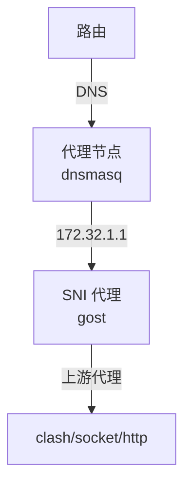

# 基于 SNI 实现无感全局代理

**基本结构**



<!-- more -->

1. 路由器上配置 DNS 为局域网内的一个节点
1. 路由器上配置 路由 172.32.1.1 到内网的一个 IP
1. DNS 匹配需要代理的路由返回 172.32.1.1
1. 172.32.1.1 上部署 sni 代理，监听 80、443

**前置条件**

- 已有相关代理服务

**后置条件**

- 修改路由器配置

**应用场景**

- 家庭
  - 无感
- 服务器运维 - 云服务器、物理服务器
  - 无感
  - 能支持任意场景
- 公司局域网
  - 能限制范围

## 配置代理节点

```bash
ip addr add 172.32.1.1/32 dev eth0 # 增加 IP

# 安装部署 gost - 提供 SNI 代理
# ===============
curl -LO https://github.com/go-gost/gost/releases/download/v3.0.0-rc8/gost_3.0.0-rc8_linux_amd64.tar.gz
tar zxvf gost*.tar.gz
# 监听 80, 443 - 上游代理为 192.168.1.2:7890，如果在当前节点也可以 127.0.0.1:7890
./gost -L sni://:80 -L sni://:443 -F socks5://192.168.1.2:7890
# 测试 gost 代理是否成功
curl -H 'Host: google.com' 127.0.0.1

# 安装部署 dnsmasq
# ===============
apk add dnsmasq
# 上游配置
cat << EOF > /etc/dnsmasq.d/main.conf
server=223.5.5.5
log-queries=extra
EOF

# 配置代理常用的域名
curl -L https://ghproxy.com/raw.githubusercontent.com/wenerme/wener/master/notes/service/dns/gfwlist.txt \
  | sed -E 's#.+#address=/&/172.32.1.1#' > /etc/dnsmasq.d/gfwlist.conf

# 测试启动
dnsmasq -d
# 测试，返回 172.32.1.1 为正常结果
nslookup google.com 127.0.0.1

# service dnsmasq start # 服务启动
# rc-update add dnsmasq # 开机自动启动
```

- 配置路由器
  - DNS
  - 路由 172.32.1.1 到内网节点

# FAQ

## 为什么用 172.32.1.1

- 172.32.1.1 为公网 IP 地址，但这个地址被使用的概率非常低
- 如果不给代理节点一个公网地址而是使用内网地址，那么 iOS 访问网络时会提示 “是否允许应用访问本地网络”。

## 为什么选择 DNS+SNI 作为全局代理

- 客户端无感，不需要改任何配置
- 能实现全局 - 例如 docker 不需要就行配置，k8s 不需要就行配置 就能拉取镜像
- 代理范围易于控制 - DNS 层控制

## 能不能不限制域名所有都代理

- 可以，dnsmasq 默认全部返回固定 ip
- 确保上游代理支持策略控制即可，例如 clash

## 关于上游 DNS

- 可以选择公共的，例如 223.5.5.5
- 也可以选择自己部署的 adguard 之类的
  - 支持拦截隐私相关域名
  - 避免 DNS 污染
